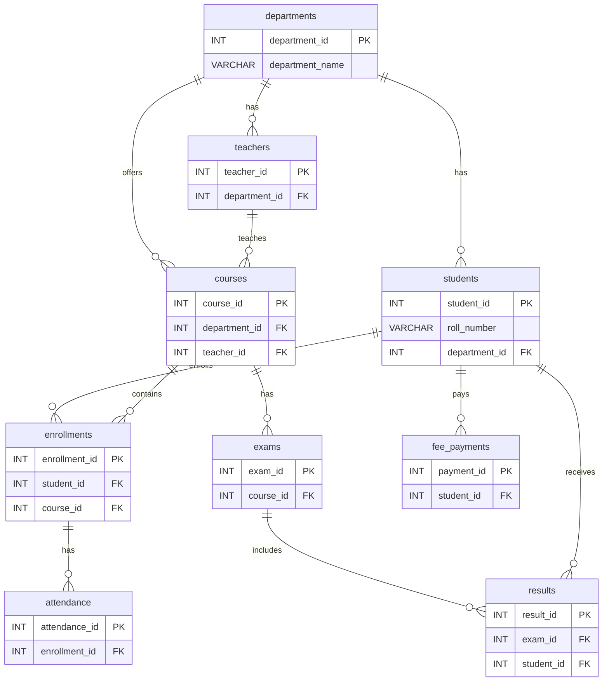
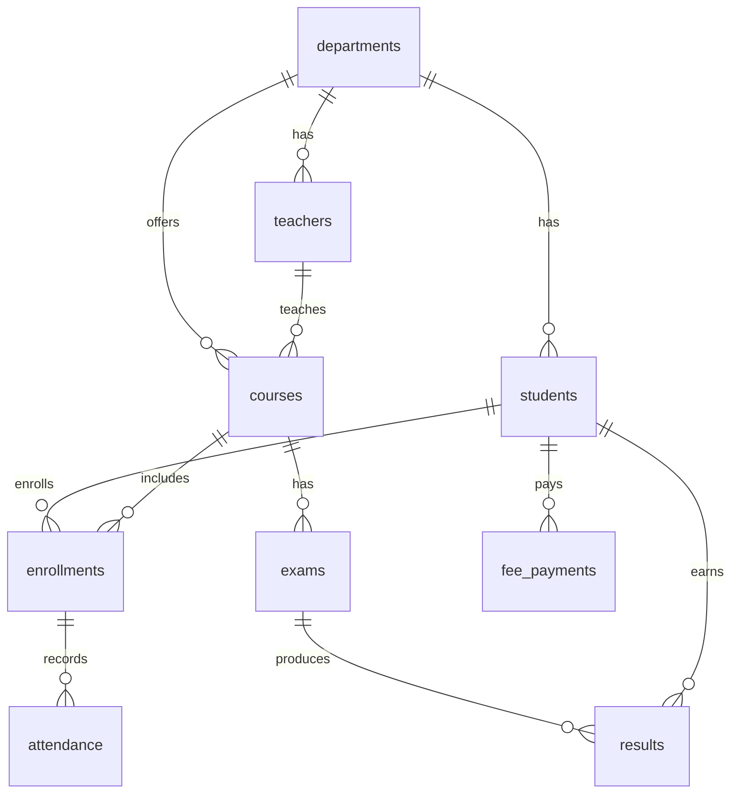

# Complete SQL Guide: Beginner to Interview Ready

This guide teaches SQL from zero to interview-ready intermediate level. It uses one consistent MySQL-based college management database so every example builds on something familiar.

How to use it:

1. Read one chapter at a time.
2. Run the SQL examples in MySQL Workbench or the MySQL command line.
3. Try the practice questions before opening the solutions.
4. Revisit the interview questions after every 5 chapters.
5. By the end, you should be able to explain SQL concepts and write common interview queries without help.

> **Important:** SQL is best learned by typing queries. Reading is useful, but interviews test whether you can reason through data.

## Table of Contents

1. [Introduction to Databases](#1-introduction-to-databases)
2. [SQL Command Categories](#2-sql-command-categories)
3. [Environment Setup](#3-environment-setup)
4. [Sample Database](#4-sample-database)
5. [Creating Databases and Tables](#5-creating-databases-and-tables)
6. [SQL Data Types](#6-sql-data-types)
7. [Constraints](#7-constraints)
8. [Modifying Tables](#8-modifying-tables)
9. [Inserting Data](#9-inserting-data)
10. [SELECT Statement](#10-select-statement)
11. [Filtering Data](#11-filtering-data)
12. [Sorting and Limiting](#12-sorting-and-limiting)
13. [SQL Functions](#13-sql-functions)
14. [Aggregate Functions](#14-aggregate-functions)
15. [GROUP BY and HAVING](#15-group-by-and-having)
16. [Joins](#16-joins)
17. [Subqueries](#17-subqueries)
18. [Set Operators](#18-set-operators)
19. [CASE Expressions](#19-case-expressions)
20. [Updating Data](#20-updating-data)
21. [Deleting Data](#21-deleting-data)
22. [Views](#22-views)
23. [Indexes](#23-indexes)
24. [Transactions](#24-transactions)
25. [Concurrency and Isolation Levels](#25-concurrency-and-isolation-levels)
26. [Deadlocks](#26-deadlocks)
27. [Stored Procedures](#27-stored-procedures)
28. [Functions](#28-functions)
29. [Triggers](#29-triggers)
30. [Cursors](#30-cursors)
31. [Normalization](#31-normalization)
32. [Entity-Relationship Concepts](#32-entity-relationship-concepts)
33. [Keys](#33-keys)
34. [Query Execution and Optimization](#34-query-execution-and-optimization)
35. [Window Functions](#35-window-functions)
36. [Common Table Expressions](#36-common-table-expressions)
37. [Database Security](#37-database-security)
38. [SQL Injection](#38-sql-injection)
39. [Backup and Recovery](#39-backup-and-recovery)
40. [Replication](#40-replication)
41. [Partitioning and Sharding](#41-partitioning-and-sharding)
42. [NoSQL Comparison](#42-nosql-comparison)
43. [Database Design Project](#43-database-design-project)
44. [SQL Interview Preparation](#44-sql-interview-preparation)
45. [Common Tricky SQL Queries](#45-common-tricky-sql-queries)
46. [Practice Sets](#46-practice-sets)
47. [Revision Cheat Sheet](#47-revision-cheat-sheet)
48. [30-Day SQL Learning Roadmap](#48-30-day-sql-learning-roadmap)

## Base College Database

The guide uses this logical structure:

```text
Database: college_management
 ├── departments
 ├── students
 ├── teachers
 ├── courses
 ├── enrollments
 ├── attendance
 ├── exams
 ├── results
 └── fee_payments
```

Main relationships:


---

## 1. Introduction to Databases

### What you will learn

- What data, databases, DBMS, RDBMS, and SQL mean.
- How tables store real-world information.
- How primary keys and foreign keys connect data.
- Why relational databases are still used in interviews and real systems.

### Why this matters

Every SQL query is written against a database structure. If you understand tables, rows, columns, and relationships, joins and subqueries become much easier.

### Concepts with examples

**Data** means raw facts. A student's name, date of birth, marks, department, and email address are data.

**Database** means an organized collection of data. A college database can store students, teachers, courses, attendance, exams, and results.

**DBMS** means Database Management System. It is software that stores, retrieves, protects, and manages data. Examples include MySQL, PostgreSQL, SQL Server, Oracle, and SQLite.

**RDBMS** means Relational Database Management System. It stores data in related tables. MySQL, PostgreSQL, SQL Server, and Oracle are RDBMS products.

| Term | Meaning | Example |
|---|---|---|
| Database | Collection of related data | `college_management` |
| Schema | Logical structure inside a database | Tables and relationships |
| Table | Data arranged in rows and columns | `students` |
| Row | One record | One student |
| Column | One attribute | `email` |
| Field | One cell value | `riya.sharma@example.com` |

Simple structure:

```text
Database
 ├── Students Table
 ├── Departments Table
 ├── Courses Table
 └── Enrollments Table
```

Example `students` table:

| student_id | first_name | department_id |
|---:|---|---:|
| 1 | Riya | 1 |
| 2 | Arjun | 2 |

Example `departments` table:

| department_id | department_name |
|---:|---|
| 1 | Computer Science |
| 2 | Commerce |

`student_id` is a **primary key** because it uniquely identifies each student. `department_id` in `students` is a **foreign key** because it refers to `departments.department_id`.

**SQL versus MySQL**

| SQL | MySQL |
|---|---|
| A language used to query relational databases | A database product that understands SQL |
| Standard concept | Specific implementation |
| Used in many databases | Owned by Oracle |

Advantages of relational databases:

- Clear table structure.
- Strong consistency.
- Useful constraints.
- Powerful querying.
- Excellent support for reporting and analytics.

Limitations:

- Schema changes may require planning.
- Very large distributed systems can need careful scaling.
- Complex joins can become slow without good indexes.

### Common mistakes

> **Common Mistake:** Saying "SQL and MySQL are the same." SQL is the language; MySQL is one database system that uses SQL.

> **Common Mistake:** Thinking every table must store everything. Good design separates related information into separate tables.

### Interview questions

1. What is a database?
2. What is the difference between DBMS and RDBMS?
3. What is SQL?
4. What is the difference between SQL and MySQL?
5. What is a primary key?
6. What is a foreign key?
7. Why do relational databases use multiple tables?

Short answers:

- A database is an organized collection of data.
- An RDBMS stores data in related tables.
- SQL is the language used to create, read, update, and delete relational data.
- A primary key uniquely identifies rows.
- A foreign key connects one table to another.

### Practice exercises

1. Identify three tables needed for a library database.
2. In a college database, name one possible primary key and one possible foreign key.
3. Explain the difference between a row and a column.

### Solutions

<details>
<summary>Show solutions</summary>

1. Example tables: `books`, `members`, `loans`.
2. `students.student_id` can be a primary key. `students.department_id` can be a foreign key.
3. A row is one full record. A column is one attribute shared by all rows.

</details>

### Chapter summary

A relational database stores related data in tables. SQL is the language used to work with that data. Primary keys identify records, and foreign keys connect records across tables.

---

## 2. SQL Command Categories

### What you will learn

- The five major categories of SQL commands.
- How `CREATE`, `SELECT`, `INSERT`, `UPDATE`, `DELETE`, `COMMIT`, and `ROLLBACK` differ.
- Interview differences between `DELETE`, `TRUNCATE`, and `DROP`.

### Why this matters

Interviewers often test SQL fundamentals before joins and advanced queries. Knowing command categories helps you answer clearly and avoid mixing concepts.

### Concepts with examples

| Category | Full form | Purpose | Examples |
|---|---|---|---|
| DDL | Data Definition Language | Define database objects | `CREATE`, `ALTER`, `DROP`, `TRUNCATE` |
| DML | Data Manipulation Language | Change table data | `INSERT`, `UPDATE`, `DELETE` |
| DQL | Data Query Language | Read data | `SELECT` |
| DCL | Data Control Language | Control permissions | `GRANT`, `REVOKE` |
| TCL | Transaction Control Language | Manage transactions | `COMMIT`, `ROLLBACK`, `SAVEPOINT` |

Command comparison:

| Command | Category | What it does | Example |
|---|---|---|---|
| `CREATE` | DDL | Creates object | `CREATE TABLE students (...)` |
| `ALTER` | DDL | Changes structure | `ALTER TABLE students ADD phone VARCHAR(20)` |
| `DROP` | DDL | Removes object | `DROP TABLE students` |
| `TRUNCATE` | DDL | Removes all rows quickly | `TRUNCATE TABLE attendance` |
| `INSERT` | DML | Adds rows | `INSERT INTO departments (...) VALUES (...)` |
| `UPDATE` | DML | Changes rows | `UPDATE students SET status = 'Graduated'` |
| `DELETE` | DML | Removes selected rows | `DELETE FROM students WHERE student_id = 1` |
| `SELECT` | DQL | Reads rows | `SELECT * FROM students` |
| `GRANT` | DCL | Gives permission | `GRANT SELECT ON college_management.* TO 'report_user'@'localhost'` |
| `REVOKE` | DCL | Removes permission | `REVOKE SELECT ON college_management.* FROM 'report_user'@'localhost'` |
| `COMMIT` | TCL | Saves transaction changes | `COMMIT` |
| `ROLLBACK` | TCL | Undoes uncommitted changes | `ROLLBACK` |
| `SAVEPOINT` | TCL | Creates rollback point | `SAVEPOINT before_update` |

DDL example:

```sql
CREATE TABLE departments (
    department_id INT PRIMARY KEY AUTO_INCREMENT,
    department_name VARCHAR(100) NOT NULL
);
```

DML example:

```sql
INSERT INTO departments (department_name)
VALUES ('Computer Science');
```

DQL example:

```sql
SELECT department_id, department_name
FROM departments;
```

`DELETE` versus `TRUNCATE` versus `DROP`:

| Feature | DELETE | TRUNCATE | DROP |
|---|---|---|---|
| Removes | Selected rows or all rows | All rows | Whole table |
| Uses `WHERE` | Yes | No | No |
| Keeps table structure | Yes | Yes | No |
| Usually logged row by row | Yes | No, often minimally logged | Object removal logged |
| Fires delete triggers | Usually yes | Usually no in MySQL | No |
| Can rollback | Yes inside transaction for InnoDB | Often implicit commit in MySQL | Often implicit commit in MySQL |

> **Interview Tip:** If asked "which is faster, DELETE or TRUNCATE?", answer: `TRUNCATE` is usually faster for removing all rows because it deallocates data pages, but behavior depends on database engine, foreign keys, and transaction rules.

### Common mistakes

> **Common Mistake:** Running `DELETE FROM table_name;` without `WHERE` and expecting only one row to disappear. It deletes every row.

> **Common Mistake:** Saying `TRUNCATE` and `DROP` are the same. `TRUNCATE` keeps the table; `DROP` removes the table.

### Interview questions

1. What is the difference between DDL and DML?
2. Is `SELECT` DML or DQL?
3. What is the difference between `COMMIT` and `ROLLBACK`?
4. What is the difference between `DELETE`, `TRUNCATE`, and `DROP`?
5. Can `DELETE` use a `WHERE` clause?

### Practice exercises

1. Classify `CREATE TABLE`, `UPDATE`, `SELECT`, and `GRANT`.
2. Write a command to permanently save a transaction.
3. Write a command to undo uncommitted changes.

### Solutions

<details>
<summary>Show solutions</summary>

1. `CREATE TABLE` is DDL, `UPDATE` is DML, `SELECT` is DQL, `GRANT` is DCL.
2. `COMMIT;`
3. `ROLLBACK;`

</details>

### Chapter summary

SQL commands are grouped by purpose. DDL changes structure, DML changes data, DQL reads data, DCL manages permissions, and TCL manages transactions.

---

## 3. Environment Setup

### What you will learn

- How to install and connect to MySQL.
- How to run commands in MySQL Workbench and the command line.
- Basic setup commands used in almost every SQL session.

### Why this matters

You cannot become interview-ready by reading only. You need an environment where you can run queries, break things safely, and fix errors.

### Concepts with examples

Install:

- **Windows:** Download MySQL Installer from the official MySQL website. Choose MySQL Server and MySQL Workbench.
- **macOS:** Use the official DMG installer or Homebrew.
- **Linux Ubuntu/Debian:** Use the package manager.

Common terminal commands:

```bash
# Windows, after adding MySQL bin folder to PATH
mysql -u root -p

# macOS with Homebrew
brew install mysql
brew services start mysql
mysql -u root -p

# Ubuntu/Debian
sudo apt update
sudo apt install mysql-server
sudo systemctl start mysql
sudo mysql
```

Connect to MySQL:

```bash
mysql -u root -p
```

Create and select a database:

```sql
CREATE DATABASE college_management;
USE college_management;
```

List databases:

```sql
SHOW DATABASES;
```

List tables:

```sql
SHOW TABLES;
```

Describe a table:

```sql
DESCRIBE students;
```

Run an SQL script:

```bash
mysql -u root -p college_management < complete_sql_guide_setup.sql
```

Inside MySQL command line:

```sql
SOURCE C:/path/to/complete_sql_guide_setup.sql;
```

Common setup errors:

| Error | Meaning | Fix |
|---|---|---|
| Access denied | Wrong username/password or permission | Check credentials |
| Unknown database | Database does not exist | Run `CREATE DATABASE` |
| Table already exists | You ran create script twice | Use `DROP TABLE IF EXISTS` in practice |
| Cannot add foreign key constraint | Referenced table/key mismatch | Check data types and order |
| Command not found | MySQL not in PATH | Add MySQL `bin` folder to PATH |

### Common mistakes

> **Common Mistake:** Creating tables before selecting the database. Always run `USE college_management;` first.

> **Common Mistake:** Creating child tables before parent tables. A foreign key must reference a table that already exists.

### Interview questions

1. What does `USE database_name` do?
2. How do you see all tables in the current database?
3. What does `DESCRIBE table_name` show?
4. Why do foreign-key tables need correct creation order?

### Practice exercises

1. Create a database named `practice_db`.
2. Select it.
3. Show all databases.
4. Show all tables.

### Solutions

<details>
<summary>Show solutions</summary>

```sql
CREATE DATABASE practice_db;
USE practice_db;
SHOW DATABASES;
SHOW TABLES;
```

</details>

### Chapter summary

Install MySQL, connect with Workbench or command line, create a database, select it, and learn basic inspection commands before writing larger SQL scripts.

---

## 4. Sample Database

### What you will learn

- How to create the full college management database.
- How tables are ordered when foreign keys exist.
- How sample data supports later query practice.

### Why this matters

Interview SQL becomes easier when you practice with connected data. This database includes one-to-many and many-to-many relationships, which are common in interviews.

### Concepts with examples

Run this script in MySQL 8.x.

```sql
DROP DATABASE IF EXISTS college_management;
CREATE DATABASE college_management;
USE college_management;

CREATE TABLE departments (
    department_id INT PRIMARY KEY AUTO_INCREMENT,
    department_name VARCHAR(100) NOT NULL UNIQUE,
    office_location VARCHAR(100),
    phone VARCHAR(20)
);

CREATE TABLE students (
    student_id INT PRIMARY KEY AUTO_INCREMENT,
    roll_number VARCHAR(20) NOT NULL UNIQUE,
    first_name VARCHAR(50) NOT NULL,
    last_name VARCHAR(50) NOT NULL,
    gender ENUM('Male', 'Female', 'Other') NOT NULL,
    date_of_birth DATE,
    email VARCHAR(100) UNIQUE,
    phone VARCHAR(20),
    admission_date DATE NOT NULL,
    department_id INT,
    status ENUM('Active', 'Graduated', 'Dropped') DEFAULT 'Active',
    CONSTRAINT fk_students_departments
        FOREIGN KEY (department_id)
        REFERENCES departments(department_id)
        ON UPDATE CASCADE
        ON DELETE RESTRICT
);

CREATE TABLE teachers (
    teacher_id INT PRIMARY KEY AUTO_INCREMENT,
    first_name VARCHAR(50) NOT NULL,
    last_name VARCHAR(50) NOT NULL,
    email VARCHAR(100) UNIQUE,
    phone VARCHAR(20),
    hire_date DATE NOT NULL,
    department_id INT,
    CONSTRAINT fk_teachers_departments
        FOREIGN KEY (department_id)
        REFERENCES departments(department_id)
        ON UPDATE CASCADE
        ON DELETE SET NULL
);

CREATE TABLE courses (
    course_id INT PRIMARY KEY AUTO_INCREMENT,
    course_code VARCHAR(20) NOT NULL UNIQUE,
    course_name VARCHAR(100) NOT NULL,
    credits INT NOT NULL CHECK (credits BETWEEN 1 AND 6),
    department_id INT,
    teacher_id INT,
    CONSTRAINT fk_courses_departments
        FOREIGN KEY (department_id)
        REFERENCES departments(department_id)
        ON UPDATE CASCADE
        ON DELETE RESTRICT,
    CONSTRAINT fk_courses_teachers
        FOREIGN KEY (teacher_id)
        REFERENCES teachers(teacher_id)
        ON UPDATE CASCADE
        ON DELETE SET NULL
);

CREATE TABLE enrollments (
    enrollment_id INT PRIMARY KEY AUTO_INCREMENT,
    student_id INT NOT NULL,
    course_id INT NOT NULL,
    semester INT NOT NULL CHECK (semester BETWEEN 1 AND 8),
    academic_year VARCHAR(9) NOT NULL,
    enrollment_date DATE NOT NULL,
    status ENUM('Enrolled', 'Completed', 'Cancelled') DEFAULT 'Enrolled',
    CONSTRAINT uq_student_course_year UNIQUE (student_id, course_id, academic_year),
    CONSTRAINT fk_enrollments_students
        FOREIGN KEY (student_id)
        REFERENCES students(student_id)
        ON UPDATE CASCADE
        ON DELETE CASCADE,
    CONSTRAINT fk_enrollments_courses
        FOREIGN KEY (course_id)
        REFERENCES courses(course_id)
        ON UPDATE CASCADE
        ON DELETE RESTRICT
);

CREATE TABLE attendance (
    attendance_id INT PRIMARY KEY AUTO_INCREMENT,
    enrollment_id INT NOT NULL,
    class_date DATE NOT NULL,
    status ENUM('Present', 'Absent', 'Late') NOT NULL,
    CONSTRAINT uq_attendance_once UNIQUE (enrollment_id, class_date),
    CONSTRAINT fk_attendance_enrollments
        FOREIGN KEY (enrollment_id)
        REFERENCES enrollments(enrollment_id)
        ON UPDATE CASCADE
        ON DELETE CASCADE
);

CREATE TABLE exams (
    exam_id INT PRIMARY KEY AUTO_INCREMENT,
    course_id INT NOT NULL,
    exam_name VARCHAR(100) NOT NULL,
    exam_date DATE NOT NULL,
    max_marks DECIMAL(5,2) NOT NULL CHECK (max_marks > 0),
    CONSTRAINT fk_exams_courses
        FOREIGN KEY (course_id)
        REFERENCES courses(course_id)
        ON UPDATE CASCADE
        ON DELETE CASCADE
);

CREATE TABLE results (
    result_id INT PRIMARY KEY AUTO_INCREMENT,
    exam_id INT NOT NULL,
    student_id INT NOT NULL,
    marks_obtained DECIMAL(5,2) CHECK (marks_obtained >= 0),
    grade CHAR(2),
    remarks VARCHAR(255),
    CONSTRAINT uq_exam_student UNIQUE (exam_id, student_id),
    CONSTRAINT fk_results_exams
        FOREIGN KEY (exam_id)
        REFERENCES exams(exam_id)
        ON UPDATE CASCADE
        ON DELETE CASCADE,
    CONSTRAINT fk_results_students
        FOREIGN KEY (student_id)
        REFERENCES students(student_id)
        ON UPDATE CASCADE
        ON DELETE CASCADE
);

CREATE TABLE fee_payments (
    payment_id INT PRIMARY KEY AUTO_INCREMENT,
    student_id INT NOT NULL,
    payment_date DATE NOT NULL,
    amount DECIMAL(10,2) NOT NULL CHECK (amount > 0),
    payment_method ENUM('Cash', 'Card', 'UPI', 'Bank Transfer') NOT NULL,
    semester INT NOT NULL CHECK (semester BETWEEN 1 AND 8),
    academic_year VARCHAR(9) NOT NULL,
    CONSTRAINT fk_fee_students
        FOREIGN KEY (student_id)
        REFERENCES students(student_id)
        ON UPDATE CASCADE
        ON DELETE CASCADE
);

INSERT INTO departments (department_name, office_location, phone) VALUES
('Computer Science', 'Block A-101', '011-4001001'),
('Commerce', 'Block B-201', '011-4001002'),
('Mathematics', 'Block C-301', '011-4001003'),
('Physics', 'Block D-401', '011-4001004'),
('English', 'Block E-501', '011-4001005');

INSERT INTO students
(roll_number, first_name, last_name, gender, date_of_birth, email, phone, admission_date, department_id, status)
VALUES
('CS2024-001', 'Riya', 'Sharma', 'Female', '2005-02-14', 'riya.sharma@example.com', '9000000001', '2024-07-10', 1, 'Active'),
('CS2024-002', 'Arjun', 'Mehta', 'Male', '2004-11-09', 'arjun.mehta@example.com', '9000000002', '2024-07-10', 1, 'Active'),
('CS2024-003', 'Nisha', 'Verma', 'Female', '2005-05-22', 'nisha.verma@example.com', '9000000003', '2024-07-11', 1, 'Active'),
('CO2024-001', 'Kabir', 'Khan', 'Male', '2004-08-18', 'kabir.khan@example.com', '9000000004', '2024-07-12', 2, 'Active'),
('CO2024-002', 'Ananya', 'Rao', 'Female', '2005-01-30', 'ananya.rao@example.com', '9000000005', '2024-07-12', 2, 'Active'),
('MA2024-001', 'Dev', 'Iyer', 'Male', '2004-12-01', 'dev.iyer@example.com', '9000000006', '2024-07-13', 3, 'Active'),
('MA2024-002', 'Sara', 'Ali', 'Female', '2005-03-16', 'sara.ali@example.com', '9000000007', '2024-07-13', 3, 'Active'),
('PH2024-001', 'Ishaan', 'Gupta', 'Male', '2004-07-21', 'ishaan.gupta@example.com', '9000000008', '2024-07-14', 4, 'Active'),
('PH2024-002', 'Meera', 'Nair', 'Female', '2005-04-05', 'meera.nair@example.com', '9000000009', '2024-07-14', 4, 'Active'),
('EN2024-001', 'Tara', 'Sen', 'Female', '2005-06-19', 'tara.sen@example.com', '9000000010', '2024-07-15', 5, 'Active'),
('EN2024-002', 'Aman', 'Joshi', 'Male', '2004-10-27', 'aman.joshi@example.com', '9000000011', '2024-07-15', 5, 'Active'),
('CS2023-004', 'Vikram', 'Patel', 'Male', '2004-01-11', 'vikram.patel@example.com', '9000000012', '2023-07-10', 1, 'Active');

INSERT INTO teachers
(first_name, last_name, email, phone, hire_date, department_id)
VALUES
('Neha', 'Kapoor', 'neha.kapoor@example.com', '9111111111', '2018-06-01', 1),
('Suresh', 'Menon', 'suresh.menon@example.com', '9111111112', '2016-08-15', 1),
('Priyanka', 'Das', 'priyanka.das@example.com', '9111111113', '2019-01-10', 2),
('Rohit', 'Bose', 'rohit.bose@example.com', '9111111114', '2017-09-20', 2),
('Farah', 'Mirza', 'farah.mirza@example.com', '9111111115', '2020-02-25', 3),
('Kunal', 'Saxena', 'kunal.saxena@example.com', '9111111116', '2015-04-18', 4),
('Leela', 'Thomas', 'leela.thomas@example.com', '9111111117', '2021-07-07', 5),
('Manav', 'Singh', 'manav.singh@example.com', '9111111118', '2022-03-12', 3);

INSERT INTO courses (course_code, course_name, credits, department_id, teacher_id) VALUES
('CS101', 'Introduction to Programming', 4, 1, 1),
('CS102', 'Database Systems', 4, 1, 2),
('CS201', 'Data Structures', 4, 1, 1),
('CO101', 'Financial Accounting', 3, 2, 3),
('CO102', 'Business Economics', 3, 2, 4),
('MA101', 'Calculus', 4, 3, 5),
('MA102', 'Linear Algebra', 4, 3, 8),
('PH101', 'Classical Mechanics', 4, 4, 6),
('PH102', 'Optics', 3, 4, 6),
('EN101', 'Academic Writing', 2, 5, 7);

INSERT INTO enrollments
(student_id, course_id, semester, academic_year, enrollment_date, status)
VALUES
(1, 1, 1, '2024-2025', '2024-07-20', 'Enrolled'),
(1, 2, 1, '2024-2025', '2024-07-20', 'Enrolled'),
(2, 1, 1, '2024-2025', '2024-07-20', 'Enrolled'),
(2, 2, 1, '2024-2025', '2024-07-20', 'Enrolled'),
(3, 1, 1, '2024-2025', '2024-07-21', 'Enrolled'),
(3, 3, 1, '2024-2025', '2024-07-21', 'Enrolled'),
(4, 4, 1, '2024-2025', '2024-07-21', 'Enrolled'),
(4, 5, 1, '2024-2025', '2024-07-21', 'Enrolled'),
(5, 4, 1, '2024-2025', '2024-07-22', 'Enrolled'),
(5, 5, 1, '2024-2025', '2024-07-22', 'Enrolled'),
(6, 6, 1, '2024-2025', '2024-07-22', 'Enrolled'),
(6, 7, 1, '2024-2025', '2024-07-22', 'Enrolled'),
(7, 6, 1, '2024-2025', '2024-07-23', 'Enrolled'),
(7, 7, 1, '2024-2025', '2024-07-23', 'Enrolled'),
(8, 8, 1, '2024-2025', '2024-07-23', 'Enrolled'),
(8, 9, 1, '2024-2025', '2024-07-23', 'Enrolled'),
(9, 8, 1, '2024-2025', '2024-07-24', 'Enrolled'),
(9, 9, 1, '2024-2025', '2024-07-24', 'Enrolled'),
(10, 10, 1, '2024-2025', '2024-07-24', 'Enrolled'),
(11, 10, 1, '2024-2025', '2024-07-24', 'Enrolled'),
(12, 2, 3, '2024-2025', '2024-07-25', 'Enrolled'),
(12, 3, 3, '2024-2025', '2024-07-25', 'Enrolled');

INSERT INTO attendance (enrollment_id, class_date, status) VALUES
(1, '2024-08-01', 'Present'), (1, '2024-08-02', 'Present'), (1, '2024-08-03', 'Absent'),
(2, '2024-08-01', 'Present'), (2, '2024-08-02', 'Late'), (2, '2024-08-03', 'Present'),
(3, '2024-08-01', 'Present'), (3, '2024-08-02', 'Present'),
(4, '2024-08-01', 'Absent'), (4, '2024-08-02', 'Present'),
(7, '2024-08-01', 'Present'), (8, '2024-08-01', 'Present'),
(11, '2024-08-01', 'Present'), (12, '2024-08-01', 'Late'),
(15, '2024-08-01', 'Absent'), (16, '2024-08-01', 'Present'),
(19, '2024-08-01', 'Present'), (20, '2024-08-01', 'Present');

INSERT INTO exams (course_id, exam_name, exam_date, max_marks) VALUES
(1, 'Midterm', '2024-09-15', 100),
(2, 'Midterm', '2024-09-16', 100),
(3, 'Midterm', '2024-09-17', 100),
(4, 'Midterm', '2024-09-18', 100),
(5, 'Midterm', '2024-09-19', 100),
(6, 'Midterm', '2024-09-20', 100),
(7, 'Midterm', '2024-09-21', 100),
(8, 'Midterm', '2024-09-22', 100),
(9, 'Midterm', '2024-09-23', 100),
(10, 'Midterm', '2024-09-24', 100);

INSERT INTO results (exam_id, student_id, marks_obtained, grade, remarks) VALUES
(1, 1, 88, 'A', 'Strong logic'),
(1, 2, 76, 'B', 'Good'),
(1, 3, 91, 'A+', 'Excellent'),
(2, 1, 84, 'A', 'Good SQL basics'),
(2, 2, 69, 'C', 'Needs practice'),
(2, 12, 93, 'A+', 'Excellent'),
(3, 3, 79, 'B', 'Good'),
(3, 12, 81, 'A', 'Consistent'),
(4, 4, 72, 'B', 'Good'),
(4, 5, 88, 'A', 'Strong'),
(5, 4, 65, 'C', 'Average'),
(5, 5, 90, 'A+', 'Excellent'),
(6, 6, 78, 'B', 'Good'),
(6, 7, 86, 'A', 'Strong'),
(7, 6, 83, 'A', 'Good'),
(7, 7, 74, 'B', 'Good'),
(8, 8, 67, 'C', 'Average'),
(8, 9, 89, 'A', 'Strong'),
(9, 8, 71, 'B', 'Good'),
(9, 9, 94, 'A+', 'Excellent'),
(10, 10, 82, 'A', 'Clear writing'),
(10, 11, 77, 'B', 'Good');

INSERT INTO fee_payments
(student_id, payment_date, amount, payment_method, semester, academic_year)
VALUES
(1, '2024-07-25', 45000, 'UPI', 1, '2024-2025'),
(2, '2024-07-26', 45000, 'Card', 1, '2024-2025'),
(3, '2024-07-26', 45000, 'Bank Transfer', 1, '2024-2025'),
(4, '2024-07-27', 38000, 'UPI', 1, '2024-2025'),
(5, '2024-07-27', 38000, 'Cash', 1, '2024-2025'),
(6, '2024-07-28', 42000, 'Bank Transfer', 1, '2024-2025'),
(7, '2024-07-28', 42000, 'UPI', 1, '2024-2025'),
(8, '2024-07-29', 43000, 'Card', 1, '2024-2025'),
(9, '2024-07-29', 43000, 'UPI', 1, '2024-2025'),
(10, '2024-07-30', 32000, 'Cash', 1, '2024-2025'),
(11, '2024-07-30', 32000, 'UPI', 1, '2024-2025'),
(12, '2024-07-31', 45000, 'Bank Transfer', 3, '2024-2025');

SELECT COUNT(*) AS total_departments FROM departments;
SELECT COUNT(*) AS total_students FROM students;
SELECT COUNT(*) AS total_courses FROM courses;
SELECT COUNT(*) AS total_enrollments FROM enrollments;
```

Expected verification output:

| Query | Expected count |
|---|---:|
| departments | 5 |
| students | 12 |
| courses | 10 |
| enrollments | 22 |

### Common mistakes

> **Common Mistake:** Inserting rows into `students` before inserting matching rows into `departments`. The foreign key will fail.

> **Common Mistake:** Using mismatched data types for foreign keys. If `departments.department_id` is `INT`, then `students.department_id` should also be `INT`.

### Interview questions

1. Why must parent tables be created before child tables?
2. Why is `enrollments` needed instead of putting `course_id` directly in `students`?
3. What does a unique constraint on `(student_id, course_id, academic_year)` prevent?
4. Why can `courses.teacher_id` be nullable?

### Practice exercises

1. Add one new department.
2. Add one new student in that department.
3. Write a query to count students by department.
4. Write a query to list all students with department names.

### Solutions

<details>
<summary>Show solutions</summary>

```sql
INSERT INTO departments (department_name, office_location, phone)
VALUES ('History', 'Block F-101', '011-4001006');

INSERT INTO students
(roll_number, first_name, last_name, gender, date_of_birth, email, phone, admission_date, department_id)
VALUES
('HI2024-001', 'Aditi', 'Roy', 'Female', '2005-09-02',
 'aditi.roy@example.com', '9000000013', '2024-07-31', 6);

SELECT d.department_name, COUNT(s.student_id) AS student_count
FROM departments d
LEFT JOIN students s ON s.department_id = d.department_id
GROUP BY d.department_id, d.department_name;

SELECT s.student_id, s.first_name, s.last_name, d.department_name
FROM students s
JOIN departments d ON d.department_id = s.department_id;
```

</details>

### Chapter summary

The sample database gives you realistic data for practicing constraints, joins, aggregation, subqueries, transactions, indexes, and interview queries.

---

## 5. Creating Databases and Tables

### What you will learn

- How to create databases and tables.
- How to read table definitions line by line.
- Good naming conventions.

### Why this matters

Before you query data, you must understand how it is structured. Interviews often ask you to design a table or explain a `CREATE TABLE` statement.

### Concepts with examples

Create a database:

```sql
CREATE DATABASE college_management;
USE college_management;
```

Create a table:

```sql
CREATE TABLE departments (
    department_id INT PRIMARY KEY AUTO_INCREMENT,
    department_name VARCHAR(100) NOT NULL UNIQUE,
    office_location VARCHAR(100),
    phone VARCHAR(20)
);
```

Line-by-line:

| Line | Meaning |
|---|---|
| `CREATE TABLE departments` | Create a table named `departments` |
| `department_id INT` | Store numeric ID |
| `PRIMARY KEY` | Make it unique and not null |
| `AUTO_INCREMENT` | MySQL generates the next value |
| `VARCHAR(100)` | Store variable-length text |
| `NOT NULL` | Value is required |
| `UNIQUE` | Duplicate department names are not allowed |

Naming conventions:

- Use lowercase table and column names.
- Use underscores: `student_id`, not `studentId`.
- Use plural table names consistently: `students`, `courses`.
- Use clear foreign key names: `department_id`, `teacher_id`.
- Avoid spaces and reserved words such as `order`, `user`, or `group`.

SQL comments:

```sql
-- Single-line comment

/*
Multi-line comment
*/
```

### Common mistakes

> **Common Mistake:** Naming columns `name`, `date`, or `type` everywhere. Specific names such as `course_name` and `exam_date` are easier to understand.

> **Common Mistake:** Forgetting semicolons in the MySQL command line.

### Interview questions

1. What is the difference between `CREATE DATABASE` and `CREATE TABLE`?
2. Why should column names be clear?
3. What does `AUTO_INCREMENT` do in MySQL?
4. What happens if you create two tables with the same name?

### Practice exercises

1. Create a table named `clubs` with `club_id`, `club_name`, and `created_date`.
2. Add a `UNIQUE` constraint on `club_name`.
3. Add comments explaining each column.

### Solutions

<details>
<summary>Show solutions</summary>

```sql
CREATE TABLE clubs (
    club_id INT PRIMARY KEY AUTO_INCREMENT, -- unique club identifier
    club_name VARCHAR(100) NOT NULL UNIQUE, -- club name must not repeat
    created_date DATE NOT NULL -- date when the club started
);
```

</details>

### Chapter summary

`CREATE DATABASE` creates a container. `CREATE TABLE` creates structure. Good names and constraints make data easier to query and maintain.

---

## 6. SQL Data Types

### What you will learn

- Common numeric, character, date/time, and special data types.
- How to choose the correct data type.
- Important MySQL differences from other databases.

### Why this matters

Data types protect data quality. A wrong data type can cause inaccurate calculations, storage waste, or failed queries.

### Concepts with examples

Numeric data types:

| Type | Use | Example |
|---|---|---|
| `SMALLINT` | Small integers | Semester number |
| `INT` | Normal integers | Student ID |
| `BIGINT` | Very large integers | Large transaction ID |
| `DECIMAL(p,s)` | Exact decimal values | Fees, marks, money |
| `FLOAT` | Approximate decimal | Scientific measurements |
| `DOUBLE` | More precise approximate decimal | Scientific calculations |

```sql
marks_obtained DECIMAL(5,2)
amount DECIMAL(10,2)
credits INT
```

Character data types:

| Type | Use |
|---|---|
| `CHAR(n)` | Fixed-length text |
| `VARCHAR(n)` | Variable-length text |
| `TEXT` | Long text |

`CHAR` versus `VARCHAR`:

| Feature | CHAR | VARCHAR |
|---|---|---|
| Length | Fixed | Variable |
| Best for | Codes of same length | Names, emails |
| Example | `gender_code CHAR(1)` | `email VARCHAR(100)` |

Date and time:

| Type | Stores | Example |
|---|---|---|
| `DATE` | Date only | `2024-07-10` |
| `TIME` | Time only | `14:30:00` |
| `DATETIME` | Date and time | `2024-07-10 14:30:00` |
| `TIMESTAMP` | Date/time often timezone-aware in storage behavior | Row update time |
| `YEAR` | Year | `2024` |

Other types:

| Type | Use | MySQL note |
|---|---|---|
| `BOOLEAN` | True/false | Alias for `TINYINT(1)` |
| `ENUM` | One value from a list | MySQL-specific style |
| `JSON` | JSON documents | Supported in MySQL 5.7+ |
| `BLOB` | Binary data | Images/files, usually store file paths instead |

`FLOAT` versus `DECIMAL`:

```sql
-- Better for money and marks
amount DECIMAL(10,2)

-- Better for approximate scientific values
temperature FLOAT
```

Portability notes:

| Concept | MySQL | PostgreSQL | SQL Server | Oracle |
|---|---|---|---|---|
| Auto number | `AUTO_INCREMENT` | `GENERATED AS IDENTITY` / `SERIAL` | `IDENTITY` | `GENERATED AS IDENTITY` |
| Boolean | `TINYINT(1)` alias | Native `BOOLEAN` | `BIT` | Often `NUMBER(1)` |
| Limit rows | `LIMIT` | `LIMIT` | `TOP` / `OFFSET FETCH` | `FETCH FIRST` |
| String concat | `CONCAT()` | `||` or `CONCAT()` | `+` or `CONCAT()` | `||` |

### Common mistakes

> **Common Mistake:** Using `FLOAT` for money. Use `DECIMAL` because it stores exact decimal values.

> **Common Mistake:** Using `VARCHAR` for dates. Use `DATE`, `DATETIME`, or `TIMESTAMP` so the database can compare and sort correctly.

### Interview questions

1. Difference between `CHAR` and `VARCHAR`?
2. Difference between `FLOAT` and `DECIMAL`?
3. Difference between `DATE`, `DATETIME`, and `TIMESTAMP`?
4. How does MySQL store `BOOLEAN`?
5. When would you use `TEXT` instead of `VARCHAR`?

### Practice exercises

1. Choose data types for employee salary, joining date, email, and active status.
2. Create a table `books` with correct data types.
3. Explain why `marks` should not be `VARCHAR`.

### Solutions

<details>
<summary>Show solutions</summary>

```sql
CREATE TABLE books (
    book_id INT PRIMARY KEY AUTO_INCREMENT,
    title VARCHAR(200) NOT NULL,
    price DECIMAL(8,2) NOT NULL,
    published_date DATE,
    is_available BOOLEAN DEFAULT TRUE
);
```

Salary should be `DECIMAL`, joining date should be `DATE`, email should be `VARCHAR`, and active status can be `BOOLEAN`.

Marks should be numeric because you need comparisons, averages, maximums, and sorting.

</details>

### Chapter summary

Choose data types based on meaning. Use `DECIMAL` for exact values, `VARCHAR` for variable text, and real date/time types for dates.

---

## 7. Constraints

### What you will learn

- How constraints protect data quality.
- How primary keys, foreign keys, unique keys, defaults, and checks work.
- How referential actions affect deletes and updates.

### Why this matters

Constraints are the database's safety rules. They prevent invalid data even if an application has bugs.

### Concepts with examples

| Constraint | Purpose | Example |
|---|---|---|
| `PRIMARY KEY` | Unique row identifier | `student_id` |
| `FOREIGN KEY` | Connects tables | `students.department_id` |
| `NOT NULL` | Requires value | `first_name` |
| `UNIQUE` | Prevents duplicates | `email` |
| `DEFAULT` | Supplies value if omitted | `status DEFAULT 'Active'` |
| `CHECK` | Validates condition | `credits BETWEEN 1 AND 6` |
| `AUTO_INCREMENT` | Generates numeric key | `student_id` |

Primary key:

```sql
student_id INT PRIMARY KEY AUTO_INCREMENT
```

Foreign key:

```sql
CONSTRAINT fk_students_departments
    FOREIGN KEY (department_id)
    REFERENCES departments(department_id)
```

Composite unique key:

```sql
CONSTRAINT uq_student_course_year
UNIQUE (student_id, course_id, academic_year)
```

This means a student cannot enroll in the same course twice in the same academic year.

Composite primary key example:

```sql
CREATE TABLE student_skills (
    student_id INT NOT NULL,
    skill_name VARCHAR(100) NOT NULL,
    PRIMARY KEY (student_id, skill_name)
);
```

Foreign-key actions:

| Action | Meaning |
|---|---|
| `ON DELETE CASCADE` | Delete child rows automatically |
| `ON DELETE SET NULL` | Set child foreign key to `NULL` |
| `ON DELETE RESTRICT` | Stop delete if child rows exist |
| `ON UPDATE CASCADE` | Update child keys when parent key changes |

### Common mistakes

> **Common Mistake:** Creating a foreign key where parent and child columns have different data types or signed/unsigned settings.

> **Common Mistake:** Allowing `ON DELETE CASCADE` everywhere. It can delete more data than expected.

### Interview questions

1. What is referential integrity?
2. Can a table have more than one primary key?
3. Can a table have multiple unique constraints?
4. Difference between primary key and unique key?
5. What does `ON DELETE CASCADE` do?

Direct answers:

- Referential integrity means foreign-key values must match valid parent rows or be `NULL` if allowed.
- A table has only one primary key, but that key can contain multiple columns.
- A table can have many unique constraints.
- A primary key cannot be null; a unique key may allow nulls depending on database behavior.

### Practice exercises

1. Add a unique constraint to prevent duplicate course names inside the same department.
2. Explain why `results` uses a unique key on `(exam_id, student_id)`.
3. Decide whether `attendance` should use `ON DELETE CASCADE`.

### Solutions

<details>
<summary>Show solutions</summary>

```sql
ALTER TABLE courses
ADD CONSTRAINT uq_department_course_name
UNIQUE (department_id, course_name);
```

`results` uses `(exam_id, student_id)` so a student has only one result for a specific exam.

`attendance` can use `ON DELETE CASCADE` because attendance belongs to an enrollment. If an enrollment is deleted in a practice database, its attendance should not remain orphaned.

</details>

### Chapter summary

Constraints keep data valid. Primary keys identify rows, foreign keys connect tables, and unique/check/default constraints enforce business rules.

---

## 8. Modifying Tables

### What you will learn

- How to change existing table structure with `ALTER TABLE`.
- How to add, modify, rename, and drop columns.
- How to add and remove constraints.

### Why this matters

Real databases evolve. You may need to add a column, change a data type, or add a constraint without rebuilding everything.

### Concepts with examples

Add a column:

```sql
ALTER TABLE students
ADD middle_name VARCHAR(50);
```

Modify a column:

```sql
ALTER TABLE students
MODIFY phone VARCHAR(25);
```

Rename a column in MySQL 8:

```sql
ALTER TABLE students
RENAME COLUMN phone TO mobile_number;
```

Rename a table:

```sql
RENAME TABLE students TO college_students;
RENAME TABLE college_students TO students;
```

Drop a column:

```sql
ALTER TABLE students
DROP COLUMN middle_name;
```

Add a constraint:

```sql
ALTER TABLE students
ADD CONSTRAINT uq_students_phone UNIQUE (phone);
```

Drop a unique constraint in MySQL:

```sql
ALTER TABLE students
DROP INDEX uq_students_phone;
```

Add and remove a foreign key:

```sql
ALTER TABLE students
ADD CONSTRAINT fk_students_departments_new
FOREIGN KEY (department_id)
REFERENCES departments(department_id);

ALTER TABLE students
DROP FOREIGN KEY fk_students_departments_new;
```

Changing a `gender` column into an `ENUM`:

```sql
ALTER TABLE students
MODIFY gender ENUM('Male', 'Female', 'Other') NOT NULL;
```

Portability:

| Task | MySQL | PostgreSQL | SQL Server |
|---|---|---|---|
| Rename column | `RENAME COLUMN` | `RENAME COLUMN` | `sp_rename` |
| Auto increment | `AUTO_INCREMENT` | `IDENTITY` / `SERIAL` | `IDENTITY` |
| Drop FK | `DROP FOREIGN KEY name` | `DROP CONSTRAINT name` | `DROP CONSTRAINT name` |

### Common mistakes

> **Common Mistake:** Dropping a column used by application code or reports without checking dependencies.

> **Common Mistake:** Modifying a column to `NOT NULL` while existing rows contain `NULL`.

### Interview questions

1. Which command changes table structure?
2. How do you add a column?
3. How do you remove a foreign key in MySQL?
4. What should you check before changing a column data type?

### Practice exercises

1. Add `linkedin_url` to `students`.
2. Change it to `VARCHAR(255)`.
3. Drop it.
4. Add a unique constraint on `teachers.phone`.

### Solutions

<details>
<summary>Show solutions</summary>

```sql
ALTER TABLE students ADD linkedin_url VARCHAR(150);
ALTER TABLE students MODIFY linkedin_url VARCHAR(255);
ALTER TABLE students DROP COLUMN linkedin_url;

ALTER TABLE teachers
ADD CONSTRAINT uq_teachers_phone UNIQUE (phone);
```

</details>

### Chapter summary

Use `ALTER TABLE` to change structure. Always check existing data, constraints, indexes, and application dependencies before changing production tables.

---

## 9. Inserting Data

### What you will learn

- How to insert one row or many rows.
- How defaults, nulls, and auto-increment values work.
- How to understand common insert errors.

### Why this matters

Most applications spend a lot of time inserting data. A good SQL user knows how to insert cleanly and diagnose failed inserts.

### Concepts with examples

Insert one row:

```sql
INSERT INTO departments (department_name, office_location, phone)
VALUES ('History', 'Block F-101', '011-4001006');
```

Insert multiple rows:

```sql
INSERT INTO departments (department_name, office_location, phone)
VALUES
('Political Science', 'Block G-101', '011-4001007'),
('Psychology', 'Block H-101', '011-4001008');
```

Insert selected columns:

```sql
INSERT INTO students
(roll_number, first_name, last_name, gender, admission_date, department_id)
VALUES
('CS2024-099', 'Maya', 'Dutta', 'Female', '2024-08-01', 1);
```

Because `status` has a default, MySQL stores `Active`.

Insert from another table:

```sql
CREATE TABLE active_students_backup AS
SELECT student_id, roll_number, first_name, last_name, department_id
FROM students
WHERE status = 'Active';
```

Handling `NULL`:

```sql
INSERT INTO teachers
(first_name, last_name, email, phone, hire_date, department_id)
VALUES
('Asha', 'Raman', NULL, NULL, '2024-01-15', 1);
```

Auto-increment:

```sql
INSERT INTO departments (department_name)
VALUES ('Biotechnology');
```

You do not provide `department_id`; MySQL generates it.

Common insertion errors:

| Error | Cause | Fix |
|---|---|---|
| Duplicate primary key | ID already exists | Let auto-increment generate value |
| Data too long | Text exceeds column size | Increase column size or shorten value |
| Invalid data type | Wrong value type | Use correct type/format |
| Foreign-key failure | Parent row missing | Insert parent first |
| Missing required value | `NOT NULL` column omitted | Provide a value |

### Common mistakes

> **Common Mistake:** Inserting values without column names. If table structure changes, the insert can break or put values in wrong columns.

```sql
-- Avoid this style in serious code
INSERT INTO departments VALUES (10, 'Design', 'Block X', '011-123');
```

Better:

```sql
INSERT INTO departments (department_name, office_location, phone)
VALUES ('Design', 'Block X', '011-123');
```

### Interview questions

1. How do you insert multiple rows?
2. What happens if you omit an auto-increment column?
3. What is a foreign-key insert failure?
4. Difference between `NULL` and empty string?

### Practice exercises

1. Insert a new teacher into Computer Science.
2. Insert two new courses.
3. Try inserting a student with a non-existing `department_id`. Explain the error.

### Solutions

<details>
<summary>Show solutions</summary>

```sql
INSERT INTO teachers
(first_name, last_name, email, phone, hire_date, department_id)
VALUES
('Ramesh', 'Kulkarni', 'ramesh.kulkarni@example.com',
 '9222222222', '2024-02-01', 1);

INSERT INTO courses (course_code, course_name, credits, department_id, teacher_id)
VALUES
('CS301', 'Operating Systems', 4, 1, 9),
('CS302', 'Computer Networks', 4, 1, 9);

-- This fails if department_id 999 does not exist.
INSERT INTO students
(roll_number, first_name, last_name, gender, admission_date, department_id)
VALUES
('XX2024-001', 'Test', 'Student', 'Other', '2024-08-01', 999);
```

</details>

### Chapter summary

Use explicit column lists for inserts. Understand defaults, `NULL`, auto-increment, and foreign-key rules to diagnose common insert errors.

---

## 10. SELECT Statement

### What you will learn

- How to read data from tables.
- How aliases, expressions, constants, and `DISTINCT` work.
- The logical order in which SQL queries are processed.

### Why this matters

`SELECT` is the most used SQL command. Interviews usually begin with simple `SELECT` queries and slowly add filters, joins, and aggregation.

### Concepts with examples

Select all columns:

```sql
SELECT *
FROM students;
```

> **Interview Tip:** `SELECT *` is fine for quick learning, but in production queries, list only required columns.

Select specific columns:

```sql
SELECT student_id, roll_number, first_name, last_name
FROM students;
```

Column aliases:

```sql
SELECT
    first_name AS first,
    last_name AS last,
    CONCAT(first_name, ' ', last_name) AS full_name
FROM students;
```

Table aliases:

```sql
SELECT s.student_id, s.first_name, d.department_name
FROM students AS s
JOIN departments AS d ON d.department_id = s.department_id;
```

Remove duplicates:

```sql
SELECT DISTINCT department_id
FROM students;
```

Calculated column:

```sql
SELECT
    result_id,
    marks_obtained,
    marks_obtained + 5 AS marks_after_bonus
FROM results;
```

Constants in output:

```sql
SELECT
    first_name,
    'College Student' AS record_type
FROM students;
```

Logical execution order:

```text
FROM
JOIN
WHERE
GROUP BY
HAVING
SELECT
DISTINCT
ORDER BY
LIMIT
```

This means `WHERE` filters rows before `SELECT` displays columns.

### Common mistakes

> **Common Mistake:** Thinking SQL runs top to bottom exactly as written. The logical processing order starts with `FROM`.

> **Common Mistake:** Using an alias in `WHERE` in MySQL-independent SQL. Since `WHERE` is processed before `SELECT`, aliases are not generally available there.

### Interview questions

1. What does `SELECT *` mean?
2. What does `DISTINCT` do?
3. What is a column alias?
4. What is the logical execution order of a query?

### Practice exercises

1. Show each student's full name.
2. Show unique student statuses.
3. Show marks with a 10-mark bonus.

### Solutions

<details>
<summary>Show solutions</summary>

```sql
SELECT CONCAT(first_name, ' ', last_name) AS full_name
FROM students;

SELECT DISTINCT status
FROM students;

SELECT result_id, marks_obtained, marks_obtained + 10 AS bonus_marks
FROM results;
```

</details>

### Chapter summary

`SELECT` retrieves data. Use aliases for readable output, `DISTINCT` for unique values, and remember the logical processing order.

---

## 11. Filtering Data

### What you will learn

- How to filter rows with `WHERE`.
- How comparison, logical, pattern, range, and null filters work.
- How to avoid common `AND`/`OR` traps.

### Why this matters

Most useful queries do not return every row. Filtering is the foundation of reporting and interview query solving.

### Concepts with examples

Basic `WHERE`:

```sql
SELECT student_id, first_name, department_id
FROM students
WHERE department_id = 1;
```

Comparison operators:

| Operator | Meaning |
|---|---|
| `=` | Equal |
| `<>` or `!=` | Not equal |
| `>` | Greater than |
| `<` | Less than |
| `>=` | Greater than or equal |
| `<=` | Less than or equal |

Logical operators:

```sql
SELECT *
FROM results
WHERE marks_obtained >= 80
  AND grade IN ('A', 'A+');
```

`BETWEEN`:

```sql
SELECT *
FROM results
WHERE marks_obtained BETWEEN 70 AND 90;
```

`IN`:

```sql
SELECT *
FROM students
WHERE department_id IN (1, 3, 5);
```

`NOT IN`:

```sql
SELECT *
FROM students
WHERE department_id NOT IN (2, 4);
```

> **Common Mistake:** `NOT IN` behaves unexpectedly if the list or subquery contains `NULL`. Prefer `NOT EXISTS` for anti-joins.

`LIKE` wildcards:

| Pattern | Meaning |
|---|---|
| `'A%'` | Starts with A |
| `'%a'` | Ends with a |
| `'%an%'` | Contains an |
| `'_iya'` | One character before iya |

```sql
SELECT first_name, last_name
FROM students
WHERE first_name LIKE 'A%';
```

Correct `NULL` handling:

```sql
SELECT *
FROM teachers
WHERE phone IS NULL;
```

This is incorrect:

```sql
WHERE phone = NULL;
```

`NULL` means unknown. A normal equality comparison with unknown does not return true. Use `IS NULL` or `IS NOT NULL`.

Operator precedence:

```sql
SELECT *
FROM students
WHERE department_id = 1
   OR department_id = 2
  AND status = 'Active';
```

`AND` runs before `OR`, so this means:

```text
department_id = 1 OR (department_id = 2 AND status = 'Active')
```

Use parentheses:

```sql
SELECT *
FROM students
WHERE (department_id = 1 OR department_id = 2)
  AND status = 'Active';
```

### Common mistakes

> **Common Mistake:** Using `= NULL` instead of `IS NULL`.

> **Common Mistake:** Forgetting parentheses when mixing `AND` and `OR`.

### Interview questions

1. Difference between `WHERE` and `HAVING`?
2. Why is `column = NULL` wrong?
3. What does `%` mean in `LIKE`?
4. Why can `NOT IN` be dangerous with `NULL`?

### Practice exercises

1. Find students admitted after `2024-07-12`.
2. Find students whose first name starts with `A`.
3. Find results where marks are between 80 and 95.
4. Find teachers whose phone is not null.

### Solutions

<details>
<summary>Show solutions</summary>

```sql
SELECT * FROM students
WHERE admission_date > '2024-07-12';

SELECT * FROM students
WHERE first_name LIKE 'A%';

SELECT * FROM results
WHERE marks_obtained BETWEEN 80 AND 95;

SELECT * FROM teachers
WHERE phone IS NOT NULL;
```

</details>

### Chapter summary

Use `WHERE` to filter rows. Learn `NULL` rules and operator precedence because they are common interview traps.

---

## 12. Sorting and Limiting

### What you will learn

- How to sort results with `ORDER BY`.
- How to limit rows and paginate results.
- How to find top N and second-highest values.

### Why this matters

Reports usually need sorted, ranked, or limited output. Interview questions often ask for top scores, second-highest salary, or pagination.

### Concepts with examples

Ascending sort:

```sql
SELECT first_name, last_name, admission_date
FROM students
ORDER BY admission_date ASC;
```

Descending sort:

```sql
SELECT first_name, last_name, admission_date
FROM students
ORDER BY admission_date DESC;
```

Sort by multiple columns:

```sql
SELECT department_id, first_name, last_name
FROM students
ORDER BY department_id ASC, first_name ASC;
```

Sort by alias:

```sql
SELECT
    CONCAT(first_name, ' ', last_name) AS full_name
FROM students
ORDER BY full_name;
```

Sort with `NULL`:

```sql
SELECT first_name, phone
FROM students
ORDER BY phone IS NULL, phone;
```

In MySQL ascending order, `NULL` often appears first. The expression `phone IS NULL` puts non-null values first because false is `0` and true is `1`.

Limit rows:

```sql
SELECT first_name, last_name
FROM students
ORDER BY student_id
LIMIT 5;
```

Offset:

```sql
SELECT first_name, last_name
FROM students
ORDER BY student_id
LIMIT 5 OFFSET 5;
```

Top N records:

```sql
SELECT student_id, marks_obtained
FROM results
ORDER BY marks_obtained DESC
LIMIT 3;
```

Second-highest marks:

```sql
SELECT DISTINCT marks_obtained
FROM results
ORDER BY marks_obtained DESC
LIMIT 1 OFFSET 1;
```

This returns the second distinct mark, not just the second row.

Row limiting differences:

| Database | Syntax |
|---|---|
| MySQL | `LIMIT 10 OFFSET 20` |
| PostgreSQL | `LIMIT 10 OFFSET 20` |
| SQL Server | `ORDER BY col OFFSET 20 ROWS FETCH NEXT 10 ROWS ONLY` |
| SQL Server older style | `SELECT TOP 10 ...` |
| Oracle | `FETCH FIRST 10 ROWS ONLY` |

### Common mistakes

> **Common Mistake:** Using `LIMIT` without `ORDER BY`. Without sorting, "top 5" has no reliable meaning.

> **Common Mistake:** Using `LIMIT 1 OFFSET 1` for second-highest without `DISTINCT`. Duplicate highest values can produce the wrong answer.

### Interview questions

1. What is the default sorting order?
2. How do you find top 5 rows in MySQL?
3. Why should `LIMIT` usually be used with `ORDER BY`?
4. Difference between second row and second-highest distinct value?

### Practice exercises

1. Find the latest admitted student.
2. Find the top 5 results by marks.
3. Display students 6 to 10 by `student_id`.
4. Find the second-highest distinct mark.

### Solutions

<details>
<summary>Show solutions</summary>

```sql
SELECT *
FROM students
ORDER BY admission_date DESC
LIMIT 1;

SELECT *
FROM results
ORDER BY marks_obtained DESC
LIMIT 5;

SELECT *
FROM students
ORDER BY student_id
LIMIT 5 OFFSET 5;

SELECT DISTINCT marks_obtained
FROM results
ORDER BY marks_obtained DESC
LIMIT 1 OFFSET 1;
```

</details>

### Chapter summary

`ORDER BY` controls result order. `LIMIT` and `OFFSET` restrict output. Always define sorting when asking for top, latest, first, or second values.

---

## 13. SQL Functions

### What you will learn

- How built-in SQL functions transform text, numbers, dates, and nulls.
- Which functions are common in MySQL interviews.
- Where syntax differs across databases.

### Why this matters

Functions help clean, format, calculate, and compare data inside queries. Interview questions often use functions for names, dates, marks, and null handling.

### Concepts with examples

String functions:

| Function | Purpose | Example |
|---|---|---|
| `UPPER()` | Convert to uppercase | `UPPER(first_name)` |
| `LOWER()` | Convert to lowercase | `LOWER(email)` |
| `LENGTH()` | Bytes length | `LENGTH(first_name)` |
| `CHAR_LENGTH()` | Character count | `CHAR_LENGTH(first_name)` |
| `CONCAT()` | Join strings | `CONCAT(first_name, ' ', last_name)` |
| `CONCAT_WS()` | Join with separator | `CONCAT_WS(' ', first_name, last_name)` |
| `SUBSTRING()` | Extract part | `SUBSTRING(course_code, 1, 2)` |
| `LEFT()` | Left characters | `LEFT(course_code, 2)` |
| `RIGHT()` | Right characters | `RIGHT(roll_number, 3)` |
| `TRIM()` | Remove spaces | `TRIM(email)` |
| `REPLACE()` | Replace text | `REPLACE(phone, '-', '')` |
| `LOCATE()` | Find position | `LOCATE('@', email)` |

```sql
SELECT
    student_id,
    UPPER(CONCAT(first_name, ' ', last_name)) AS full_name_upper,
    LEFT(roll_number, 2) AS department_code,
    LOCATE('@', email) AS at_position
FROM students;
```

Numeric functions:

```sql
SELECT
    marks_obtained,
    ROUND(marks_obtained / 100 * 100, 0) AS rounded_marks,
    CEIL(marks_obtained) AS marks_ceiling,
    FLOOR(marks_obtained) AS marks_floor,
    MOD(student_id, 2) AS id_remainder
FROM results;
```

Date functions:

```sql
SELECT
    first_name,
    admission_date,
    YEAR(admission_date) AS admission_year,
    MONTH(admission_date) AS admission_month,
    DATEDIFF(CURDATE(), admission_date) AS days_since_admission,
    DATE_ADD(admission_date, INTERVAL 30 DAY) AS first_month_complete
FROM students;
```

`TIMESTAMPDIFF` example:

```sql
SELECT
    first_name,
    date_of_birth,
    TIMESTAMPDIFF(YEAR, date_of_birth, CURDATE()) AS age
FROM students;
```

Null-handling functions:

```sql
SELECT
    first_name,
    COALESCE(phone, 'Phone not provided') AS display_phone,
    IFNULL(email, 'Email missing') AS display_email,
    NULLIF(status, 'Active') AS non_active_status
FROM students;
```

Portability:

| Need | MySQL | PostgreSQL | SQL Server | Oracle |
|---|---|---|---|---|
| Current date | `CURDATE()` | `CURRENT_DATE` | `CAST(GETDATE() AS date)` | `CURRENT_DATE` |
| Current date/time | `NOW()` | `NOW()` | `GETDATE()` | `SYSDATE` |
| Null fallback | `COALESCE`, `IFNULL` | `COALESCE` | `COALESCE`, `ISNULL` | `COALESCE`, `NVL` |
| String length | `CHAR_LENGTH` | `CHAR_LENGTH` | `LEN` | `LENGTH` |

### Common mistakes

> **Common Mistake:** Using functions on indexed columns in `WHERE`, such as `YEAR(admission_date) = 2024`. This can prevent efficient index use.

Better:

```sql
WHERE admission_date >= '2024-01-01'
  AND admission_date < '2025-01-01'
```

### Interview questions

1. Difference between `LENGTH` and `CHAR_LENGTH` in MySQL?
2. Difference between `COALESCE` and `IFNULL`?
3. How do you calculate age in MySQL?
4. Why can functions in `WHERE` hurt performance?

### Practice exercises

1. Show full names in uppercase.
2. Extract the department code from `roll_number`.
3. Show students with phone fallback text.
4. Find how many days ago each student was admitted.

### Solutions

<details>
<summary>Show solutions</summary>

```sql
SELECT UPPER(CONCAT(first_name, ' ', last_name)) AS full_name
FROM students;

SELECT roll_number, LEFT(roll_number, 2) AS department_code
FROM students;

SELECT first_name, COALESCE(phone, 'Not provided') AS phone
FROM students;

SELECT first_name, DATEDIFF(CURDATE(), admission_date) AS days_enrolled
FROM students;
```

</details>

### Chapter summary

SQL functions transform values. Use string, numeric, date, and null-handling functions often, but be careful when using functions on indexed columns.

---

## 14. Aggregate Functions

### What you will learn

- How `COUNT`, `SUM`, `AVG`, `MIN`, and `MAX` summarize rows.
- How aggregates handle `NULL`.
- Why aggregate subquery syntax matters.

### Why this matters

Aggregates answer business questions: how many students, total fees, average marks, highest score, and lowest score.

### Concepts with examples

| Function | Meaning |
|---|---|
| `COUNT(*)` | Count rows |
| `COUNT(column)` | Count non-null values |
| `COUNT(DISTINCT column)` | Count unique non-null values |
| `SUM(column)` | Total |
| `AVG(column)` | Average |
| `MIN(column)` | Minimum |
| `MAX(column)` | Maximum |

```sql
SELECT COUNT(*) AS total_students
FROM students;
```

```sql
SELECT
    COUNT(*) AS result_rows,
    COUNT(marks_obtained) AS marked_results,
    AVG(marks_obtained) AS average_marks,
    MIN(marks_obtained) AS lowest_marks,
    MAX(marks_obtained) AS highest_marks
FROM results;
```

How aggregates treat `NULL`:

- `COUNT(*)` counts the row even if columns contain `NULL`.
- `COUNT(column)` ignores `NULL`.
- `SUM`, `AVG`, `MIN`, and `MAX` ignore `NULL`.

Invalid query:

```sql
SELECT COUNT(SELECT student_id FROM students)
FROM students;
```

Why invalid: `COUNT()` expects an expression or column, not a nested `SELECT` directly inside it.

Correct alternatives:

```sql
SELECT COUNT(student_id) AS student_count
FROM students;
```

or:

```sql
SELECT COUNT(*) AS student_count
FROM (SELECT student_id FROM students) AS student_list;
```

### Common mistakes

> **Common Mistake:** Thinking `COUNT(column)` and `COUNT(*)` are always the same. They differ when the column contains `NULL`.

> **Common Mistake:** Using aggregate functions with normal columns without `GROUP BY`.

### Interview questions

1. Difference between `COUNT(*)` and `COUNT(column)`?
2. Does `AVG()` include `NULL` values?
3. How do you count distinct departments among students?
4. Why is `COUNT(SELECT ...)` invalid?

### Practice exercises

1. Count all students.
2. Count distinct departments that have students.
3. Find total fees collected.
4. Find highest marks.

### Solutions

<details>
<summary>Show solutions</summary>

```sql
SELECT COUNT(*) AS total_students FROM students;

SELECT COUNT(DISTINCT department_id) AS departments_with_students
FROM students;

SELECT SUM(amount) AS total_fees
FROM fee_payments;

SELECT MAX(marks_obtained) AS highest_marks
FROM results;
```

</details>

### Chapter summary

Aggregate functions summarize rows. Know how `NULL` affects each function and use `GROUP BY` when summarizing by category.

---

## 15. GROUP BY and HAVING

### What you will learn

- How to group rows and calculate summaries per group.
- Difference between `WHERE` and `HAVING`.
- Common `GROUP BY` mistakes in MySQL.

### Why this matters

Most reporting queries use grouping: students per department, average marks per course, total fees per semester, and highest score per subject.

### Concepts with examples

Number of students in each department:

```sql
SELECT
    d.department_name,
    COUNT(s.student_id) AS student_count
FROM departments d
LEFT JOIN students s ON s.department_id = d.department_id
GROUP BY d.department_id, d.department_name
ORDER BY student_count DESC;
```

Expected output description:

| department_name | student_count |
|---|---:|
| Computer Science | 4 |
| Commerce | 2 |
| Mathematics | 2 |
| Physics | 2 |
| English | 2 |

Average marks by course:

```sql
SELECT
    c.course_name,
    ROUND(AVG(r.marks_obtained), 2) AS average_marks
FROM courses c
JOIN exams e ON e.course_id = c.course_id
JOIN results r ON r.exam_id = e.exam_id
GROUP BY c.course_id, c.course_name
ORDER BY average_marks DESC;
```

Departments with more than two students:

```sql
SELECT
    d.department_name,
    COUNT(s.student_id) AS student_count
FROM departments d
JOIN students s ON s.department_id = d.department_id
GROUP BY d.department_id, d.department_name
HAVING COUNT(s.student_id) > 2;
```

`WHERE` versus `HAVING`:

| Clause | Filters | Runs |
|---|---|---|
| `WHERE` | Individual rows | Before grouping |
| `HAVING` | Groups | After grouping |

Highest score in each subject:

```sql
SELECT
    c.course_name,
    MAX(r.marks_obtained) AS highest_score
FROM courses c
JOIN exams e ON e.course_id = c.course_id
JOIN results r ON r.exam_id = e.exam_id
GROUP BY c.course_id, c.course_name;
```

MySQL `ONLY_FULL_GROUP_BY`:

When enabled, MySQL rejects queries that select non-aggregated columns not included in `GROUP BY`.

Bad:

```sql
SELECT department_id, first_name, COUNT(*)
FROM students
GROUP BY department_id;
```

`first_name` is not grouped or aggregated, so it is ambiguous.

### Common mistakes

> **Common Mistake:** Using `WHERE COUNT(*) > 2`. Aggregate filters belong in `HAVING`.

> **Common Mistake:** Selecting columns that are neither grouped nor aggregated.

### Interview questions

1. Difference between `WHERE` and `HAVING`?
2. Can you use aggregate functions in `WHERE`?
3. What is `ONLY_FULL_GROUP_BY`?
4. How do you find departments with no students?

### Practice exercises

1. Count courses per department.
2. Find average fee amount by payment method.
3. Find courses with average marks above 80.
4. Find departments with at least 3 students.

### Solutions

<details>
<summary>Show solutions</summary>

```sql
SELECT d.department_name, COUNT(c.course_id) AS course_count
FROM departments d
LEFT JOIN courses c ON c.department_id = d.department_id
GROUP BY d.department_id, d.department_name;

SELECT payment_method, AVG(amount) AS average_amount
FROM fee_payments
GROUP BY payment_method;

SELECT c.course_name, AVG(r.marks_obtained) AS avg_marks
FROM courses c
JOIN exams e ON e.course_id = c.course_id
JOIN results r ON r.exam_id = e.exam_id
GROUP BY c.course_id, c.course_name
HAVING AVG(r.marks_obtained) > 80;

SELECT d.department_name, COUNT(s.student_id) AS student_count
FROM departments d
JOIN students s ON s.department_id = d.department_id
GROUP BY d.department_id, d.department_name
HAVING COUNT(s.student_id) >= 3;
```

</details>

### Chapter summary

Use `GROUP BY` to summarize categories. Use `WHERE` before grouping and `HAVING` after grouping.

---

## 16. Joins

### What you will learn

- How joins combine rows from multiple tables.
- The purpose and output of inner, left, right, full, cross, self, natural, equi, and non-equi joins.
- Common interview traps around joins.

### Why this matters

Joins are the heart of SQL interviews. If you understand joins deeply, most query-based problems become manageable.

### Concepts with examples

Small input tables:

`students`

| student_id | first_name | department_id |
|---:|---|---:|
| 1 | Riya | 1 |
| 4 | Kabir | 2 |
| 99 | Test | NULL |

`departments`

| department_id | department_name |
|---:|---|
| 1 | Computer Science |
| 2 | Commerce |
| 3 | Mathematics |

#### INNER JOIN

Purpose: return only matching rows from both tables.

```sql
SELECT s.first_name, d.department_name
FROM students s
INNER JOIN departments d ON d.department_id = s.department_id;
```

Expected output:

| first_name | department_name |
|---|---|
| Riya | Computer Science |
| Kabir | Commerce |

Diagram:

```text
Students matching Departments only
[ Students ] ∩ [ Departments ]
```

Line by line:

- `FROM students s` starts with students.
- `INNER JOIN departments d` combines matching departments.
- `ON d.department_id = s.department_id` defines the match rule.

Interview trap: rows without matches disappear.

#### LEFT JOIN

Purpose: return all rows from the left table and matching rows from the right table.

```sql
SELECT s.first_name, d.department_name
FROM students s
LEFT JOIN departments d ON d.department_id = s.department_id;
```

Expected output includes `Test` with `NULL` department.

Interview trap:

```sql
SELECT s.first_name, d.department_name
FROM students s
LEFT JOIN departments d ON d.department_id = s.department_id
WHERE d.department_name = 'Computer Science';
```

The `WHERE` filter removes `NULL` right-side rows, so this behaves like an inner join for that condition. Put right-table filters in the `ON` clause when you want to preserve unmatched left rows.

#### RIGHT JOIN

Purpose: return all rows from the right table and matching rows from the left table.

```sql
SELECT s.first_name, d.department_name
FROM students s
RIGHT JOIN departments d ON d.department_id = s.department_id;
```

Expected output includes departments with no students.

Interview tip: Most teams prefer rewriting `RIGHT JOIN` as `LEFT JOIN` by swapping table order.

#### FULL OUTER JOIN

Purpose: return all rows from both sides, matched where possible.

MySQL does not directly support `FULL OUTER JOIN`.

Simulation:

```sql
SELECT s.first_name, d.department_name
FROM students s
LEFT JOIN departments d ON d.department_id = s.department_id

UNION

SELECT s.first_name, d.department_name
FROM students s
RIGHT JOIN departments d ON d.department_id = s.department_id;
```

Use `UNION ALL` plus anti-filtering if duplicates matter and you want more control.

#### CROSS JOIN

Purpose: return every combination of rows.

```sql
SELECT s.first_name, c.course_name
FROM students s
CROSS JOIN courses c
LIMIT 10;
```

If there are 12 students and 10 courses, a full cross join produces 120 rows.

Interview trap: accidental cross joins happen when you forget the join condition.

#### SELF JOIN

Purpose: join a table to itself.

Example: pair students from the same department.

```sql
SELECT
    s1.first_name AS student_one,
    s2.first_name AS student_two,
    s1.department_id
FROM students s1
JOIN students s2
  ON s1.department_id = s2.department_id
 AND s1.student_id < s2.student_id;
```

The `<` avoids duplicate pairs and pairing a student with themself.

#### Natural join

Purpose: automatically joins columns with the same name.

```sql
SELECT *
FROM students
NATURAL JOIN departments;
```

> **Common Mistake:** Natural joins are risky because adding a same-named column later can silently change results. Prefer explicit `JOIN ... ON`.

#### Equi join

An equi join uses equality:

```sql
SELECT s.first_name, d.department_name
FROM students s
JOIN departments d ON d.department_id = s.department_id;
```

#### Non-equi join

A non-equi join uses conditions other than `=`.

```sql
SELECT
    r.student_id,
    r.marks_obtained,
    g.grade_label
FROM results r
JOIN (
    SELECT 90 AS min_mark, 100 AS max_mark, 'Excellent' AS grade_label
    UNION ALL SELECT 75, 89.99, 'Good'
    UNION ALL SELECT 60, 74.99, 'Average'
    UNION ALL SELECT 0, 59.99, 'Needs Improvement'
) g
  ON r.marks_obtained BETWEEN g.min_mark AND g.max_mark;
```

Multi-table join:

```sql
SELECT
    s.roll_number,
    CONCAT(s.first_name, ' ', s.last_name) AS student_name,
    d.department_name,
    c.course_name,
    t.first_name AS teacher_first_name
FROM enrollments e
JOIN students s ON s.student_id = e.student_id
JOIN courses c ON c.course_id = e.course_id
JOIN departments d ON d.department_id = s.department_id
LEFT JOIN teachers t ON t.teacher_id = c.teacher_id
ORDER BY s.roll_number, c.course_name;
```

Many-to-many trap:

`students` and `courses` are many-to-many through `enrollments`. Joining them can multiply rows because one student can appear once per course.

### Common mistakes

> **Common Mistake:** Forgetting the `ON` condition and creating a huge cross join.

> **Common Mistake:** Counting rows after a many-to-many join and thinking it equals number of students.

### Interview questions

1. Difference between inner join and left join?
2. How do you find departments with no students?
3. Does MySQL support full outer join directly?
4. What is a self join?
5. Why can joins create duplicate-looking rows?

### Practice exercises

1. List all students with department names.
2. List all departments even if no student exists.
3. List each course with teacher name.
4. Find students not enrolled in any course.
5. Find departments with no students.

### Solutions

<details>
<summary>Show solutions</summary>

```sql
SELECT s.first_name, s.last_name, d.department_name
FROM students s
JOIN departments d ON d.department_id = s.department_id;

SELECT d.department_name, s.first_name
FROM departments d
LEFT JOIN students s ON s.department_id = d.department_id;

SELECT c.course_name, CONCAT(t.first_name, ' ', t.last_name) AS teacher_name
FROM courses c
LEFT JOIN teachers t ON t.teacher_id = c.teacher_id;

SELECT s.student_id, s.first_name
FROM students s
LEFT JOIN enrollments e ON e.student_id = s.student_id
WHERE e.enrollment_id IS NULL;

SELECT d.department_name
FROM departments d
LEFT JOIN students s ON s.department_id = d.department_id
WHERE s.student_id IS NULL;
```

</details>

### Chapter summary

Joins combine related tables. Know which side is preserved, how matching works, and how filters affect joined results.

---

## 17. Subqueries

### What you will learn

- How queries can be nested inside other queries.
- Differences between scalar, single-row, multiple-row, nested, and correlated subqueries.
- How `IN`, `EXISTS`, `ANY`, and `ALL` work.

### Why this matters

Subqueries are common in interviews because they test whether you can break a problem into smaller questions.

### Concepts with examples

Students scoring above average:

```sql
SELECT student_id, marks_obtained
FROM results
WHERE marks_obtained > (
    SELECT AVG(marks_obtained)
    FROM results
);
```

The inner query returns one value, so this is a scalar subquery.

Multiple-row subquery:

```sql
SELECT first_name, last_name
FROM students
WHERE department_id IN (
    SELECT department_id
    FROM departments
    WHERE department_name IN ('Computer Science', 'Mathematics')
);
```

Subquery in `SELECT`:

```sql
SELECT
    s.student_id,
    s.first_name,
    (SELECT COUNT(*)
     FROM enrollments e
     WHERE e.student_id = s.student_id) AS course_count
FROM students s;
```

Subquery in `FROM`:

```sql
SELECT department_id, average_marks
FROM (
    SELECT s.department_id, AVG(r.marks_obtained) AS average_marks
    FROM students s
    JOIN results r ON r.student_id = s.student_id
    GROUP BY s.department_id
) AS dept_result_summary
WHERE average_marks > 80;
```

Correlated subquery:

```sql
SELECT s.student_id, s.first_name
FROM students s
WHERE EXISTS (
    SELECT 1
    FROM enrollments e
    WHERE e.student_id = s.student_id
);
```

The inner query depends on the outer row.

Departments without students:

```sql
SELECT d.department_name
FROM departments d
WHERE NOT EXISTS (
    SELECT 1
    FROM students s
    WHERE s.department_id = d.department_id
);
```

Highest-scoring student in each course:

```sql
SELECT
    c.course_name,
    s.first_name,
    s.last_name,
    r.marks_obtained
FROM results r
JOIN exams e ON e.exam_id = r.exam_id
JOIN courses c ON c.course_id = e.course_id
JOIN students s ON s.student_id = r.student_id
WHERE r.marks_obtained = (
    SELECT MAX(r2.marks_obtained)
    FROM results r2
    JOIN exams e2 ON e2.exam_id = r2.exam_id
    WHERE e2.course_id = c.course_id
);
```

Teachers handling more courses than average:

```sql
SELECT teacher_id, COUNT(*) AS course_count
FROM courses
GROUP BY teacher_id
HAVING COUNT(*) > (
    SELECT AVG(course_count)
    FROM (
        SELECT COUNT(*) AS course_count
        FROM courses
        WHERE teacher_id IS NOT NULL
        GROUP BY teacher_id
    ) AS teacher_course_counts
);
```

`IN` versus `EXISTS`:

| Feature | IN | EXISTS |
|---|---|---|
| Compares | Value to list | Existence of matching row |
| Null concern | `NOT IN` can fail with `NULL` | Safer for anti-joins |
| Often good for | Small lists | Correlated existence checks |

`ANY` and `ALL`:

```sql
SELECT *
FROM results
WHERE marks_obtained > ANY (
    SELECT marks_obtained
    FROM results
    WHERE grade = 'A'
);

SELECT *
FROM results
WHERE marks_obtained >= ALL (
    SELECT marks_obtained
    FROM results
);
```

### Common mistakes

> **Common Mistake:** Using `=` with a subquery that returns multiple rows. Use `IN`, `ANY`, or rewrite the query.

> **Common Mistake:** Using `NOT IN` with a subquery that might return `NULL`.

### Interview questions

1. What is a correlated subquery?
2. Difference between join and subquery?
3. Difference between `IN` and `EXISTS`?
4. What happens if a scalar subquery returns more than one row?

### Practice exercises

1. Find students whose marks are above the overall average.
2. Find departments without students.
3. Find courses having more enrollments than average.
4. Find students enrolled in at least one course.

### Solutions

<details>
<summary>Show solutions</summary>

```sql
SELECT student_id, marks_obtained
FROM results
WHERE marks_obtained > (SELECT AVG(marks_obtained) FROM results);

SELECT d.department_name
FROM departments d
WHERE NOT EXISTS (
    SELECT 1 FROM students s
    WHERE s.department_id = d.department_id
);

SELECT course_id, COUNT(*) AS enrollment_count
FROM enrollments
GROUP BY course_id
HAVING COUNT(*) > (
    SELECT AVG(course_count)
    FROM (
        SELECT COUNT(*) AS course_count
        FROM enrollments
        GROUP BY course_id
    ) x
);

SELECT *
FROM students s
WHERE EXISTS (
    SELECT 1 FROM enrollments e
    WHERE e.student_id = s.student_id
);
```

</details>

### Chapter summary

Subqueries let one query answer a smaller question for another query. Use correlated subqueries carefully and prefer `NOT EXISTS` for anti-join logic.

---

## 18. Set Operators

### What you will learn

- How to combine result sets using set operators.
- Difference between `UNION` and `UNION ALL`.
- MySQL limitations for `INTERSECT` and `EXCEPT`.

### Why this matters

Set operators are useful when you need to combine similar lists, compare tables, or simulate full outer joins in MySQL.

### Concepts with examples

Rules:

- Each query must return the same number of columns.
- Column positions must have compatible data types.
- Final column names come from the first query.

`UNION` removes duplicates:

```sql
SELECT email FROM students
UNION
SELECT email FROM teachers;
```

`UNION ALL` keeps duplicates:

```sql
SELECT department_id FROM students
UNION ALL
SELECT department_id FROM teachers;
```

`INTERSECT` returns rows present in both result sets. MySQL before 8.0.31 does not support it directly. Use `JOIN` or `EXISTS`.

```sql
SELECT DISTINCT s.department_id
FROM students s
WHERE EXISTS (
    SELECT 1
    FROM teachers t
    WHERE t.department_id = s.department_id
);
```

`EXCEPT` returns rows in the first result but not the second. Oracle uses `MINUS`.

MySQL alternative:

```sql
SELECT d.department_id, d.department_name
FROM departments d
WHERE NOT EXISTS (
    SELECT 1
    FROM students s
    WHERE s.department_id = d.department_id
);
```

Compatibility mistake:

```sql
-- Invalid: different column counts
SELECT student_id, first_name FROM students
UNION
SELECT teacher_id FROM teachers;
```

Correct:

```sql
SELECT student_id AS person_id, first_name, 'Student' AS person_type
FROM students
UNION ALL
SELECT teacher_id AS person_id, first_name, 'Teacher' AS person_type
FROM teachers;
```

### Common mistakes

> **Common Mistake:** Using `UNION` when duplicates are not a problem. `UNION ALL` is usually faster because it does not remove duplicates.

> **Common Mistake:** Expecting `ORDER BY` inside each part to control final order. Use one final `ORDER BY`.

### Interview questions

1. Difference between `UNION` and `UNION ALL`?
2. What are set-operator compatibility rules?
3. What is Oracle's equivalent of `EXCEPT`?
4. How can you simulate `INTERSECT` in MySQL?

### Practice exercises

1. Create a combined list of student and teacher emails.
2. Find departments that have both students and teachers.
3. Find departments with no students.

### Solutions

<details>
<summary>Show solutions</summary>

```sql
SELECT email, 'Student' AS source_type FROM students
UNION ALL
SELECT email, 'Teacher' AS source_type FROM teachers;

SELECT DISTINCT d.department_name
FROM departments d
WHERE EXISTS (SELECT 1 FROM students s WHERE s.department_id = d.department_id)
  AND EXISTS (SELECT 1 FROM teachers t WHERE t.department_id = d.department_id);

SELECT d.department_name
FROM departments d
WHERE NOT EXISTS (
    SELECT 1 FROM students s
    WHERE s.department_id = d.department_id
);
```

</details>

### Chapter summary

Set operators combine compatible result sets. Use `UNION ALL` when duplicates are acceptable, and use `EXISTS` or joins to simulate unsupported operators in MySQL.

---

## 19. CASE Expressions

### What you will learn

- How to write conditional logic in SQL.
- How simple and searched `CASE` differ.
- How to use `CASE` for grades, sorting, and conditional aggregation.

### Why this matters

`CASE` helps turn raw values into business labels. It is frequently used in reports and interviews.

### Concepts with examples

Simple `CASE`:

```sql
SELECT
    first_name,
    status,
    CASE status
        WHEN 'Active' THEN 'Currently studying'
        WHEN 'Graduated' THEN 'Completed'
        WHEN 'Dropped' THEN 'Not continuing'
        ELSE 'Unknown'
    END AS status_description
FROM students;
```

Searched `CASE`:

```sql
SELECT
    student_id,
    marks_obtained,
    CASE
        WHEN marks_obtained >= 90 THEN 'Excellent'
        WHEN marks_obtained >= 75 THEN 'Good'
        WHEN marks_obtained >= 60 THEN 'Average'
        ELSE 'Needs Improvement'
    END AS performance_band
FROM results;
```

`CASE` in `ORDER BY` for custom sorting:

```sql
SELECT first_name, status
FROM students
ORDER BY
    CASE status
        WHEN 'Active' THEN 1
        WHEN 'Graduated' THEN 2
        WHEN 'Dropped' THEN 3
        ELSE 4
    END,
    first_name;
```

Conditional aggregation:

```sql
SELECT
    COUNT(*) AS total_results,
    SUM(CASE WHEN marks_obtained >= 75 THEN 1 ELSE 0 END) AS strong_results,
    SUM(CASE WHEN marks_obtained < 60 THEN 1 ELSE 0 END) AS weak_results
FROM results;
```

### Common mistakes

> **Common Mistake:** Forgetting `END`. Every `CASE` expression must end with `END`.

> **Common Mistake:** Using overlapping conditions in the wrong order. Put the most specific or highest threshold first.

### Interview questions

1. Difference between simple and searched `CASE`?
2. Can `CASE` be used in `ORDER BY`?
3. How can you count conditional rows?
4. Is `CASE` a statement or expression in SQL queries?

### Practice exercises

1. Categorize marks into `Pass` and `Fail`.
2. Count how many results are A grade.
3. Sort students by custom status priority.

### Solutions

<details>
<summary>Show solutions</summary>

```sql
SELECT
    student_id,
    marks_obtained,
    CASE WHEN marks_obtained >= 40 THEN 'Pass' ELSE 'Fail' END AS result_status
FROM results;

SELECT
    SUM(CASE WHEN grade IN ('A', 'A+') THEN 1 ELSE 0 END) AS a_grade_count
FROM results;

SELECT *
FROM students
ORDER BY
    CASE status
        WHEN 'Active' THEN 1
        WHEN 'Graduated' THEN 2
        ELSE 3
    END;
```

</details>

### Chapter summary

`CASE` adds conditional logic to SQL. It is useful for labels, grade bands, custom sorting, and conditional counts.

---

## 20. Updating Data

### What you will learn

- How to update one or many rows.
- How to use `CASE`, joins, and subqueries in updates.
- Why missing `WHERE` clauses are dangerous.

### Why this matters

Updates change existing data. A wrong update can damage thousands of rows, so interviews test safe update habits.

### Concepts with examples

Update one row:

```sql
UPDATE students
SET phone = '9000000099'
WHERE student_id = 1;
```

Update multiple rows:

```sql
UPDATE students
SET status = 'Graduated'
WHERE admission_date < '2020-01-01';
```

Update with `CASE`:

```sql
UPDATE results
SET grade = CASE
    WHEN marks_obtained >= 90 THEN 'A+'
    WHEN marks_obtained >= 80 THEN 'A'
    WHEN marks_obtained >= 70 THEN 'B'
    WHEN marks_obtained >= 60 THEN 'C'
    ELSE 'D'
END;
```

Update using join:

```sql
UPDATE courses c
JOIN teachers t ON t.teacher_id = c.teacher_id
SET c.credits = 4
WHERE t.department_id = 1;
```

Update using subquery:

```sql
UPDATE students
SET status = 'Graduated'
WHERE student_id IN (
    SELECT student_id
    FROM (
        SELECT s.student_id
        FROM students s
        JOIN results r ON r.student_id = s.student_id
        GROUP BY s.student_id
        HAVING AVG(r.marks_obtained) >= 90
    ) AS high_performers
);
```

MySQL uses a derived table here because MySQL can complain when updating a table and reading the same table in a direct subquery.

Danger of omitting `WHERE`:

```sql
UPDATE students
SET status = 'Dropped';
```

This updates every student.

Why this may delete every row:

```sql
DELETE FROM employees
WHERE empid = empid;
```

For every row where `empid` is not `NULL`, `empid = empid` is true. It behaves like deleting almost all rows. If `empid` is a primary key, it is never null, so every row is deleted.

`NULL` behavior:

```sql
WHERE empid = empid
```

For `NULL`, the result is unknown, not true. But primary keys are not null, so the trap remains serious.

Safe update mode:

MySQL Workbench may enable safe update mode. It prevents updates/deletes without a key condition.

```sql
SET SQL_SAFE_UPDATES = 0; -- turn off only for controlled practice
SET SQL_SAFE_UPDATES = 1; -- turn on again
```

### Common mistakes

> **Common Mistake:** Running an update before previewing affected rows. First run the same condition with `SELECT`.

> **Common Mistake:** Assuming `= NULL` works in update filters. Use `IS NULL`.

### Interview questions

1. What happens if you omit `WHERE` in `UPDATE`?
2. How do you update rows using a join in MySQL?
3. What is safe update mode?
4. Why is `WHERE empid = empid` dangerous?

### Practice exercises

1. Update one student's phone number.
2. Change grades using a `CASE` expression.
3. Preview rows before updating inactive students.

### Solutions

<details>
<summary>Show solutions</summary>

```sql
UPDATE students
SET phone = '9000000100'
WHERE student_id = 2;

UPDATE results
SET grade = CASE
    WHEN marks_obtained >= 90 THEN 'A+'
    WHEN marks_obtained >= 80 THEN 'A'
    WHEN marks_obtained >= 70 THEN 'B'
    WHEN marks_obtained >= 60 THEN 'C'
    ELSE 'D'
END;

SELECT *
FROM students
WHERE status <> 'Active';
```

</details>

### Chapter summary

Updates are powerful and risky. Always preview with `SELECT`, use precise `WHERE` clauses, and understand how nulls behave.

---

## 21. Deleting Data

### What you will learn

- How to delete selected rows safely.
- How deletes interact with foreign keys.
- Difference between `DELETE`, `TRUNCATE`, and `DROP`.

### Why this matters

Deletes are permanent unless protected by transactions and backups. Interviews check whether you understand safe deletion and referential integrity.

### Concepts with examples

Delete one row:

```sql
DELETE FROM attendance
WHERE attendance_id = 1;
```

Delete multiple rows:

```sql
DELETE FROM attendance
WHERE status = 'Absent'
  AND class_date < '2024-08-02';
```

Delete all rows:

```sql
DELETE FROM attendance;
```

Delete using join in MySQL:

```sql
DELETE a
FROM attendance a
JOIN enrollments e ON e.enrollment_id = a.enrollment_id
WHERE e.status = 'Cancelled';
```

Delete using subquery:

```sql
DELETE FROM attendance
WHERE enrollment_id IN (
    SELECT enrollment_id
    FROM enrollments
    WHERE status = 'Cancelled'
);
```

Foreign-key restrictions:

If a course has enrollments and the foreign key says `ON DELETE RESTRICT`, MySQL blocks deleting that course.

Cascade deletion:

If a student is deleted and `enrollments.student_id` uses `ON DELETE CASCADE`, that student's enrollments are deleted too.

Safe delete routine:

```sql
START TRANSACTION;

SELECT *
FROM attendance
WHERE status = 'Absent'
  AND class_date < '2024-08-02';

DELETE FROM attendance
WHERE status = 'Absent'
  AND class_date < '2024-08-02';

-- COMMIT if correct, ROLLBACK if wrong
ROLLBACK;
```

Comparison:

| Command | Removes data | Keeps table | Allows `WHERE` |
|---|---|---|---|
| `DELETE` | Yes | Yes | Yes |
| `TRUNCATE` | All rows | Yes | No |
| `DROP` | Whole table | No | No |

### Common mistakes

> **Common Mistake:** Deleting parent rows without understanding cascade effects.

> **Common Mistake:** Using `TRUNCATE` on a table referenced by foreign keys and expecting it to work like `DELETE`.

### Interview questions

1. Difference between `DELETE`, `TRUNCATE`, and `DROP`?
2. What is cascade deletion?
3. Why should you use transactions before large deletes?
4. How do you find rows before deleting them?

### Practice exercises

1. Delete attendance rows for one enrollment.
2. Try deleting a department that has students. Explain what happens.
3. Write a transaction-safe delete pattern.

### Solutions

<details>
<summary>Show solutions</summary>

```sql
DELETE FROM attendance
WHERE enrollment_id = 1;

DELETE FROM departments
WHERE department_id = 1;
-- Expected: blocked if students/courses reference it with RESTRICT.

START TRANSACTION;
SELECT * FROM attendance WHERE class_date < '2024-08-01';
DELETE FROM attendance WHERE class_date < '2024-08-01';
ROLLBACK;
```

</details>

### Chapter summary

Use `DELETE` for selected rows, `TRUNCATE` for all rows when safe, and `DROP` only when removing the object. Always understand foreign-key effects.

---

## 22. Views

### What you will learn

- What views are and why they are useful.
- How to create, query, replace, update, and drop views.
- Why MySQL does not have traditional materialized views.

### Why this matters

Views simplify complex queries, protect sensitive columns, and make reporting easier.

### Concepts with examples

A view is a saved query that behaves like a virtual table.

Create a view:

```sql
CREATE VIEW student_department_view AS
SELECT
    s.student_id,
    s.roll_number,
    CONCAT(s.first_name, ' ', s.last_name) AS student_name,
    d.department_name,
    s.status
FROM students s
JOIN departments d ON d.department_id = s.department_id;
```

Query a view:

```sql
SELECT *
FROM student_department_view
WHERE department_name = 'Computer Science';
```

Replace a view:

```sql
CREATE OR REPLACE VIEW student_department_view AS
SELECT
    s.student_id,
    s.roll_number,
    CONCAT(s.first_name, ' ', s.last_name) AS student_name,
    d.department_name,
    s.email,
    s.status
FROM students s
JOIN departments d ON d.department_id = s.department_id;
```

Drop a view:

```sql
DROP VIEW IF EXISTS student_department_view;
```

Simple views may be updatable:

```sql
CREATE VIEW active_students AS
SELECT student_id, first_name, last_name, status
FROM students
WHERE status = 'Active';
```

Complex views with joins, grouping, distinct, or calculations are usually not directly updatable.

Security use case:

```sql
CREATE VIEW public_student_list AS
SELECT student_id, first_name, last_name, department_id
FROM students;
```

This hides email and phone.

Materialized views:

- A normal view stores the query, not the result.
- A materialized view stores the result physically.
- MySQL does not provide traditional materialized views directly.
- You can simulate them with summary tables refreshed by scheduled jobs.

### Common mistakes

> **Common Mistake:** Thinking a normal view always improves performance. A view usually runs its underlying query when used.

> **Common Mistake:** Exposing sensitive columns through views meant for reporting users.

### Interview questions

1. What is a view?
2. Does a view store data?
3. Can views be updated?
4. What is a materialized view?
5. Does MySQL support traditional materialized views?

### Practice exercises

1. Create a view showing student name and department.
2. Create a view showing course name and teacher name.
3. Drop one view.

### Solutions

<details>
<summary>Show solutions</summary>

```sql
CREATE VIEW v_students_departments AS
SELECT s.student_id, s.first_name, s.last_name, d.department_name
FROM students s
JOIN departments d ON d.department_id = s.department_id;

CREATE VIEW v_courses_teachers AS
SELECT c.course_name, CONCAT(t.first_name, ' ', t.last_name) AS teacher_name
FROM courses c
LEFT JOIN teachers t ON t.teacher_id = c.teacher_id;

DROP VIEW IF EXISTS v_courses_teachers;
```

</details>

### Chapter summary

Views are saved queries. They simplify repeated logic and can improve security, but normal views do not automatically store results.

---

## 23. Indexes

### What you will learn

- What indexes are and how they help queries.
- Types of indexes: primary, unique, composite, covering, full-text, clustered, and non-clustered.
- When indexes improve performance and when they slow writes.

### Why this matters

Indexes are one of the most common intermediate interview topics. A candidate who can explain indexes clearly looks practical, not just theoretical.

### Concepts with examples

An index is a data structure that helps the database find rows faster, similar to an index in a book.

Without an index, MySQL may scan every row:

```sql
SELECT *
FROM students
WHERE email = 'riya.sharma@example.com';
```

Because `email` is unique, MySQL creates an index automatically.

Create an index:

```sql
CREATE INDEX idx_students_department_id
ON students (department_id);
```

Drop an index:

```sql
DROP INDEX idx_students_department_id ON students;
```

Types:

| Index type | Meaning |
|---|---|
| Primary index | Created for primary key |
| Unique index | Prevents duplicate values |
| Composite index | Uses multiple columns |
| Covering index | Contains all columns needed by a query |
| Full-text index | Optimized for text search |
| Clustered index | Table data stored in index order |
| Non-clustered index | Separate structure pointing to rows |

In MySQL InnoDB, the primary key is clustered. Secondary indexes point to the primary key.

Composite index:

```sql
CREATE INDEX idx_results_student_marks
ON results (student_id, marks_obtained);
```

Leftmost-prefix rule:

An index on `(department_id, marks_obtained)` helps:

```sql
WHERE department_id = 1
WHERE department_id = 1 AND marks_obtained > 80
```

It may not efficiently help:

```sql
WHERE marks_obtained > 80
```

Why: the index is ordered first by `department_id`, then by `marks_obtained`. Without the leftmost column, MySQL cannot jump directly to a marks range as effectively.

Index selectivity:

High selectivity means many distinct values. `email` is highly selective. `gender` is low selective. Indexes on low-selectivity columns may be less useful.

When indexes help:

- Filtering with `WHERE`.
- Joining on foreign keys.
- Sorting with `ORDER BY`.
- Grouping with `GROUP BY`.
- Enforcing uniqueness.

When indexes hurt:

- Every `INSERT`, `UPDATE`, and `DELETE` must maintain indexes.
- Too many indexes waste storage.
- Poor indexes confuse query planning.

### Common mistakes

> **Common Mistake:** Adding indexes on every column. Indexes speed reads but slow writes and consume storage.

> **Common Mistake:** Ignoring column order in composite indexes.

### Interview questions

1. What is an index?
2. Difference between clustered and non-clustered index?
3. What is a composite index?
4. What is the leftmost-prefix rule?
5. Why can indexes slow inserts?

### Practice exercises

1. Create an index on `enrollments.student_id`.
2. Create a composite index on `results(student_id, marks_obtained)`.
3. Explain whether `(department_id, marks_obtained)` helps `WHERE marks_obtained > 80`.

### Solutions

<details>
<summary>Show solutions</summary>

```sql
CREATE INDEX idx_enrollments_student_id
ON enrollments (student_id);

CREATE INDEX idx_results_student_marks
ON results (student_id, marks_obtained);
```

An index on `(department_id, marks_obtained)` is not ideal for filtering only by `marks_obtained` because `department_id` is the first indexed column.

</details>

### Chapter summary

Indexes speed reads by reducing scanning, but they cost storage and write overhead. Composite index order matters.

---

## 24. Transactions

### What you will learn

- How transactions group multiple SQL operations into one unit.
- How `COMMIT`, `ROLLBACK`, and `SAVEPOINT` work.
- ACID properties using a bank-transfer example.

### Why this matters

Transactions protect data consistency. Interviewers expect you to explain what happens if one part of a multi-step operation fails.

### Concepts with examples

A transaction is a group of operations that succeed or fail together.

Bank transfer idea:

1. Debit account A.
2. Credit account B.
3. If either step fails, undo both.

Commands:

```sql
START TRANSACTION;

UPDATE fee_payments
SET amount = amount + 1000
WHERE payment_id = 1;

SAVEPOINT after_first_update;

UPDATE fee_payments
SET amount = amount - 1000
WHERE payment_id = 2;

-- Save everything
COMMIT;
```

Rollback:

```sql
START TRANSACTION;

UPDATE students
SET status = 'Dropped'
WHERE student_id = 1;

ROLLBACK;
```

Rollback to savepoint:

```sql
START TRANSACTION;

UPDATE students SET phone = '9000000111' WHERE student_id = 1;
SAVEPOINT phone_done;

UPDATE students SET email = 'bad-email' WHERE student_id = 1;
ROLLBACK TO SAVEPOINT phone_done;

COMMIT;
```

Autocommit:

MySQL usually has autocommit enabled, meaning each statement is committed automatically unless you start a transaction.

```sql
SELECT @@autocommit;
SET autocommit = 0;
SET autocommit = 1;
```

ACID:

| Property | Meaning |
|---|---|
| Atomicity | All steps happen or none happen |
| Consistency | Data moves from one valid state to another |
| Isolation | Concurrent transactions do not corrupt each other |
| Durability | Committed data survives crashes |

Error-handling style in MySQL stored program:

```sql
DELIMITER //

CREATE PROCEDURE mark_student_dropped(IN p_student_id INT)
BEGIN
    DECLARE EXIT HANDLER FOR SQLEXCEPTION
    BEGIN
        ROLLBACK;
        RESIGNAL;
    END;

    START TRANSACTION;

    UPDATE students
    SET status = 'Dropped'
    WHERE student_id = p_student_id;

    UPDATE enrollments
    SET status = 'Cancelled'
    WHERE student_id = p_student_id
      AND status = 'Enrolled';

    COMMIT;
END//

DELIMITER ;
```

### Common mistakes

> **Common Mistake:** Assuming `ROLLBACK` can undo every command. Some DDL statements in MySQL cause implicit commits.

> **Common Mistake:** Leaving transactions open for a long time, causing locks and blocking.

### Interview questions

1. What is a transaction?
2. Explain ACID.
3. Difference between `COMMIT` and `ROLLBACK`?
4. What is a savepoint?
5. What is autocommit?

### Practice exercises

1. Start a transaction, update a phone number, and roll it back.
2. Start a transaction, update a phone number, and commit it.
3. Use a savepoint between two updates.

### Solutions

<details>
<summary>Show solutions</summary>

```sql
START TRANSACTION;
UPDATE students SET phone = '9999999999' WHERE student_id = 1;
ROLLBACK;

START TRANSACTION;
UPDATE students SET phone = '9999999999' WHERE student_id = 1;
COMMIT;

START TRANSACTION;
UPDATE students SET phone = '8888888888' WHERE student_id = 1;
SAVEPOINT phone_changed;
UPDATE students SET status = 'Dropped' WHERE student_id = 1;
ROLLBACK TO SAVEPOINT phone_changed;
COMMIT;
```

</details>

### Chapter summary

Transactions group related changes. Use `COMMIT` to save, `ROLLBACK` to undo, and design transactions to be short and consistent.

---

## 25. Concurrency and Isolation Levels

### What you will learn

- What happens when multiple transactions run together.
- Common read anomalies and isolation levels.
- Basic locking concepts used in interviews.

### Why this matters

Databases are used by many users at once. Isolation and locks decide whether those users block each other or see inconsistent data.

### Concepts with examples

Concurrency means multiple transactions run at the same time.

Read phenomena:

| Phenomenon | Meaning |
|---|---|
| Dirty read | Reading uncommitted data from another transaction |
| Non-repeatable read | Same row gives different values in same transaction |
| Phantom read | Re-running a range query returns new rows |
| Lost update | Two transactions overwrite each other's changes |
| Write skew | Two transactions make decisions based on overlapping reads and produce invalid combined state |

Isolation levels:

| Isolation level | Dirty read | Non-repeatable read | Phantom read | Typical concurrency |
|---|---|---|---|---|
| Read Uncommitted | Possible | Possible | Possible | Highest |
| Read Committed | Prevented | Possible | Possible | High |
| Repeatable Read | Prevented | Prevented | Depends on DB/locking | Medium |
| Serializable | Prevented | Prevented | Prevented | Lowest |

MySQL InnoDB default isolation level:

```sql
SELECT @@transaction_isolation;
```

Default is usually `REPEATABLE-READ`.

Set isolation:

```sql
SET TRANSACTION ISOLATION LEVEL READ COMMITTED;
START TRANSACTION;
```

Locks:

| Lock | Meaning |
|---|---|
| Shared lock | Allows reads, blocks conflicting writes |
| Exclusive lock | Used for writes, blocks conflicting reads/writes depending on isolation |
| Row-level lock | Locks selected rows |
| Table-level lock | Locks whole table |
| Intention lock | Signals planned row locks at table level |
| Gap lock | Locks gap between index records |
| Next-key lock | Record lock plus gap lock |
| Optimistic locking | Detect conflict at update time, often with version column |
| Pessimistic locking | Lock early because conflict is expected |

Interview question:

> If two concurrent transactions access different rows in the same table, which lock is preferred?

Answer: row-level locking is preferred because it allows better concurrency. However, actual behavior depends on the storage engine, indexes, isolation level, and query conditions. Poor indexes may cause wider locking.

Example pessimistic lock:

```sql
START TRANSACTION;

SELECT *
FROM students
WHERE student_id = 1
FOR UPDATE;

UPDATE students
SET phone = '9000000222'
WHERE student_id = 1;

COMMIT;
```

### Common mistakes

> **Common Mistake:** Thinking row-level locks always happen. Without useful indexes, the database may scan and lock more rows than expected.

> **Common Mistake:** Believing higher isolation is always better. It improves consistency but can reduce concurrency.

### Interview questions

1. What is a dirty read?
2. Difference between non-repeatable read and phantom read?
3. What is MySQL InnoDB's default isolation level?
4. Difference between optimistic and pessimistic locking?
5. Why are indexes important for locking?

### Practice exercises

1. Check the current isolation level.
2. Write a `SELECT ... FOR UPDATE`.
3. Explain which anomaly Read Committed prevents.

### Solutions

<details>
<summary>Show solutions</summary>

```sql
SELECT @@transaction_isolation;

START TRANSACTION;
SELECT * FROM students WHERE student_id = 1 FOR UPDATE;
COMMIT;
```

Read Committed prevents dirty reads but still allows non-repeatable reads and phantom reads in many databases.

</details>

### Chapter summary

Isolation controls what concurrent transactions can see. Locks protect data, but good indexes and short transactions are essential for performance.

---

## 26. Deadlocks

### What you will learn

- What deadlocks are.
- How they happen.
- How to prevent and handle them.

### Why this matters

Deadlocks happen in real systems. Interviewers want to know whether you understand the cause and the practical fix: retry and reduce lock conflict.

### Concepts with examples

A deadlock occurs when two transactions wait for each other forever.

Example:

Transaction A:

```sql
START TRANSACTION;
UPDATE students SET phone = '111' WHERE student_id = 1;
UPDATE students SET phone = '222' WHERE student_id = 2;
COMMIT;
```

Transaction B:

```sql
START TRANSACTION;
UPDATE students SET phone = '333' WHERE student_id = 2;
UPDATE students SET phone = '444' WHERE student_id = 1;
COMMIT;
```

If A locks student 1 and B locks student 2, then each waits for the other row.

MySQL InnoDB detects deadlocks and rolls back one transaction.

Prevention:

- Access resources in a consistent order.
- Keep transactions short.
- Use proper indexes to avoid wide scans.
- Avoid user interaction inside transactions.
- Retry failed transactions.
- Update only necessary rows.

Retry logic idea:

```text
try transaction
if deadlock error:
    wait briefly
    retry transaction
```

### Common mistakes

> **Common Mistake:** Treating a deadlock as a database bug. Deadlocks are normal under concurrency and should be retried.

> **Common Mistake:** Updating rows in different order in different parts of the application.

### Interview questions

1. What is a deadlock?
2. How does consistent ordering prevent deadlocks?
3. What should an application do after a deadlock?
4. How do indexes reduce lock scope?

### Practice exercises

1. Explain the two-transaction deadlock above.
2. Rewrite both transactions to update rows in the same order.
3. List three deadlock prevention techniques.

### Solutions

<details>
<summary>Show solutions</summary>

Both transactions should update `student_id = 1` first, then `student_id = 2`.

Prevention techniques: consistent order, short transactions, proper indexes, retry logic, and precise filters.

</details>

### Chapter summary

Deadlocks occur when transactions wait on each other. Prevent them with consistent order and short indexed transactions; handle them with retries.

---

## 27. Stored Procedures

### What you will learn

- What stored procedures are.
- How to create and call procedures in MySQL.
- How input, output, variables, loops, and error handlers work.

### Why this matters

Stored procedures are common in enterprise databases and interviews. They package repeatable logic inside the database.

### Concepts with examples

A stored procedure is saved SQL logic that can be called by name.

Create and call:

```sql
DELIMITER //

CREATE PROCEDURE get_students_by_department(IN p_department_id INT)
BEGIN
    SELECT student_id, first_name, last_name
    FROM students
    WHERE department_id = p_department_id;
END//

DELIMITER ;

CALL get_students_by_department(1);
```

Output parameter:

```sql
DELIMITER //

CREATE PROCEDURE count_students_by_department(
    IN p_department_id INT,
    OUT p_student_count INT
)
BEGIN
    SELECT COUNT(*)
    INTO p_student_count
    FROM students
    WHERE department_id = p_department_id;
END//

DELIMITER ;

CALL count_students_by_department(1, @student_count);
SELECT @student_count;
```

`INOUT` parameter:

```sql
DELIMITER //

CREATE PROCEDURE add_bonus_marks(INOUT p_marks DECIMAL(5,2))
BEGIN
    SET p_marks = LEAST(p_marks + 5, 100);
END//

DELIMITER ;
```

Local variable and condition:

```sql
DELIMITER //

CREATE PROCEDURE get_result_message(IN p_marks DECIMAL(5,2))
BEGIN
    DECLARE v_message VARCHAR(50);

    IF p_marks >= 40 THEN
        SET v_message = 'Pass';
    ELSE
        SET v_message = 'Fail';
    END IF;

    SELECT v_message AS result_message;
END//

DELIMITER ;
```

Loop:

```sql
DELIMITER //

CREATE PROCEDURE print_numbers(IN p_limit INT)
BEGIN
    DECLARE v_counter INT DEFAULT 1;

    WHILE v_counter <= p_limit DO
        SELECT v_counter AS number_value;
        SET v_counter = v_counter + 1;
    END WHILE;
END//

DELIMITER ;
```

Error handling:

```sql
DELIMITER //

CREATE PROCEDURE safe_cancel_enrollment(IN p_enrollment_id INT)
BEGIN
    DECLARE EXIT HANDLER FOR SQLEXCEPTION
    BEGIN
        ROLLBACK;
        RESIGNAL;
    END;

    START TRANSACTION;

    UPDATE enrollments
    SET status = 'Cancelled'
    WHERE enrollment_id = p_enrollment_id;

    COMMIT;
END//

DELIMITER ;
```

`CALL`, `EXEC`, and `EXECUTE`:

| Database | Common procedure call |
|---|---|
| MySQL | `CALL procedure_name(...)` |
| PostgreSQL | `CALL` for procedures, `SELECT function_name(...)` for functions |
| SQL Server | `EXEC procedure_name` or `EXECUTE procedure_name` |
| Oracle | PL/SQL block or `EXEC procedure_name` in tools |

### Common mistakes

> **Common Mistake:** Forgetting to change `DELIMITER` when creating MySQL procedures with multiple statements.

> **Common Mistake:** Putting too much business logic in procedures without version control or tests.

### Interview questions

1. What is a stored procedure?
2. Difference between `IN`, `OUT`, and `INOUT`?
3. How do you call a procedure in MySQL?
4. Advantages and disadvantages of stored procedures?

### Practice exercises

1. Create a procedure to list courses by department.
2. Create a procedure that returns total fees paid by one student.
3. Create a procedure that updates enrollment status safely.

### Solutions

<details>
<summary>Show solutions</summary>

```sql
DELIMITER //

CREATE PROCEDURE get_courses_by_department(IN p_department_id INT)
BEGIN
    SELECT course_code, course_name
    FROM courses
    WHERE department_id = p_department_id;
END//

CREATE PROCEDURE get_total_fee_by_student(
    IN p_student_id INT,
    OUT p_total_fee DECIMAL(10,2)
)
BEGIN
    SELECT COALESCE(SUM(amount), 0)
    INTO p_total_fee
    FROM fee_payments
    WHERE student_id = p_student_id;
END//

DELIMITER ;
```

</details>

### Chapter summary

Stored procedures package reusable database operations. MySQL uses `CALL` and often requires delimiter changes during creation.

---

## 28. Functions

### What you will learn

- How user-defined functions return values.
- Difference between functions and stored procedures.
- How deterministic functions are used.

### Why this matters

Functions are useful for reusable calculations such as grade labels or fee categories. Interviews often ask how they differ from procedures.

### Concepts with examples

A function returns one value.

```sql
DELIMITER //

CREATE FUNCTION get_grade_label(p_marks DECIMAL(5,2))
RETURNS VARCHAR(20)
DETERMINISTIC
BEGIN
    RETURN CASE
        WHEN p_marks >= 90 THEN 'Excellent'
        WHEN p_marks >= 75 THEN 'Good'
        WHEN p_marks >= 60 THEN 'Average'
        WHEN p_marks IS NULL THEN 'Missing'
        ELSE 'Needs Improvement'
    END;
END//

DELIMITER ;
```

Use it:

```sql
SELECT
    student_id,
    marks_obtained,
    get_grade_label(marks_obtained) AS grade_label
FROM results;
```

Function versus procedure:

| Feature | Function | Stored procedure |
|---|---|---|
| Returns | One value | Zero, one, or many result sets/output params |
| Used in SQL expression | Yes | Usually no |
| Called with | `SELECT function()` | `CALL procedure()` |
| Best for | Calculation | Business process |

Restrictions:

- MySQL functions should not perform transaction control.
- Functions should avoid side effects.
- Some environments require binary logging settings for function creation.

### Common mistakes

> **Common Mistake:** Using a function for heavy row-by-row work when a set-based query would be faster.

> **Common Mistake:** Confusing a function's single returned value with a procedure's result set.

### Interview questions

1. Difference between function and procedure?
2. What does deterministic mean?
3. Can a function be used inside `SELECT`?
4. Should functions perform transactions?

### Practice exercises

1. Create a function that returns `Pass` or `Fail`.
2. Use it on the `results` table.
3. Explain why grade calculation can also be done with `CASE`.

### Solutions

<details>
<summary>Show solutions</summary>

```sql
DELIMITER //

CREATE FUNCTION pass_fail(p_marks DECIMAL(5,2))
RETURNS VARCHAR(10)
DETERMINISTIC
BEGIN
    RETURN CASE WHEN p_marks >= 40 THEN 'Pass' ELSE 'Fail' END;
END//

DELIMITER ;

SELECT student_id, marks_obtained, pass_fail(marks_obtained) AS status
FROM results;
```

`CASE` is often better for one query because it is visible and avoids function overhead.

</details>

### Chapter summary

Functions return values and can be used in SQL expressions. Procedures execute operations. Use functions for small reusable calculations.

---

## 29. Triggers

### What you will learn

- What triggers are and how they are called.
- How `BEFORE` and `AFTER` triggers use `OLD` and `NEW`.
- Audit and validation examples.

### Why this matters

Triggers automate database reactions. They are useful but can hide behavior, so interviewers expect balanced answers.

### Concepts with examples

A trigger is database code that runs automatically when a table event occurs.

> **Interview Tip:** Triggers are not manually called. They execute automatically when the associated `INSERT`, `UPDATE`, or `DELETE` event happens.

Trigger timings/events:

| Trigger | When it runs |
|---|---|
| `BEFORE INSERT` | Before a row is inserted |
| `AFTER INSERT` | After a row is inserted |
| `BEFORE UPDATE` | Before a row is updated |
| `AFTER UPDATE` | After a row is updated |
| `BEFORE DELETE` | Before a row is deleted |
| `AFTER DELETE` | After a row is deleted |

MySQL triggers are row-level. Some databases also support statement-level triggers.

Audit table:

```sql
CREATE TABLE student_audit_log (
    audit_id INT PRIMARY KEY AUTO_INCREMENT,
    student_id INT,
    old_status VARCHAR(20),
    new_status VARCHAR(20),
    changed_at DATETIME DEFAULT CURRENT_TIMESTAMP
);
```

Audit trigger:

```sql
DELIMITER //

CREATE TRIGGER trg_students_status_audit
AFTER UPDATE ON students
FOR EACH ROW
BEGIN
    IF OLD.status <> NEW.status THEN
        INSERT INTO student_audit_log (student_id, old_status, new_status)
        VALUES (OLD.student_id, OLD.status, NEW.status);
    END IF;
END//

DELIMITER ;
```

Validation trigger:

```sql
DELIMITER //

CREATE TRIGGER trg_results_marks_check
BEFORE INSERT ON results
FOR EACH ROW
BEGIN
    IF NEW.marks_obtained > 100 THEN
        SIGNAL SQLSTATE '45000'
        SET MESSAGE_TEXT = 'Marks cannot exceed 100';
    END IF;
END//

DELIMITER ;
```

`OLD` and `NEW`:

| Event | OLD | NEW |
|---|---|---|
| INSERT | Not available | New row |
| UPDATE | Existing row | Updated row |
| DELETE | Deleted row | Not available |

### Common mistakes

> **Common Mistake:** Forgetting triggers exist when debugging data changes.

> **Common Mistake:** Creating recursive trigger behavior that modifies the same table repeatedly.

### Interview questions

1. How are triggers called?
2. Difference between `BEFORE` and `AFTER` trigger?
3. What are `OLD` and `NEW`?
4. Advantages and disadvantages of triggers?

### Practice exercises

1. Create an audit table for changes to `results.grade`.
2. Write a `BEFORE INSERT` trigger that rejects negative marks.
3. Explain why triggers can make debugging harder.

### Solutions

<details>
<summary>Show solutions</summary>

```sql
CREATE TABLE result_grade_audit (
    audit_id INT PRIMARY KEY AUTO_INCREMENT,
    result_id INT,
    old_grade CHAR(2),
    new_grade CHAR(2),
    changed_at DATETIME DEFAULT CURRENT_TIMESTAMP
);

DELIMITER //

CREATE TRIGGER trg_results_grade_audit
AFTER UPDATE ON results
FOR EACH ROW
BEGIN
    IF OLD.grade <> NEW.grade THEN
        INSERT INTO result_grade_audit (result_id, old_grade, new_grade)
        VALUES (OLD.result_id, OLD.grade, NEW.grade);
    END IF;
END//

CREATE TRIGGER trg_results_no_negative_marks
BEFORE INSERT ON results
FOR EACH ROW
BEGIN
    IF NEW.marks_obtained < 0 THEN
        SIGNAL SQLSTATE '45000'
        SET MESSAGE_TEXT = 'Marks cannot be negative';
    END IF;
END//

DELIMITER ;
```

</details>

### Chapter summary

Triggers run automatically on table events. They are useful for audit and validation, but hidden logic can make systems harder to reason about.

---

## 30. Cursors

### What you will learn

- What cursors are.
- How to declare, open, fetch, and close cursors.
- Why set-based alternatives are usually preferred.

### Why this matters

SQL is designed for sets of rows, but some procedural tasks process rows one by one. Interviews may ask why cursors are slower or when they are needed.

### Concepts with examples

A cursor lets a procedure process query results row by row.

Implicit cursor: the database internally handles result processing for normal SQL.

Explicit cursor: you declare and control it.

MySQL cursor pattern:

```sql
DELIMITER //

CREATE PROCEDURE list_student_names_cursor()
BEGIN
    DECLARE v_done INT DEFAULT 0;
    DECLARE v_name VARCHAR(120);

    DECLARE student_cursor CURSOR FOR
        SELECT CONCAT(first_name, ' ', last_name)
        FROM students;

    DECLARE CONTINUE HANDLER FOR NOT FOUND SET v_done = 1;

    OPEN student_cursor;

    read_loop: LOOP
        FETCH student_cursor INTO v_name;

        IF v_done = 1 THEN
            LEAVE read_loop;
        END IF;

        SELECT v_name AS student_name;
    END LOOP;

    CLOSE student_cursor;
END//

DELIMITER ;
```

Set-based alternative:

```sql
SELECT CONCAT(first_name, ' ', last_name) AS student_name
FROM students;
```

When cursors should be avoided:

- Simple updates.
- Aggregations.
- Joins.
- Reporting queries.
- Operations that can be written in one SQL statement.

When cursors may be acceptable:

- Complex procedural operations.
- Calling external logic row by row.
- Administrative scripts.

### Common mistakes

> **Common Mistake:** Using a cursor where one `UPDATE`, `INSERT ... SELECT`, or aggregate query would work.

> **Common Mistake:** Forgetting the `NOT FOUND` handler in MySQL cursor loops.

### Interview questions

1. What is a cursor?
2. Difference between implicit and explicit cursor?
3. Why are cursors often avoided?
4. What are cursor steps?

### Practice exercises

1. Identify whether a cursor is needed to list all students.
2. Write a set-based query to update grades.
3. Name the four cursor steps.

### Solutions

<details>
<summary>Show solutions</summary>

A cursor is not needed to list all students.

```sql
UPDATE results
SET grade = CASE
    WHEN marks_obtained >= 90 THEN 'A+'
    WHEN marks_obtained >= 80 THEN 'A'
    WHEN marks_obtained >= 70 THEN 'B'
    WHEN marks_obtained >= 60 THEN 'C'
    ELSE 'D'
END;
```

Cursor steps: declare, open, fetch, close.

</details>

### Chapter summary

Cursors process rows one at a time. Prefer set-based SQL whenever possible because it is usually simpler and faster.

---

## 31. Normalization

### What you will learn

- Why normalization reduces redundancy.
- What anomalies are.
- How to normalize an unstructured table to 3NF/BCNF.

### Why this matters

Database design questions are common in interviews. Normalization shows that you can design data, not only query it.

### Concepts with examples

Redundant unnormalized table:

| roll_number | student_name | department_name | course1 | teacher1 | course2 | teacher2 |
|---|---|---|---|---|---|---|
| CS2024-001 | Riya Sharma | Computer Science | CS101 | Neha Kapoor | CS102 | Suresh Menon |

Problems:

- Repeating groups: `course1`, `course2`.
- Department name repeated for many students.
- Teacher name repeated for many courses.

Anomalies:

| Anomaly | Meaning |
|---|---|
| Update anomaly | Same fact must be updated in many places |
| Insert anomaly | Cannot insert a fact without another fact |
| Delete anomaly | Deleting one row accidentally loses another fact |

Functional dependency:

If `roll_number` determines `student_name`, then:

```text
roll_number -> student_name
```

Partial dependency:

A non-key column depends on part of a composite key.

Transitive dependency:

`student_id -> department_id -> department_name`.

Normal forms:

| Normal form | Main rule |
|---|---|
| 1NF | Atomic values, no repeating groups |
| 2NF | 1NF plus no partial dependency |
| 3NF | 2NF plus no transitive dependency |
| BCNF | Every determinant is a candidate key |
| 4NF | No multi-valued dependency |

Step to 1NF:

| roll_number | student_name | department_name | course_code | teacher_name |
|---|---|---|---|---|
| CS2024-001 | Riya Sharma | Computer Science | CS101 | Neha Kapoor |
| CS2024-001 | Riya Sharma | Computer Science | CS102 | Suresh Menon |

Step to 2NF/3NF:

- `students(student_id, roll_number, first_name, last_name, department_id)`
- `departments(department_id, department_name)`
- `teachers(teacher_id, first_name, last_name, department_id)`
- `courses(course_id, course_code, course_name, teacher_id, department_id)`
- `enrollments(enrollment_id, student_id, course_id, academic_year)`

Denormalization:

Sometimes data is intentionally duplicated for reporting speed, such as monthly summary tables. It should be deliberate and maintained carefully.

### Common mistakes

> **Common Mistake:** Thinking normalization always means maximum performance. Normalization improves integrity; performance may require indexes or controlled denormalization.

> **Common Mistake:** Storing comma-separated values in one column. That violates 1NF.

### Interview questions

1. What is normalization?
2. What is 1NF?
3. Difference between 2NF and 3NF?
4. What is transitive dependency?
5. Why denormalize?

### Practice exercises

1. Identify repeating groups in the unnormalized table.
2. Split student and department data into separate tables.
3. Explain one update anomaly.

### Solutions

<details>
<summary>Show solutions</summary>

Repeating groups are `course1`, `teacher1`, `course2`, `teacher2`.

Student table stores student facts. Department table stores department facts. If a department name changes, update only `departments`.

Update anomaly: if "Computer Science" is stored in 500 student rows, renaming it requires 500 updates.

</details>

### Chapter summary

Normalization organizes data to reduce duplication and anomalies. Aim for 3NF/BCNF for clean transactional design, then denormalize only when justified.

---

## 32. Entity-Relationship Concepts

### What you will learn

- ER concepts: entity, attribute, relationship, cardinality, and participation.
- One-to-one, one-to-many, and many-to-many relationships.
- How the college database maps to an ER diagram.

### Why this matters

Before creating tables, good designers model the real world. ER diagrams are common in system design and database interviews.

### Concepts with examples

| Concept | Meaning | College example |
|---|---|---|
| Entity | Thing about which data is stored | Student |
| Attribute | Property of an entity | Student email |
| Relationship | Association between entities | Student enrolls in course |
| Cardinality | Number of related records | One department has many students |
| Participation | Whether relationship is required | Student may or may not have fee payment |
| Weak entity | Depends on another entity | Attendance depends on enrollment |
| Associative table | Resolves many-to-many | `enrollments` |

Relationship types:

- One-to-one: one person has one passport.
- One-to-many: one department has many students.
- Many-to-many: students enroll in many courses; courses have many students.

College ER diagram:



### Common mistakes

> **Common Mistake:** Implementing a many-to-many relationship with comma-separated IDs. Use an associative table.

> **Common Mistake:** Confusing cardinality with optionality. Cardinality is count; participation is required versus optional.

### Interview questions

1. What is an entity?
2. What is cardinality?
3. How do you implement many-to-many relationships?
4. What is a weak entity?

### Practice exercises

1. Identify the associative table in the college schema.
2. State the cardinality between departments and students.
3. Explain why attendance depends on enrollment.

### Solutions

<details>
<summary>Show solutions</summary>

`enrollments` is the associative table between `students` and `courses`.

One department has many students; each student belongs to one department in this design.

Attendance depends on enrollment because attendance is recorded for a student's participation in a specific course.

</details>

### Chapter summary

ER modeling turns real-world requirements into entities, attributes, relationships, and cardinalities before table creation.

---

## 33. Keys

### What you will learn

- Different types of keys in relational databases.
- How super, candidate, primary, alternate, composite, foreign, natural, and surrogate keys differ.
- How to answer key questions clearly in interviews.

### Why this matters

Keys are foundational to relational design. Many interview questions test whether you can distinguish similar key types.

### Concepts with examples

Use `students`:

| student_id | roll_number | email |
|---:|---|---|
| 1 | CS2024-001 | riya.sharma@example.com |

| Key type | Meaning | Example |
|---|---|---|
| Super key | Any column set that uniquely identifies a row | `{student_id}`, `{roll_number}`, `{student_id, email}` |
| Candidate key | Minimal super key | `{student_id}`, `{roll_number}`, `{email}` |
| Primary key | Chosen candidate key | `student_id` |
| Alternate key | Candidate key not chosen as primary | `roll_number`, `email` |
| Composite key | Key with multiple columns | `(student_id, course_id, academic_year)` |
| Foreign key | References another table | `students.department_id` |
| Natural key | Real-world meaningful key | `roll_number` |
| Surrogate key | Artificial generated key | `student_id` |

Why use surrogate keys?

- Short and stable.
- Easy for foreign keys.
- Avoids business-key changes.

Why keep natural keys unique?

- Prevents duplicate real-world records.
- Supports business rules.

### Common mistakes

> **Common Mistake:** Saying a table can have many primary keys. It can have one primary key, which may contain multiple columns.

> **Common Mistake:** Thinking every unique key is automatically the primary key.

### Interview questions

1. Difference between super key and candidate key?
2. Difference between primary key and alternate key?
3. What is a composite key?
4. Natural key versus surrogate key?
5. Can a foreign key contain nulls?

### Practice exercises

1. Identify candidate keys in `students`.
2. Identify a composite unique key in the schema.
3. Explain why `student_id` is surrogate and `roll_number` is natural.

### Solutions

<details>
<summary>Show solutions</summary>

Candidate keys: `student_id`, `roll_number`, and `email` if email is required and unique. In our schema email is unique but nullable, so it is not a perfect candidate key unless made `NOT NULL`.

Composite unique key: `enrollments(student_id, course_id, academic_year)`.

`student_id` is generated by the database. `roll_number` has business meaning.

</details>

### Chapter summary

Keys uniquely identify rows and connect tables. Candidate keys are minimal unique identifiers; the primary key is the chosen one.

---

## 34. Query Execution and Optimization

### What you will learn

- How SQL queries are processed internally.
- What execution plans, scans, seeks, and join algorithms mean.
- Practical optimization rules for interviews.

### Why this matters

Writing a correct query is step one. Writing a query that performs well on large data is the intermediate skill.

### Concepts with examples

Query processing stages:

1. Parsing: check SQL syntax.
2. Validation: check tables, columns, and permissions.
3. Optimization: choose a low-cost plan.
4. Execution: run the plan and return rows.

Execution plan terms:

| Term | Meaning |
|---|---|
| Full table scan | Reads whole table |
| Index scan | Reads much of an index |
| Index seek | Jumps to matching index range |
| Cardinality estimation | Estimate how many rows match |
| Cost-based optimization | Choose plan based on estimated cost |

Join algorithms:

| Algorithm | Idea |
|---|---|
| Nested-loop join | For each row in one table, search matching rows in another |
| Hash join | Build hash table on one input, probe with another |
| Merge join | Join two sorted inputs |

MySQL `EXPLAIN`:

```sql
EXPLAIN
SELECT s.first_name, d.department_name
FROM students s
JOIN departments d ON d.department_id = s.department_id
WHERE d.department_name = 'Computer Science';
```

MySQL `EXPLAIN ANALYZE`:

```sql
EXPLAIN ANALYZE
SELECT *
FROM results
WHERE marks_obtained >= 80;
```

Optimization habits:

- Avoid `SELECT *` in production.
- Index join/filter columns.
- Avoid functions on indexed columns in `WHERE`.
- Avoid unnecessary subqueries.
- Prefer sargable conditions.
- Paginate with deterministic ordering.
- Batch large writes.

Sargable condition:

```sql
-- Less index-friendly
WHERE YEAR(admission_date) = 2024

-- More index-friendly
WHERE admission_date >= '2024-01-01'
  AND admission_date < '2025-01-01'
```

Pagination:

```sql
SELECT student_id, first_name
FROM students
WHERE student_id > 100
ORDER BY student_id
LIMIT 20;
```

Keyset pagination can be faster than high-offset pagination for large tables.

### Common mistakes

> **Common Mistake:** Assuming indexes always get used. The optimizer may choose a scan if it estimates that a scan is cheaper.

> **Common Mistake:** Optimizing tiny tables and ignoring real production data size.

### Interview questions

1. What is an execution plan?
2. Difference between table scan and index seek?
3. What is a sargable condition?
4. Why avoid functions on indexed columns?
5. What is cardinality estimation?

### Practice exercises

1. Run `EXPLAIN` on a join query.
2. Rewrite a non-sargable date filter.
3. Add an index for a query filtering by `student_id`.

### Solutions

<details>
<summary>Show solutions</summary>

```sql
EXPLAIN
SELECT *
FROM enrollments
WHERE student_id = 1;

WHERE admission_date >= '2024-01-01'
  AND admission_date < '2025-01-01'

CREATE INDEX idx_enrollments_student_id
ON enrollments (student_id);
```

</details>

### Chapter summary

The optimizer chooses how to run your query. Use indexes wisely, write sargable filters, and inspect plans with `EXPLAIN`.

---

## 35. Window Functions

### What you will learn

- How window functions calculate across related rows without collapsing them.
- How `ROW_NUMBER`, `RANK`, `DENSE_RANK`, `LAG`, `LEAD`, and running totals work.
- Difference between `GROUP BY` and window functions.

### Why this matters

Window functions are heavily used in intermediate SQL interviews for ranking, top N per group, running totals, and comparisons.

### Concepts with examples

Basic syntax:

```sql
function_name() OVER (
    PARTITION BY column
    ORDER BY column
)
```

`GROUP BY` versus window functions:

| Feature | GROUP BY | Window function |
|---|---|---|
| Rows returned | One row per group | Keeps original rows |
| Best for | Summaries | Ranking, comparisons, running totals |

Rank students by marks:

```sql
SELECT
    student_id,
    marks_obtained,
    ROW_NUMBER() OVER (ORDER BY marks_obtained DESC) AS row_num,
    RANK() OVER (ORDER BY marks_obtained DESC) AS rank_num,
    DENSE_RANK() OVER (ORDER BY marks_obtained DESC) AS dense_rank_num
FROM results;
```

Difference:

| Function | Ties | Gaps |
|---|---|---|
| `ROW_NUMBER` | No same rank | No concern |
| `RANK` | Same rank | Leaves gaps |
| `DENSE_RANK` | Same rank | No gaps |

Top three students in each department:

```sql
WITH ranked_students AS (
    SELECT
        d.department_name,
        s.student_id,
        CONCAT(s.first_name, ' ', s.last_name) AS student_name,
        AVG(r.marks_obtained) AS avg_marks,
        DENSE_RANK() OVER (
            PARTITION BY d.department_id
            ORDER BY AVG(r.marks_obtained) DESC
        ) AS dept_rank
    FROM students s
    JOIN departments d ON d.department_id = s.department_id
    JOIN results r ON r.student_id = s.student_id
    GROUP BY d.department_id, d.department_name, s.student_id, student_name
)
SELECT *
FROM ranked_students
WHERE dept_rank <= 3;
```

Second-highest marks:

```sql
WITH ranked_marks AS (
    SELECT
        student_id,
        marks_obtained,
        DENSE_RANK() OVER (ORDER BY marks_obtained DESC) AS mark_rank
    FROM results
)
SELECT *
FROM ranked_marks
WHERE mark_rank = 2;
```

Running total of fees:

```sql
SELECT
    payment_id,
    payment_date,
    amount,
    SUM(amount) OVER (
        ORDER BY payment_date, payment_id
    ) AS running_total
FROM fee_payments;
```

Moving average:

```sql
SELECT
    payment_id,
    payment_date,
    amount,
    AVG(amount) OVER (
        ORDER BY payment_date, payment_id
        ROWS BETWEEN 2 PRECEDING AND CURRENT ROW
    ) AS moving_average_3_rows
FROM fee_payments;
```

`LAG` and `LEAD`:

```sql
SELECT
    student_id,
    marks_obtained,
    LAG(marks_obtained) OVER (ORDER BY marks_obtained) AS previous_marks,
    LEAD(marks_obtained) OVER (ORDER BY marks_obtained) AS next_marks
FROM results;
```

First and last values:

```sql
SELECT
    student_id,
    marks_obtained,
    FIRST_VALUE(marks_obtained) OVER (ORDER BY marks_obtained DESC) AS highest_mark,
    LAST_VALUE(marks_obtained) OVER (
        ORDER BY marks_obtained DESC
        ROWS BETWEEN UNBOUNDED PRECEDING AND UNBOUNDED FOLLOWING
    ) AS lowest_mark
FROM results;
```

### Common mistakes

> **Common Mistake:** Forgetting that `LAST_VALUE` depends on the window frame. Use `UNBOUNDED FOLLOWING` when you need the true last row.

> **Common Mistake:** Using `ROW_NUMBER` when ties should share the same rank. Use `RANK` or `DENSE_RANK`.

### Interview questions

1. Difference between `GROUP BY` and window functions?
2. Difference between `ROW_NUMBER`, `RANK`, and `DENSE_RANK`?
3. How do you find top 3 per group?
4. What does `PARTITION BY` do?
5. What do `LAG` and `LEAD` do?

### Practice exercises

1. Rank all results by marks.
2. Find second-highest marks using `DENSE_RANK`.
3. Calculate running total of fees.
4. Compare each payment amount with previous payment amount.

### Solutions

<details>
<summary>Show solutions</summary>

```sql
SELECT result_id, marks_obtained,
       RANK() OVER (ORDER BY marks_obtained DESC) AS marks_rank
FROM results;

WITH ranked AS (
    SELECT *,
           DENSE_RANK() OVER (ORDER BY marks_obtained DESC) AS rnk
    FROM results
)
SELECT * FROM ranked WHERE rnk = 2;

SELECT payment_id, amount,
       SUM(amount) OVER (ORDER BY payment_date, payment_id) AS running_total
FROM fee_payments;

SELECT payment_id, amount,
       LAG(amount) OVER (ORDER BY payment_date, payment_id) AS previous_amount
FROM fee_payments;
```

</details>

### Chapter summary

Window functions calculate rankings, running totals, and row comparisons while keeping row detail. They are essential for intermediate interviews.

---

## 36. Common Table Expressions

### What you will learn

- How CTEs make complex queries easier to read.
- How multiple and recursive CTEs work.
- When to use CTEs instead of subqueries.

### Why this matters

CTEs help you solve interview problems step by step. They make ranking, hierarchy, and multi-stage logic easier to explain.

### Concepts with examples

Basic CTE:

```sql
WITH high_scores AS (
    SELECT *
    FROM results
    WHERE marks_obtained >= 85
)
SELECT *
FROM high_scores
ORDER BY marks_obtained DESC;
```

Multiple CTEs:

```sql
WITH dept_counts AS (
    SELECT department_id, COUNT(*) AS student_count
    FROM students
    GROUP BY department_id
),
course_counts AS (
    SELECT department_id, COUNT(*) AS course_count
    FROM courses
    GROUP BY department_id
)
SELECT
    d.department_name,
    COALESCE(dc.student_count, 0) AS student_count,
    COALESCE(cc.course_count, 0) AS course_count
FROM departments d
LEFT JOIN dept_counts dc ON dc.department_id = d.department_id
LEFT JOIN course_counts cc ON cc.department_id = d.department_id;
```

CTE versus subquery:

| CTE | Subquery |
|---|---|
| Named result | Inline result |
| Easier for multi-step logic | Good for small one-time logic |
| Can be recursive | Normal subqueries are not recursive |

Recursive CTE to generate sequence:

```sql
WITH RECURSIVE numbers AS (
    SELECT 1 AS n
    UNION ALL
    SELECT n + 1
    FROM numbers
    WHERE n < 10
)
SELECT *
FROM numbers;
```

Department hierarchy example:

```sql
CREATE TABLE department_hierarchy (
    department_id INT PRIMARY KEY,
    department_name VARCHAR(100),
    parent_department_id INT NULL
);

WITH RECURSIVE dept_tree AS (
    SELECT
        department_id,
        department_name,
        parent_department_id,
        0 AS level
    FROM department_hierarchy
    WHERE parent_department_id IS NULL

    UNION ALL

    SELECT
        child.department_id,
        child.department_name,
        child.parent_department_id,
        parent.level + 1
    FROM department_hierarchy child
    JOIN dept_tree parent
      ON child.parent_department_id = parent.department_id
)
SELECT *
FROM dept_tree
ORDER BY level, department_name;
```

Advantages:

- Readable.
- Reusable inside the same query.
- Supports recursive logic.
- Good for breaking interview problems into steps.

Limitations:

- Scope is only one statement.
- Materialization behavior depends on database and optimizer.
- Recursive CTEs need a termination condition.

### Common mistakes

> **Common Mistake:** Forgetting the stop condition in recursive CTEs.

> **Common Mistake:** Assuming a CTE is always faster than a subquery. It is mainly a readability tool unless the optimizer benefits.

### Interview questions

1. What is a CTE?
2. Difference between CTE and subquery?
3. What is a recursive CTE?
4. How do you generate numbers using SQL?

### Practice exercises

1. Create a CTE for average marks by student.
2. Use a CTE to find students above average.
3. Generate numbers from 1 to 5 using recursive CTE.

### Solutions

<details>
<summary>Show solutions</summary>

```sql
WITH student_avg AS (
    SELECT student_id, AVG(marks_obtained) AS avg_marks
    FROM results
    GROUP BY student_id
)
SELECT * FROM student_avg;

WITH overall_avg AS (
    SELECT AVG(marks_obtained) AS avg_marks FROM results
)
SELECT r.*
FROM results r
CROSS JOIN overall_avg oa
WHERE r.marks_obtained > oa.avg_marks;

WITH RECURSIVE nums AS (
    SELECT 1 AS n
    UNION ALL
    SELECT n + 1 FROM nums WHERE n < 5
)
SELECT * FROM nums;
```

</details>

### Chapter summary

CTEs make complex SQL readable. Recursive CTEs solve hierarchy and sequence problems when used with a clear stopping condition.

---

## 37. Database Security

### What you will learn

- How users, roles, and privileges protect databases.
- Why least privilege matters.
- Basics of password storage, encryption, audit logs, and backups.

### Why this matters

A technically correct database can still be unsafe. Interviewers expect developers to understand secure access and SQL injection prevention.

### Concepts with examples

Users and privileges:

```sql
CREATE USER 'report_user'@'localhost' IDENTIFIED BY 'StrongPasswordHere!';

GRANT SELECT ON college_management.* TO 'report_user'@'localhost';

REVOKE SELECT ON college_management.* FROM 'report_user'@'localhost';
```

Roles in MySQL:

```sql
CREATE ROLE 'college_readonly';
GRANT SELECT ON college_management.* TO 'college_readonly';
GRANT 'college_readonly' TO 'report_user'@'localhost';
SET DEFAULT ROLE 'college_readonly' TO 'report_user'@'localhost';
```

Principle of least privilege:

Give a user only the permissions needed for their job. A reporting user should not have `DROP`, `DELETE`, or `UPDATE` permissions.

Unsafe query construction:

```python
query = "SELECT * FROM students WHERE email = '" + email + "'"
cursor.execute(query)
```

Safe parameterized query:

```python
query = "SELECT * FROM students WHERE email = %s"
cursor.execute(query, (email,))
```

Password storage:

- Never store plain text passwords.
- Store salted password hashes.
- Use strong password hashing algorithms such as bcrypt, Argon2, or PBKDF2 in the application layer.

Other security practices:

- Regular backups.
- Audit logs for sensitive changes.
- Encryption in transit with TLS.
- Encryption at rest where required.
- Separate accounts for application, reporting, and administration.

### Common mistakes

> **Common Mistake:** Giving application users full administrator privileges.

> **Common Mistake:** Thinking stored procedures automatically prevent SQL injection. They help only when used with parameters and no unsafe dynamic SQL.

### Interview questions

1. What is least privilege?
2. Difference between `GRANT` and `REVOKE`?
3. Why should passwords be hashed and salted?
4. What is a parameterized query?
5. What is an audit log?

### Practice exercises

1. Create a read-only user.
2. Revoke permissions from that user.
3. Rewrite an unsafe string-concatenated query as a parameterized query.

### Solutions

<details>
<summary>Show solutions</summary>

```sql
CREATE USER 'readonly_user'@'localhost' IDENTIFIED BY 'StrongPasswordHere!';
GRANT SELECT ON college_management.* TO 'readonly_user'@'localhost';
REVOKE SELECT ON college_management.* FROM 'readonly_user'@'localhost';
```

Safe Python:

```python
cursor.execute(
    "SELECT * FROM students WHERE roll_number = %s",
    (roll_number,)
)
```

</details>

### Chapter summary

Secure databases use least privilege, parameterized queries, hashed passwords, backups, audit logs, and encryption.

---

## 38. SQL Injection

### What you will learn

- What SQL injection is.
- How unsafe string concatenation creates risk.
- How prepared statements prevent injection.

### Why this matters

SQL injection is one of the most important database security topics. You must know how to prevent it, not exploit it.

### Concepts with examples

SQL injection happens when user input is treated as SQL code instead of data.

Unsafe pattern:

```python
email = request.form["email"]
query = "SELECT * FROM students WHERE email = '" + email + "'"
cursor.execute(query)
```

The problem is not the user input itself. The problem is mixing user input into the SQL string.

Safe prepared statement:

```python
email = request.form["email"]
query = "SELECT * FROM students WHERE email = %s"
cursor.execute(query, (email,))
```

Prepared statements separate SQL structure from values.

Defense checklist:

- Use parameterized queries.
- Validate input format.
- Use least-privilege database accounts.
- Avoid unsafe dynamic SQL.
- Do not expose raw database errors to users.
- Log suspicious failures.
- Keep database drivers updated.

Stored procedures:

Stored procedures can be safe when they use parameters. They can still be unsafe if they build SQL strings by concatenating user input.

### Common mistakes

> **Common Mistake:** Escaping strings manually instead of using parameters.

> **Common Mistake:** Assuming input validation alone is enough. Use parameterized queries even after validation.

### Interview questions

1. What is SQL injection?
2. What causes SQL injection?
3. How do prepared statements prevent injection?
4. Are stored procedures always safe?
5. Why is least privilege important against injection?

### Practice exercises

1. Identify the unsafe part of a concatenated SQL query.
2. Rewrite it using parameters.
3. List three defense layers.

### Solutions

<details>
<summary>Show solutions</summary>

Unsafe part: user input is concatenated into the SQL text.

```python
cursor.execute(
    "SELECT * FROM students WHERE email = %s",
    (email,)
)
```

Defense layers: parameterized queries, least privilege, validation, error handling, logging.

</details>

### Chapter summary

SQL injection is prevented by treating user input as data, not SQL code. Use prepared statements and least-privilege accounts.

---

## 39. Backup and Recovery

### What you will learn

- Types of database backups.
- What point-in-time recovery means.
- Why MySQL binary logs matter.

### Why this matters

Backups are the difference between an incident and a disaster. Interviewers value candidates who understand recovery, not just query writing.

### Concepts with examples

Backup types:

| Type | Meaning |
|---|---|
| Full backup | Complete copy of data |
| Incremental backup | Changes since last backup |
| Differential backup | Changes since last full backup |
| Logical backup | SQL statements or logical rows |
| Physical backup | Raw database files/pages |

MySQL logical backup:

```bash
mysqldump -u root -p college_management > college_management_backup.sql
```

Restore:

```bash
mysql -u root -p college_management < college_management_backup.sql
```

Point-in-time recovery:

Restore a backup, then replay logs up to a specific time before the mistake happened.

Binary logs:

MySQL binary logs record database changes. They are used for replication and point-in-time recovery.

Write-ahead logs:

Many databases write changes to a log before applying them to data files. This helps crash recovery.

RPO and RTO:

| Term | Meaning |
|---|---|
| RPO | Recovery Point Objective: how much data loss is acceptable |
| RTO | Recovery Time Objective: how quickly service must be restored |

Restore testing:

A backup is not trustworthy until you have tested restoring it.

### Common mistakes

> **Common Mistake:** Taking backups but never testing restore.

> **Common Mistake:** Storing backups on the same server only.

### Interview questions

1. Difference between full, incremental, and differential backup?
2. Logical versus physical backup?
3. What is point-in-time recovery?
4. What is the purpose of MySQL binary logs?
5. Difference between RPO and RTO?

### Practice exercises

1. Write a `mysqldump` command.
2. Explain when binary logs are useful.
3. Define RPO for a college fee system.

### Solutions

<details>
<summary>Show solutions</summary>

```bash
mysqldump -u root -p college_management > college_management_backup.sql
```

Binary logs are useful for replication and recovering changes after a full backup.

For a fee system, RPO may be near zero because losing payments is unacceptable.

</details>

### Chapter summary

Backup strategy includes backup type, log retention, restore testing, RPO, and RTO. MySQL binary logs support replication and point-in-time recovery.

---

## 40. Replication

### What you will learn

- How primary-replica replication works.
- Statement-based, row-based, and mixed replication.
- Replication lag, failover, and read replicas.

### Why this matters

Replication is used for high availability, backups, and read scaling. It is a common system design interview bridge from SQL to architecture.

### Concepts with examples

Primary-replica replication:

```text
Application writes -> Primary database
Primary changes -> Binary logs
Replicas read logs -> Apply same changes
Application reads -> Primary or replicas
```

Replication formats:

| Method | What is logged |
|---|---|
| Statement-based | SQL statements |
| Row-based | Record-level row changes |
| Mixed | MySQL chooses statement or row |

Interview answer:

> Which replication method stores record-level changes in MySQL binary logs?

Row-based replication stores record-level changes.

Synchronous versus asynchronous:

| Type | Meaning |
|---|---|
| Synchronous | Commit waits for replica confirmation |
| Asynchronous | Primary commits without waiting fully for replica |

Replication lag:

Delay between primary change and replica applying it. Reads from replicas may be stale.

Failover:

If primary fails, promote a replica to primary. This needs careful automation and consistency checks.

Read replicas:

Used to reduce read load from primary, especially for reporting dashboards.

### Common mistakes

> **Common Mistake:** Reading immediately from a replica after writing to the primary and expecting the new row to always appear.

> **Common Mistake:** Treating replication as a replacement for backups. Mistakes can replicate too.

### Interview questions

1. What is primary-replica replication?
2. What is replication lag?
3. Statement-based versus row-based replication?
4. Which method stores row-level changes?
5. Does replication replace backups?

### Practice exercises

1. Explain a use case for read replicas.
2. Explain why replication lag affects user experience.
3. Choose row-based or statement-based replication for non-deterministic updates.

### Solutions

<details>
<summary>Show solutions</summary>

Read replicas help reporting queries avoid overloading the primary.

Lag means a user may not see their latest write if the app reads from a stale replica.

Row-based replication is safer for non-deterministic changes because it records actual row changes.

</details>

### Chapter summary

Replication copies changes from primary to replicas. It helps availability and read scaling, but lag and failover must be handled carefully.

---

## 41. Partitioning and Sharding

### What you will learn

- Difference between partitioning and sharding.
- Range, list, hash, horizontal, and vertical partitioning.
- Scaling issues such as hot shards and cross-shard queries.

### Why this matters

Large systems eventually outgrow simple single-table thinking. Interviews may ask how to handle millions or billions of rows.

### Concepts with examples

Horizontal partitioning:

Split rows by condition.

```text
fee_payments_2024
fee_payments_2025
```

Vertical partitioning:

Split columns.

```text
students_basic(student_id, name, department_id)
students_private(student_id, email, phone)
```

MySQL range partition example:

```sql
CREATE TABLE fee_payments_large (
    payment_id INT NOT NULL,
    student_id INT NOT NULL,
    payment_date DATE NOT NULL,
    amount DECIMAL(10,2) NOT NULL,
    PRIMARY KEY (payment_id, payment_date)
)
PARTITION BY RANGE (YEAR(payment_date)) (
    PARTITION p2024 VALUES LESS THAN (2025),
    PARTITION p2025 VALUES LESS THAN (2026),
    PARTITION pmax VALUES LESS THAN MAXVALUE
);
```

Partition types:

| Type | Split by |
|---|---|
| Range | Value ranges, such as dates |
| List | Specific listed values |
| Hash | Hash function |
| Horizontal | Rows |
| Vertical | Columns |

Sharding:

Sharding splits data across different database servers.

```text
Shard 1: student_id 1-1,000,000
Shard 2: student_id 1,000,001-2,000,000
Shard 3: student_id 2,000,001-3,000,000
```

Shard key:

Column used to decide where data lives. A good shard key distributes data evenly and supports common queries.

Hot shard:

One shard receives too much traffic.

Cross-shard query:

A query that needs data from multiple shards. These are more complex and slower.

Partitioning versus sharding:

| Feature | Partitioning | Sharding |
|---|---|---|
| Location | Same database server usually | Multiple servers |
| Goal | Manage large tables | Scale storage/write load |
| Complexity | Lower | Higher |

Replication versus sharding:

| Replication | Sharding |
|---|---|
| Copies same data | Splits different data |
| Helps reads/availability | Helps scale data volume/writes |

### Common mistakes

> **Common Mistake:** Sharding too early. It adds major application complexity.

> **Common Mistake:** Choosing a shard key that creates hot shards.

### Interview questions

1. Difference between partitioning and sharding?
2. What is a shard key?
3. What is a hot shard?
4. Replication versus sharding?
5. Why are cross-shard joins hard?

### Practice exercises

1. Choose a partitioning strategy for 100 million fee payments.
2. Pick a shard key for student records.
3. Explain one disadvantage of sharding.

### Solutions

<details>
<summary>Show solutions</summary>

For fee payments, range partition by payment date is often useful for reporting and archiving.

`student_id` can be a shard key if most queries use student identity and IDs distribute evenly.

Disadvantage: cross-shard joins and transactions become complex.

</details>

### Chapter summary

Partitioning splits large tables; sharding splits data across servers. Sharding is powerful but complex and should be chosen carefully.

---

## 42. NoSQL Comparison

### What you will learn

- Main differences between SQL and NoSQL databases.
- When to choose MySQL, PostgreSQL, MongoDB, Redis, Cassandra, or Neo4j.

### Why this matters

Interviews sometimes ask why you chose a database. A good answer compares data shape, consistency, query needs, and scale.

### Concepts with examples

NoSQL categories:

| Type | Data model | Example | Good for |
|---|---|---|---|
| Document | JSON-like documents | MongoDB | Flexible nested records |
| Key-value | Key and value | Redis | Cache, sessions |
| Column-family | Wide distributed rows | Cassandra | High write scale |
| Graph | Nodes and edges | Neo4j | Relationship-heavy data |

SQL strengths:

- Structured data.
- Joins.
- Transactions.
- Strong consistency.
- Reporting.

NoSQL strengths:

- Flexible schema.
- Horizontal scaling for specific workloads.
- Fast key-based access.
- Specialized relationship or document patterns.

When to choose:

| Database | Choose when |
|---|---|
| MySQL | General web apps, transactions, reporting, familiar ecosystem |
| PostgreSQL | Advanced SQL, JSON support, analytics, strong correctness features |
| MongoDB | Document-shaped data with flexible fields |
| Redis | Cache, counters, queues, sessions |
| Cassandra | Huge write-heavy distributed workloads |
| Neo4j | Deep relationship traversal, graph queries |

College example:

- Use MySQL/PostgreSQL for students, courses, enrollments, exams, and fees.
- Use Redis for caching dashboard counts.
- Use MongoDB for flexible student feedback forms.
- Use Neo4j if analyzing complex social/mentor relationships.

### Common mistakes

> **Common Mistake:** Saying NoSQL means "no SQL at all." It usually means non-relational or "not only SQL."

> **Common Mistake:** Choosing NoSQL only because it sounds modern. Choose based on data and query needs.

### Interview questions

1. SQL versus NoSQL?
2. When would you choose MongoDB?
3. When would you choose Redis?
4. When is a graph database useful?
5. Why is MySQL suitable for a college management system?

### Practice exercises

1. Choose a database for fee transactions and explain why.
2. Choose a database for caching login sessions.
3. Choose a database for social connections between alumni.

### Solutions

<details>
<summary>Show solutions</summary>

Fee transactions: MySQL or PostgreSQL because transactions and consistency matter.

Login sessions: Redis because fast key-value access is ideal.

Alumni social connections: Neo4j if relationship traversal is central.

</details>

### Chapter summary

SQL databases are excellent for structured, relational, transactional data. NoSQL databases solve specialized problems such as caching, flexible documents, massive writes, and graph traversal.

---

## 43. Database Design Project

### What you will learn

- How to explain a complete database project in interviews.
- How requirements become entities, relationships, tables, queries, views, indexes, procedures, functions, triggers, and transactions.
- How to discuss security and performance for a real schema.

### Why this matters

Many fresher and intermediate interviews include a project discussion. A well-explained database project proves that you can design, query, and reason about data end to end.

### Concepts with examples

Project: **College Management System**

Requirements:

- Store departments, students, teachers, and courses.
- Allow students to enroll in multiple courses.
- Track attendance per enrollment.
- Store exams and marks.
- Track fee payments.
- Generate reports by department, course, student, and academic year.
- Protect sensitive student data.

Entities:

| Entity | Purpose |
|---|---|
| Department | Academic department |
| Student | Learner enrolled in college |
| Teacher | Faculty member |
| Course | Subject offered by a department |
| Enrollment | Student-course relationship |
| Attendance | Class attendance |
| Exam | Assessment for a course |
| Result | Student marks in an exam |
| Fee Payment | Student fee transaction |

Relationships:

- Department to students: one-to-many.
- Department to teachers: one-to-many.
- Teacher to courses: one-to-many.
- Student to courses: many-to-many through enrollments.
- Course to exams: one-to-many.
- Exam to results: one-to-many.
- Student to fee payments: one-to-many.

ER diagram:



Normalized schema:

- `departments` stores department data once.
- `students` references departments.
- `teachers` references departments.
- `courses` references departments and teachers.
- `enrollments` resolves the many-to-many relationship between students and courses.
- `attendance`, `exams`, `results`, and `fee_payments` store dependent facts separately.

Complete table-creation script:

Use the full script in [Sample Database](#4-sample-database). In an interview, explain that the script creates parent tables first, then child tables, then inserts data in foreign-key-safe order.

Views:

```sql
CREATE OR REPLACE VIEW v_student_course_report AS
SELECT
    s.roll_number,
    CONCAT(s.first_name, ' ', s.last_name) AS student_name,
    d.department_name,
    c.course_code,
    c.course_name,
    e.academic_year,
    e.status AS enrollment_status
FROM enrollments e
JOIN students s ON s.student_id = e.student_id
JOIN departments d ON d.department_id = s.department_id
JOIN courses c ON c.course_id = e.course_id;
```

Indexes:

```sql
CREATE INDEX idx_students_department_id ON students (department_id);
CREATE INDEX idx_enrollments_student_course ON enrollments (student_id, course_id);
CREATE INDEX idx_results_student_marks ON results (student_id, marks_obtained);
CREATE INDEX idx_fee_payments_student_date ON fee_payments (student_id, payment_date);
```

Stored procedure:

```sql
DELIMITER //

CREATE PROCEDURE get_student_report(IN p_student_id INT)
BEGIN
    SELECT
        s.roll_number,
        CONCAT(s.first_name, ' ', s.last_name) AS student_name,
        c.course_name,
        r.marks_obtained,
        r.grade
    FROM students s
    LEFT JOIN enrollments e ON e.student_id = s.student_id
    LEFT JOIN courses c ON c.course_id = e.course_id
    LEFT JOIN exams ex ON ex.course_id = c.course_id
    LEFT JOIN results r ON r.exam_id = ex.exam_id AND r.student_id = s.student_id
    WHERE s.student_id = p_student_id;
END//

DELIMITER ;
```

Function:

```sql
DELIMITER //

CREATE FUNCTION fee_band(p_amount DECIMAL(10,2))
RETURNS VARCHAR(20)
DETERMINISTIC
BEGIN
    RETURN CASE
        WHEN p_amount >= 45000 THEN 'High'
        WHEN p_amount >= 35000 THEN 'Medium'
        ELSE 'Low'
    END;
END//

DELIMITER ;
```

Trigger:

```sql
CREATE TABLE fee_audit (
    audit_id INT PRIMARY KEY AUTO_INCREMENT,
    payment_id INT,
    action_type VARCHAR(20),
    action_time DATETIME DEFAULT CURRENT_TIMESTAMP
);

DELIMITER //

CREATE TRIGGER trg_fee_insert_audit
AFTER INSERT ON fee_payments
FOR EACH ROW
BEGIN
    INSERT INTO fee_audit (payment_id, action_type)
    VALUES (NEW.payment_id, 'INSERT');
END//

DELIMITER ;
```

Transaction:

```sql
START TRANSACTION;

INSERT INTO fee_payments
(student_id, payment_date, amount, payment_method, semester, academic_year)
VALUES (1, CURDATE(), 45000, 'UPI', 2, '2024-2025');

UPDATE students
SET status = 'Active'
WHERE student_id = 1;

COMMIT;
```

Window-function query:

```sql
WITH ranked AS (
    SELECT
        s.department_id,
        s.student_id,
        CONCAT(s.first_name, ' ', s.last_name) AS student_name,
        AVG(r.marks_obtained) AS avg_marks,
        DENSE_RANK() OVER (
            PARTITION BY s.department_id
            ORDER BY AVG(r.marks_obtained) DESC
        ) AS dept_rank
    FROM students s
    JOIN results r ON r.student_id = s.student_id
    GROUP BY s.department_id, s.student_id, student_name
)
SELECT *
FROM ranked
WHERE dept_rank <= 3;
```

CTE query:

```sql
WITH department_strength AS (
    SELECT department_id, COUNT(*) AS student_count
    FROM students
    GROUP BY department_id
)
SELECT d.department_name, ds.student_count
FROM departments d
LEFT JOIN department_strength ds ON ds.department_id = d.department_id;
```

Thirty project queries:

```sql
-- 1. List all active students.
SELECT * FROM students WHERE status = 'Active';

-- 2. List students with department names.
SELECT s.roll_number, s.first_name, d.department_name
FROM students s JOIN departments d ON d.department_id = s.department_id;

-- 3. Count students by department.
SELECT d.department_name, COUNT(s.student_id) AS student_count
FROM departments d LEFT JOIN students s ON s.department_id = d.department_id
GROUP BY d.department_id, d.department_name;

-- 4. List courses with teacher names.
SELECT c.course_code, c.course_name, CONCAT(t.first_name, ' ', t.last_name) AS teacher
FROM courses c LEFT JOIN teachers t ON t.teacher_id = c.teacher_id;

-- 5. List students enrolled in Database Systems.
SELECT s.roll_number, s.first_name
FROM enrollments e JOIN students s ON s.student_id = e.student_id
JOIN courses c ON c.course_id = e.course_id
WHERE c.course_name = 'Database Systems';

-- 6. Count enrollments per course.
SELECT c.course_name, COUNT(e.enrollment_id) AS enrollment_count
FROM courses c LEFT JOIN enrollments e ON e.course_id = c.course_id
GROUP BY c.course_id, c.course_name;

-- 7. Find courses with no enrollments.
SELECT c.course_name
FROM courses c LEFT JOIN enrollments e ON e.course_id = c.course_id
WHERE e.enrollment_id IS NULL;

-- 8. Average marks per course.
SELECT c.course_name, AVG(r.marks_obtained) AS avg_marks
FROM courses c JOIN exams ex ON ex.course_id = c.course_id
JOIN results r ON r.exam_id = ex.exam_id
GROUP BY c.course_id, c.course_name;

-- 9. Highest marks per course.
SELECT c.course_name, MAX(r.marks_obtained) AS highest_marks
FROM courses c JOIN exams ex ON ex.course_id = c.course_id
JOIN results r ON r.exam_id = ex.exam_id
GROUP BY c.course_id, c.course_name;

-- 10. Students scoring above overall average.
SELECT * FROM results
WHERE marks_obtained > (SELECT AVG(marks_obtained) FROM results);

-- 11. Total fees collected.
SELECT SUM(amount) AS total_fees FROM fee_payments;

-- 12. Fees collected by payment method.
SELECT payment_method, SUM(amount) AS total_amount
FROM fee_payments GROUP BY payment_method;

-- 13. Students with no fee payment.
SELECT s.student_id, s.first_name
FROM students s LEFT JOIN fee_payments f ON f.student_id = s.student_id
WHERE f.payment_id IS NULL;

-- 14. Attendance percentage by enrollment.
SELECT enrollment_id,
       AVG(CASE WHEN status = 'Present' THEN 1 ELSE 0 END) * 100 AS attendance_percentage
FROM attendance
GROUP BY enrollment_id;

-- 15. Late attendance count.
SELECT enrollment_id, COUNT(*) AS late_count
FROM attendance WHERE status = 'Late'
GROUP BY enrollment_id;

-- 16. Department with maximum students.
SELECT d.department_name, COUNT(*) AS student_count
FROM departments d JOIN students s ON s.department_id = d.department_id
GROUP BY d.department_id, d.department_name
ORDER BY student_count DESC LIMIT 1;

-- 17. Teachers handling more than one course.
SELECT t.teacher_id, t.first_name, COUNT(c.course_id) AS course_count
FROM teachers t JOIN courses c ON c.teacher_id = t.teacher_id
GROUP BY t.teacher_id, t.first_name
HAVING COUNT(c.course_id) > 1;

-- 18. Top 3 marks.
SELECT * FROM results ORDER BY marks_obtained DESC LIMIT 3;

-- 19. Second-highest distinct marks.
SELECT DISTINCT marks_obtained FROM results
ORDER BY marks_obtained DESC LIMIT 1 OFFSET 1;

-- 20. Rank results by marks.
SELECT result_id, marks_obtained,
       DENSE_RANK() OVER (ORDER BY marks_obtained DESC) AS marks_rank
FROM results;

-- 21. Running fee total.
SELECT payment_id, amount,
       SUM(amount) OVER (ORDER BY payment_date, payment_id) AS running_total
FROM fee_payments;

-- 22. Latest fee payment per student.
SELECT *
FROM (
    SELECT f.*, ROW_NUMBER() OVER (PARTITION BY student_id ORDER BY payment_date DESC, payment_id DESC) AS rn
    FROM fee_payments f
) x
WHERE rn = 1;

-- 23. Departments without teachers.
SELECT d.department_name
FROM departments d LEFT JOIN teachers t ON t.department_id = d.department_id
WHERE t.teacher_id IS NULL;

-- 24. Students with more than one course.
SELECT s.student_id, s.first_name, COUNT(e.course_id) AS course_count
FROM students s JOIN enrollments e ON e.student_id = s.student_id
GROUP BY s.student_id, s.first_name
HAVING COUNT(e.course_id) > 1;

-- 25. Course-wise grade counts.
SELECT c.course_name, r.grade, COUNT(*) AS grade_count
FROM courses c JOIN exams ex ON ex.course_id = c.course_id
JOIN results r ON r.exam_id = ex.exam_id
GROUP BY c.course_name, r.grade;

-- 26. Students with missing result for an enrolled course exam.
SELECT s.student_id, s.first_name, c.course_name
FROM enrollments e JOIN students s ON s.student_id = e.student_id
JOIN courses c ON c.course_id = e.course_id
JOIN exams ex ON ex.course_id = c.course_id
LEFT JOIN results r ON r.exam_id = ex.exam_id AND r.student_id = s.student_id
WHERE r.result_id IS NULL;

-- 27. Monthly fee collection.
SELECT DATE_FORMAT(payment_date, '%Y-%m') AS month_name, SUM(amount) AS total_amount
FROM fee_payments GROUP BY DATE_FORMAT(payment_date, '%Y-%m');

-- 28. Students admitted in 2024.
SELECT * FROM students
WHERE admission_date >= '2024-01-01' AND admission_date < '2025-01-01';

-- 29. Department average marks.
SELECT d.department_name, AVG(r.marks_obtained) AS avg_marks
FROM departments d JOIN students s ON s.department_id = d.department_id
JOIN results r ON r.student_id = s.student_id
GROUP BY d.department_id, d.department_name;

-- 30. Course result report.
SELECT c.course_name, s.roll_number, s.first_name, r.marks_obtained, r.grade
FROM results r JOIN exams ex ON ex.exam_id = r.exam_id
JOIN courses c ON c.course_id = ex.course_id
JOIN students s ON s.student_id = r.student_id
ORDER BY c.course_name, r.marks_obtained DESC;
```

Security considerations:

- Use separate read-only and write accounts.
- Hide email/phone from public views.
- Use parameterized queries in applications.
- Audit fee changes and student status changes.
- Back up data and test restoration.

### Common mistakes

> **Common Mistake:** Discussing a project only as tables. In interviews, also explain constraints, relationships, indexes, transactions, and security.

### Interview questions

1. Why did you use an `enrollments` table?
2. How did you enforce no duplicate enrollment?
3. Which indexes would you add first?
4. How would you secure student personal data?
5. How would you generate top students by department?

### Practice exercises

1. Explain this project in two minutes.
2. Draw the ER diagram without looking.
3. Write five reports from memory.
4. Add one feature: library books or hostel rooms.

### Solutions

<details>
<summary>Show solutions</summary>

Two-minute explanation: "I designed a normalized college management database with departments, students, teachers, courses, enrollments, attendance, exams, results, and fee payments. Many-to-many student-course relation is handled by enrollments. Constraints protect data quality, indexes improve common joins and filters, views support reports, and transactions protect fee operations."

Possible new feature:

```sql
CREATE TABLE hostel_rooms (
    room_id INT PRIMARY KEY AUTO_INCREMENT,
    room_number VARCHAR(20) UNIQUE NOT NULL,
    capacity INT NOT NULL
);

CREATE TABLE hostel_allocations (
    allocation_id INT PRIMARY KEY AUTO_INCREMENT,
    student_id INT NOT NULL,
    room_id INT NOT NULL,
    allocation_date DATE NOT NULL,
    FOREIGN KEY (student_id) REFERENCES students(student_id),
    FOREIGN KEY (room_id) REFERENCES hostel_rooms(room_id)
);
```

</details>

### Chapter summary

A strong database project includes design, constraints, sample data, reports, indexes, stored programs, transactions, and security. Be ready to explain every design choice.

---

## 44. SQL Interview Preparation

### What you will learn

- Direct answers to common beginner, intermediate, tricky, and query-based SQL questions.
- How to phrase SQL concepts in interviews.
- How to recognize traps before writing code.

### Why this matters

Interview performance depends on clarity. You need short correct definitions, practical examples, and the ability to explain tradeoffs.

### Concepts with examples

#### Beginner Questions

1. What is SQL? SQL is a language for working with relational databases.
2. What is a table? A structure of rows and columns.
3. What is a row? One record in a table.
4. What is a column? One attribute of all rows.
5. What is a primary key? A column or set of columns that uniquely identifies each row.
6. What is a foreign key? A column that references a key in another table.
7. What is `SELECT`? It reads data.
8. What is `WHERE`? It filters rows before grouping.
9. What is `ORDER BY`? It sorts query output.
10. What is `LIMIT`? It restricts number of returned rows in MySQL/PostgreSQL.
11. What is `DISTINCT`? It removes duplicate result rows.
12. What is `NULL`? Unknown or missing value.
13. How do you compare `NULL`? Use `IS NULL` or `IS NOT NULL`.
14. What is DDL? Commands that define structure.
15. What is DML? Commands that modify data.
16. What is DQL? `SELECT` queries.
17. What is DCL? Permission commands.
18. What is TCL? Transaction commands.
19. Difference between `DELETE` and `DROP`? `DELETE` removes rows; `DROP` removes the object.
20. Difference between `CHAR` and `VARCHAR`? Fixed versus variable length.
21. Difference between `WHERE` and `HAVING`? Row filter versus group filter.
22. What is `GROUP BY`? It groups rows for aggregation.
23. What is `COUNT(*)`? Count all rows.
24. What is `COUNT(column)`? Count non-null values in that column.
25. What is an alias? Temporary output/query name.
26. What is a constraint? A rule enforced by the database.
27. What is `NOT NULL`? A column must have a value.
28. What is `UNIQUE`? Duplicate values are not allowed.
29. What is a default value? Value used when no explicit value is provided.
30. What is a database schema? Logical structure of database objects.

#### Intermediate Questions

1. Inner join versus left join? Inner returns matches only; left returns all left rows and matches if present.
2. What is a many-to-many relationship? Both sides can have many related rows; use an associative table.
3. What is a subquery? A query nested inside another query.
4. What is a correlated subquery? Inner query depends on the outer row.
5. `IN` versus `EXISTS`? `IN` compares values to a list; `EXISTS` checks matching row existence.
6. What is a CTE? A named temporary result for one statement.
7. What is a recursive CTE? A CTE that references itself.
8. What is a window function? A function that calculates across related rows without collapsing rows.
9. `ROW_NUMBER` versus `RANK`? `ROW_NUMBER` always unique; `RANK` shares rank for ties and leaves gaps.
10. `RANK` versus `DENSE_RANK`? `DENSE_RANK` does not leave gaps.
11. What is an index? A structure that speeds lookup.
12. What is a composite index? An index on multiple columns.
13. What is the leftmost-prefix rule? Composite indexes work best from the first column onward.
14. What is a transaction? A group of operations committed or rolled back together.
15. Explain ACID. Atomicity, consistency, isolation, durability.
16. What is isolation level? Rule controlling transaction visibility.
17. What is dirty read? Reading uncommitted data.
18. What is phantom read? A repeated range query sees new rows.
19. What is a deadlock? Transactions wait on each other cyclically.
20. What is a view? A saved query.
21. What is a materialized view? A stored query result.
22. Does MySQL have traditional materialized views? No.
23. What is normalization? Organizing data to reduce redundancy and anomalies.
24. What is denormalization? Intentional duplication for performance/reporting.
25. What is a stored procedure? Saved database logic called by name.
26. What is a trigger? Logic that runs automatically on table events.
27. What is a cursor? Row-by-row processing mechanism.
28. What is SQL injection? Treating user input as SQL code.
29. How prevent SQL injection? Parameterized queries and least privilege.
30. What is `EXPLAIN`? It shows the query execution plan.

#### Tricky Questions

1. Why is `WHERE column = NULL` wrong? `NULL` is unknown; use `IS NULL`.
2. Does `COUNT(column)` count nulls? No.
3. Does `COUNT(*)` count null rows? It counts rows regardless of nulls.
4. Can a primary key be null? No.
5. Can a unique column contain nulls? Often yes, depending on database.
6. Can a table have multiple primary keys? No, one primary key, possibly composite.
7. Can a foreign key reference a unique key? Yes, if the referenced key is unique/candidate.
8. Does `UNION` keep duplicates? No, `UNION ALL` keeps them.
9. Does `ORDER BY` run before `SELECT`? Logically after `SELECT`.
10. Can `WHERE` use aggregate functions? No, use `HAVING`.
11. Why can `LEFT JOIN` become inner join? Right-table filters in `WHERE` remove null-extended rows.
12. Why is `NOT IN` risky? If subquery returns `NULL`, result may be empty.
13. Why can joins duplicate rows? One-to-many and many-to-many matches multiply rows.
14. Does an index always improve performance? No, it can be ignored or slow writes.
15. Is `TRUNCATE` same as `DELETE`? No, truncate removes all rows and usually cannot filter.
16. Can rollback undo all DDL? Not always; MySQL DDL often commits implicitly.
17. Why is second-highest salary tricky? Duplicates require distinct ranking.
18. Why use `DENSE_RANK` for nth highest? It handles ties without gaps.
19. Can triggers be called manually? No, they fire automatically on events.
20. Are stored procedures always safe from injection? No, dynamic SQL can still be unsafe.
21. Does a view always store data? No, normal views store query definitions.
22. Is normalization always faster? No, it improves integrity; performance depends.
23. Why avoid `SELECT *`? It fetches unnecessary columns and breaks when schema changes.
24. What is sargability? Ability of a predicate to use an index efficiently.
25. Why can `LIKE '%abc'` be slow? Leading wildcard prevents normal index seek.
26. What if two transactions update different rows? Row-level locking is preferred if indexes allow it.
27. What causes lost update? Two transactions overwrite based on stale reads.
28. Does replication replace backups? No, mistakes replicate too.
29. What is row-based replication? Binary log stores row-level changes.
30. Why is sharding hard? Cross-shard joins, transactions, and rebalancing are complex.

#### Query-Based Questions

1. Students by department:

```sql
SELECT d.department_name, COUNT(s.student_id) AS student_count
FROM departments d LEFT JOIN students s ON s.department_id = d.department_id
GROUP BY d.department_id, d.department_name;
```

2. Students with no enrollments:

```sql
SELECT s.*
FROM students s LEFT JOIN enrollments e ON e.student_id = s.student_id
WHERE e.enrollment_id IS NULL;
```

3. Courses with no students:

```sql
SELECT c.*
FROM courses c LEFT JOIN enrollments e ON e.course_id = c.course_id
WHERE e.enrollment_id IS NULL;
```

4. Average marks per student:

```sql
SELECT s.student_id, s.first_name, AVG(r.marks_obtained) AS avg_marks
FROM students s JOIN results r ON r.student_id = s.student_id
GROUP BY s.student_id, s.first_name;
```

5. Above-average marks:

```sql
SELECT * FROM results
WHERE marks_obtained > (SELECT AVG(marks_obtained) FROM results);
```

6. Highest marks per course:

```sql
SELECT c.course_name, MAX(r.marks_obtained) AS highest_marks
FROM courses c JOIN exams e ON e.course_id = c.course_id
JOIN results r ON r.exam_id = e.exam_id
GROUP BY c.course_id, c.course_name;
```

7. Top student per course:

```sql
WITH ranked AS (
    SELECT c.course_name, s.first_name, r.marks_obtained,
           DENSE_RANK() OVER (PARTITION BY c.course_id ORDER BY r.marks_obtained DESC) AS rnk
    FROM results r JOIN exams e ON e.exam_id = r.exam_id
    JOIN courses c ON c.course_id = e.course_id
    JOIN students s ON s.student_id = r.student_id
)
SELECT * FROM ranked WHERE rnk = 1;
```

8. Second-highest marks:

```sql
SELECT DISTINCT marks_obtained
FROM results
ORDER BY marks_obtained DESC
LIMIT 1 OFFSET 1;
```

9. Nth-highest marks:

```sql
WITH ranked AS (
    SELECT marks_obtained, DENSE_RANK() OVER (ORDER BY marks_obtained DESC) AS rnk
    FROM results
)
SELECT DISTINCT marks_obtained FROM ranked WHERE rnk = 3;
```

10. Duplicate emails:

```sql
SELECT email, COUNT(*) FROM students
GROUP BY email HAVING COUNT(*) > 1;
```

11. Latest payment per student:

```sql
WITH ranked AS (
    SELECT f.*, ROW_NUMBER() OVER (PARTITION BY student_id ORDER BY payment_date DESC, payment_id DESC) AS rn
    FROM fee_payments f
)
SELECT * FROM ranked WHERE rn = 1;
```

12. Running total:

```sql
SELECT payment_id, amount,
       SUM(amount) OVER (ORDER BY payment_date, payment_id) AS running_total
FROM fee_payments;
```

13. Conditional grade count:

```sql
SELECT
    SUM(CASE WHEN grade = 'A+' THEN 1 ELSE 0 END) AS a_plus_count,
    SUM(CASE WHEN grade = 'A' THEN 1 ELSE 0 END) AS a_count
FROM results;
```

14. Departments without students:

```sql
SELECT d.department_name
FROM departments d
WHERE NOT EXISTS (
    SELECT 1 FROM students s WHERE s.department_id = d.department_id
);
```

15. Teachers with more than average courses:

```sql
SELECT teacher_id, COUNT(*) AS course_count
FROM courses
GROUP BY teacher_id
HAVING COUNT(*) > (
    SELECT AVG(course_count)
    FROM (SELECT COUNT(*) AS course_count FROM courses GROUP BY teacher_id) x
);
```

16. Attendance percentage:

```sql
SELECT enrollment_id,
       AVG(CASE WHEN status = 'Present' THEN 1 ELSE 0 END) * 100 AS attendance_percentage
FROM attendance GROUP BY enrollment_id;
```

17. Course enrollment count:

```sql
SELECT c.course_name, COUNT(e.enrollment_id) AS enrollment_count
FROM courses c LEFT JOIN enrollments e ON e.course_id = c.course_id
GROUP BY c.course_id, c.course_name;
```

18. Students in same department pairs:

```sql
SELECT s1.first_name AS student_one, s2.first_name AS student_two
FROM students s1 JOIN students s2
ON s1.department_id = s2.department_id AND s1.student_id < s2.student_id;
```

19. Full outer join simulation:

```sql
SELECT s.first_name, d.department_name
FROM students s LEFT JOIN departments d ON d.department_id = s.department_id
UNION
SELECT s.first_name, d.department_name
FROM students s RIGHT JOIN departments d ON d.department_id = s.department_id;
```

20. Payments above student average:

```sql
SELECT f.*
FROM fee_payments f
WHERE amount > (
    SELECT AVG(f2.amount)
    FROM fee_payments f2
    WHERE f2.student_id = f.student_id
);
```

21. Courses by department with zero included:

```sql
SELECT d.department_name, COUNT(c.course_id) AS course_count
FROM departments d LEFT JOIN courses c ON c.department_id = d.department_id
GROUP BY d.department_id, d.department_name;
```

22. Students admitted per month:

```sql
SELECT DATE_FORMAT(admission_date, '%Y-%m') AS admission_month, COUNT(*) AS count_students
FROM students GROUP BY DATE_FORMAT(admission_date, '%Y-%m');
```

23. Marks compared with previous mark:

```sql
SELECT result_id, marks_obtained,
       LAG(marks_obtained) OVER (ORDER BY marks_obtained) AS previous_mark
FROM results;
```

24. Top 3 per department:

```sql
WITH ranked AS (
    SELECT s.*, AVG(r.marks_obtained) AS avg_marks,
           DENSE_RANK() OVER (PARTITION BY s.department_id ORDER BY AVG(r.marks_obtained) DESC) AS rnk
    FROM students s JOIN results r ON r.student_id = s.student_id
    GROUP BY s.student_id
)
SELECT * FROM ranked WHERE rnk <= 3;
```

25. Courses with average marks above 80:

```sql
SELECT c.course_name, AVG(r.marks_obtained) AS avg_marks
FROM courses c JOIN exams e ON e.course_id = c.course_id
JOIN results r ON r.exam_id = e.exam_id
GROUP BY c.course_id, c.course_name
HAVING AVG(r.marks_obtained) > 80;
```

26. Students having all CS courses is a relational division style problem:

```sql
SELECT s.student_id, s.first_name
FROM students s
WHERE NOT EXISTS (
    SELECT 1 FROM courses c
    WHERE c.department_id = 1
      AND NOT EXISTS (
          SELECT 1 FROM enrollments e
          WHERE e.student_id = s.student_id AND e.course_id = c.course_id
      )
);
```

27. Fee percentage contribution:

```sql
SELECT payment_id, amount,
       amount * 100 / SUM(amount) OVER () AS percentage_contribution
FROM fee_payments;
```

28. Missing result for exam:

```sql
SELECT s.student_id, ex.exam_id
FROM students s CROSS JOIN exams ex
LEFT JOIN results r ON r.student_id = s.student_id AND r.exam_id = ex.exam_id
WHERE r.result_id IS NULL;
```

29. Delete duplicates pattern:

```sql
DELETE s1
FROM students s1
JOIN students s2
  ON s1.email = s2.email
 AND s1.student_id > s2.student_id;
```

30. Recursive sequence:

```sql
WITH RECURSIVE nums AS (
    SELECT 1 AS n
    UNION ALL
    SELECT n + 1 FROM nums WHERE n < 30
)
SELECT * FROM nums;
```

### Common mistakes

> **Common Mistake:** Memorizing answers without understanding why they work. In interviews, explain the join/filter/grouping logic.

### Interview questions

The lists above are the interview questions. Rehearse them out loud until your answers are short and confident.

### Practice exercises

1. Pick any 10 query-based questions and write them without looking.
2. Explain `NOT EXISTS` using departments without students.
3. Explain ranking functions using second-highest marks.

### Solutions

<details>
<summary>Show solutions</summary>

Use the query-based section above as the answer key. For each query, explain:

- Which table starts the query.
- Which joins add related data.
- Which filter removes rows.
- Whether grouping or ranking is used.
- Why the output solves the business question.

</details>

### Chapter summary

Interview SQL requires crisp definitions plus query fluency. Practice answering verbally and writing queries from memory.

---

## 45. Common Tricky SQL Queries

### What you will learn

- Classic SQL interview query patterns.
- Multiple solutions for ranking, duplicates, gaps, pivots, and latest records.
- The trap behind each query.

### Why this matters

Many SQL interviews reuse the same patterns with different table names. Learn the pattern, not only the exact query.

### Concepts with examples

Classic employee tables for salary questions:

```sql
CREATE TABLE employee_departments (
    department_id INT PRIMARY KEY,
    department_name VARCHAR(100)
);

CREATE TABLE employees (
    employee_id INT PRIMARY KEY,
    employee_name VARCHAR(100),
    department_id INT,
    salary DECIMAL(10,2),
    manager_id INT,
    hire_date DATE
);
```

#### 1. Second-highest salary

Preferred:

```sql
SELECT DISTINCT salary
FROM employees
ORDER BY salary DESC
LIMIT 1 OFFSET 1;
```

Alternative:

```sql
WITH ranked AS (
    SELECT salary, DENSE_RANK() OVER (ORDER BY salary DESC) AS rnk
    FROM employees
)
SELECT DISTINCT salary FROM ranked WHERE rnk = 2;
```

Trap: duplicate highest salaries.

#### 2. Nth-highest salary

```sql
WITH ranked AS (
    SELECT salary, DENSE_RANK() OVER (ORDER BY salary DESC) AS rnk
    FROM employees
)
SELECT DISTINCT salary
FROM ranked
WHERE rnk = 5;
```

Trap: `OFFSET n-1` must use distinct values if ties matter.

#### 3. Duplicate rows by email/name

```sql
SELECT employee_name, salary, COUNT(*) AS duplicate_count
FROM employees
GROUP BY employee_name, salary
HAVING COUNT(*) > 1;
```

#### 4. Delete duplicate rows

```sql
DELETE e1
FROM employees e1
JOIN employees e2
  ON e1.employee_name = e2.employee_name
 AND e1.salary = e2.salary
 AND e1.employee_id > e2.employee_id;
```

Trap: keep one deterministic row, usually the lowest ID.

#### 5. Employees with same salary

```sql
SELECT e.*
FROM employees e
WHERE EXISTS (
    SELECT 1
    FROM employees e2
    WHERE e2.salary = e.salary
      AND e2.employee_id <> e.employee_id
);
```

#### 6. Highest salary by department

```sql
SELECT d.department_name, e.employee_name, e.salary
FROM employees e
JOIN employee_departments d ON d.department_id = e.department_id
WHERE e.salary = (
    SELECT MAX(e2.salary)
    FROM employees e2
    WHERE e2.department_id = e.department_id
);
```

#### 7. Top three salaries by department

```sql
WITH ranked AS (
    SELECT e.*,
           DENSE_RANK() OVER (PARTITION BY department_id ORDER BY salary DESC) AS rnk
    FROM employees e
)
SELECT * FROM ranked WHERE rnk <= 3;
```

#### 8. Records present in one table but not another

Departments with no students:

```sql
SELECT d.department_name
FROM departments d
LEFT JOIN students s ON s.department_id = d.department_id
WHERE s.student_id IS NULL;
```

Alternative:

```sql
SELECT d.department_name
FROM departments d
WHERE NOT EXISTS (
    SELECT 1 FROM students s WHERE s.department_id = d.department_id
);
```

Trap: `NOT EXISTS` is safer than `NOT IN` with nullable values.

#### 9. Consecutive values

Find students with consecutive IDs:

```sql
SELECT s1.student_id AS first_id, s2.student_id AS next_id
FROM students s1
JOIN students s2 ON s2.student_id = s1.student_id + 1;
```

#### 10. Running total

```sql
SELECT payment_id, payment_date, amount,
       SUM(amount) OVER (ORDER BY payment_date, payment_id) AS running_total
FROM fee_payments;
```

#### 11. Moving average

```sql
SELECT payment_id, payment_date, amount,
       AVG(amount) OVER (
           ORDER BY payment_date, payment_id
           ROWS BETWEEN 2 PRECEDING AND CURRENT ROW
       ) AS moving_avg_3
FROM fee_payments;
```

#### 12. Missing IDs

```sql
SELECT s1.student_id + 1 AS missing_start
FROM students s1
LEFT JOIN students s2 ON s2.student_id = s1.student_id + 1
WHERE s2.student_id IS NULL;
```

For complete gap ranges, use `LEAD`.

#### 13. Finding gaps in dates

```sql
SELECT class_date,
       LEAD(class_date) OVER (ORDER BY class_date) AS next_date,
       DATEDIFF(LEAD(class_date) OVER (ORDER BY class_date), class_date) AS gap_days
FROM attendance;
```

Filter where `gap_days > 1` using a CTE.

#### 14. Pivot rows into columns

```sql
SELECT
    student_id,
    MAX(CASE WHEN grade = 'A+' THEN 1 ELSE 0 END) AS has_a_plus,
    MAX(CASE WHEN grade = 'A' THEN 1 ELSE 0 END) AS has_a
FROM results
GROUP BY student_id;
```

#### 15. Unpivot columns into rows

```sql
SELECT student_id, 'email' AS attribute_name, email AS attribute_value
FROM students
UNION ALL
SELECT student_id, 'phone', phone
FROM students;
```

#### 16. Median value

```sql
WITH ordered AS (
    SELECT marks_obtained,
           ROW_NUMBER() OVER (ORDER BY marks_obtained) AS rn,
           COUNT(*) OVER () AS total_rows
    FROM results
)
SELECT AVG(marks_obtained) AS median_marks
FROM ordered
WHERE rn IN (FLOOR((total_rows + 1) / 2), FLOOR((total_rows + 2) / 2));
```

#### 17. Percentage contribution

```sql
SELECT payment_id, amount,
       ROUND(amount * 100 / SUM(amount) OVER (), 2) AS percent_of_total
FROM fee_payments;
```

#### 18. Year-over-year growth

```sql
WITH yearly AS (
    SELECT YEAR(payment_date) AS payment_year, SUM(amount) AS total_amount
    FROM fee_payments
    GROUP BY YEAR(payment_date)
)
SELECT payment_year, total_amount,
       total_amount - LAG(total_amount) OVER (ORDER BY payment_year) AS yoy_growth
FROM yearly;
```

#### 19. Students scoring above class average

```sql
SELECT r.*
FROM results r
WHERE r.marks_obtained > (
    SELECT AVG(r2.marks_obtained)
    FROM results r2
    WHERE r2.exam_id = r.exam_id
);
```

#### 20. Departments with no students

```sql
SELECT d.department_name
FROM departments d
WHERE NOT EXISTS (
    SELECT 1 FROM students s WHERE s.department_id = d.department_id
);
```

#### 21. Latest record for each user

```sql
WITH ranked AS (
    SELECT f.*,
           ROW_NUMBER() OVER (PARTITION BY student_id ORDER BY payment_date DESC, payment_id DESC) AS rn
    FROM fee_payments f
)
SELECT * FROM ranked WHERE rn = 1;
```

#### 22. First and last records per group

```sql
WITH ranked AS (
    SELECT f.*,
           ROW_NUMBER() OVER (PARTITION BY student_id ORDER BY payment_date, payment_id) AS first_rn,
           ROW_NUMBER() OVER (PARTITION BY student_id ORDER BY payment_date DESC, payment_id DESC) AS last_rn
    FROM fee_payments f
)
SELECT *
FROM ranked
WHERE first_rn = 1 OR last_rn = 1;
```

### Common mistakes

> **Common Mistake:** Solving every tricky query with a correlated subquery. Window functions are often clearer for ranking and latest-record problems.

### Interview questions

1. Which function handles ties for top N per group?
2. Why is `DENSE_RANK` useful for nth highest?
3. How do you find records missing from another table?
4. How do you calculate running totals?
5. How do you find latest record per user?

### Practice exercises

1. Rewrite second-highest marks using `DENSE_RANK`.
2. Find students with duplicate phone numbers.
3. Find the latest payment for each student.
4. Find top two students per department by average marks.

### Solutions

<details>
<summary>Show solutions</summary>

```sql
WITH ranked AS (
    SELECT marks_obtained,
           DENSE_RANK() OVER (ORDER BY marks_obtained DESC) AS rnk
    FROM results
)
SELECT DISTINCT marks_obtained FROM ranked WHERE rnk = 2;

SELECT phone, COUNT(*)
FROM students
WHERE phone IS NOT NULL
GROUP BY phone
HAVING COUNT(*) > 1;

WITH ranked AS (
    SELECT f.*,
           ROW_NUMBER() OVER (PARTITION BY student_id ORDER BY payment_date DESC, payment_id DESC) AS rn
    FROM fee_payments f
)
SELECT * FROM ranked WHERE rn = 1;
```

</details>

### Chapter summary

Most tricky SQL queries are variations of ranking, grouping, anti-joins, duplicate handling, or window functions. Learn the patterns and the traps.

---

## 46. Practice Sets

### What you will learn

- How to practice SQL in increasing difficulty.
- How to connect fundamentals, joins, subqueries, indexes, transactions, and design.
- How to check your own answers.

### Why this matters

Interview readiness comes from repetition. These sets force you to write, explain, and debug queries.

### Concepts with examples

Use the `college_management` database for all questions.

#### Level 1: Basic

Questions:

1. Show all rows from `students`.
2. Show only `first_name`, `last_name`, and `email`.
3. Show unique student statuses.
4. Show students from department `1`.
5. Show students admitted after `2024-07-12`.
6. Show students whose first name starts with `A`.
7. Show students sorted by `first_name`.
8. Show the latest admitted student.
9. Count all students.
10. Count all departments.
11. Show full name using `CONCAT`.
12. Show student names in uppercase.
13. Show students with missing phone numbers.
14. Show the first five students.
15. Explain why `WHERE phone = NULL` is wrong.

Hints:

- Use `SELECT`, `WHERE`, `ORDER BY`, `LIMIT`, `COUNT`, `CONCAT`, `UPPER`, and `IS NULL`.

<details>
<summary>Level 1 solutions</summary>

```sql
SELECT * FROM students;
SELECT first_name, last_name, email FROM students;
SELECT DISTINCT status FROM students;
SELECT * FROM students WHERE department_id = 1;
SELECT * FROM students WHERE admission_date > '2024-07-12';
SELECT * FROM students WHERE first_name LIKE 'A%';
SELECT * FROM students ORDER BY first_name;
SELECT * FROM students ORDER BY admission_date DESC LIMIT 1;
SELECT COUNT(*) AS total_students FROM students;
SELECT COUNT(*) AS total_departments FROM departments;
SELECT CONCAT(first_name, ' ', last_name) AS full_name FROM students;
SELECT UPPER(first_name) AS first_name_upper FROM students;
SELECT * FROM students WHERE phone IS NULL;
SELECT * FROM students ORDER BY student_id LIMIT 5;
```

`WHERE phone = NULL` is wrong because `NULL` means unknown. Use `phone IS NULL`.

</details>

#### Level 2: Filtering and Functions

Questions:

1. Find results with marks between 70 and 90.
2. Find students from departments 1, 3, and 5.
3. Find students not from departments 2 and 4.
4. Extract department code from `roll_number`.
5. Show email domain for each student.
6. Show age using `TIMESTAMPDIFF`.
7. Show days since admission.
8. Replace null phone with `Not provided`.
9. Format payment month as `YYYY-MM`.
10. Round average marks to two decimals.
11. Find marks after adding 5 bonus marks, capped at 100.
12. Categorize fee amount as High, Medium, Low.
13. Find names containing `an`.
14. Sort null phones last.
15. Explain the difference between `LENGTH` and `CHAR_LENGTH`.

Hints:

- Use `BETWEEN`, `IN`, `NOT IN`, `LEFT`, `SUBSTRING`, `LOCATE`, `TIMESTAMPDIFF`, `DATEDIFF`, `COALESCE`, `DATE_FORMAT`, `ROUND`, `LEAST`, and `CASE`.

<details>
<summary>Level 2 solutions</summary>

```sql
SELECT * FROM results WHERE marks_obtained BETWEEN 70 AND 90;
SELECT * FROM students WHERE department_id IN (1, 3, 5);
SELECT * FROM students WHERE department_id NOT IN (2, 4);
SELECT roll_number, LEFT(roll_number, 2) AS department_code FROM students;
SELECT email, SUBSTRING(email, LOCATE('@', email) + 1) AS domain_name FROM students;
SELECT first_name, TIMESTAMPDIFF(YEAR, date_of_birth, CURDATE()) AS age FROM students;
SELECT first_name, DATEDIFF(CURDATE(), admission_date) AS days_since_admission FROM students;
SELECT first_name, COALESCE(phone, 'Not provided') AS phone FROM students;
SELECT payment_id, DATE_FORMAT(payment_date, '%Y-%m') AS payment_month FROM fee_payments;
SELECT ROUND(AVG(marks_obtained), 2) AS avg_marks FROM results;
SELECT result_id, LEAST(marks_obtained + 5, 100) AS capped_bonus_marks FROM results;
SELECT amount,
       CASE WHEN amount >= 45000 THEN 'High'
            WHEN amount >= 35000 THEN 'Medium'
            ELSE 'Low' END AS fee_band
FROM fee_payments;
SELECT * FROM students WHERE first_name LIKE '%an%';
SELECT first_name, phone FROM students ORDER BY phone IS NULL, phone;
```

`LENGTH` counts bytes in MySQL. `CHAR_LENGTH` counts characters.

</details>

#### Level 3: Joins and Aggregation

Questions:

1. List students with department names.
2. List departments with student counts.
3. List courses with teacher names.
4. List students with enrolled courses.
5. Count enrollments per course.
6. Find courses with no enrollments.
7. Find departments with no students.
8. Average marks per course.
9. Highest marks per course.
10. Count grades by course.
11. Total fees by payment method.
12. Attendance percentage by enrollment.
13. Departments with more than two students.
14. Teachers handling more than one course.
15. Explain why a many-to-many join can multiply rows.

Hints:

- Use `JOIN`, `LEFT JOIN`, `GROUP BY`, `HAVING`, `COUNT`, `AVG`, `MAX`, and conditional aggregation.

<details>
<summary>Level 3 solutions</summary>

```sql
SELECT s.first_name, d.department_name
FROM students s JOIN departments d ON d.department_id = s.department_id;

SELECT d.department_name, COUNT(s.student_id) AS student_count
FROM departments d LEFT JOIN students s ON s.department_id = d.department_id
GROUP BY d.department_id, d.department_name;

SELECT c.course_name, CONCAT(t.first_name, ' ', t.last_name) AS teacher_name
FROM courses c LEFT JOIN teachers t ON t.teacher_id = c.teacher_id;

SELECT s.first_name, c.course_name
FROM enrollments e JOIN students s ON s.student_id = e.student_id
JOIN courses c ON c.course_id = e.course_id;

SELECT c.course_name, COUNT(e.enrollment_id) AS enrollment_count
FROM courses c LEFT JOIN enrollments e ON e.course_id = c.course_id
GROUP BY c.course_id, c.course_name;

SELECT c.course_name
FROM courses c LEFT JOIN enrollments e ON e.course_id = c.course_id
WHERE e.enrollment_id IS NULL;

SELECT d.department_name
FROM departments d LEFT JOIN students s ON s.department_id = d.department_id
WHERE s.student_id IS NULL;

SELECT c.course_name, AVG(r.marks_obtained) AS avg_marks
FROM courses c JOIN exams ex ON ex.course_id = c.course_id
JOIN results r ON r.exam_id = ex.exam_id
GROUP BY c.course_id, c.course_name;

SELECT c.course_name, MAX(r.marks_obtained) AS highest_marks
FROM courses c JOIN exams ex ON ex.course_id = c.course_id
JOIN results r ON r.exam_id = ex.exam_id
GROUP BY c.course_id, c.course_name;

SELECT c.course_name, r.grade, COUNT(*) AS grade_count
FROM courses c JOIN exams ex ON ex.course_id = c.course_id
JOIN results r ON r.exam_id = ex.exam_id
GROUP BY c.course_name, r.grade;

SELECT payment_method, SUM(amount) AS total_amount
FROM fee_payments GROUP BY payment_method;

SELECT enrollment_id,
       AVG(CASE WHEN status = 'Present' THEN 1 ELSE 0 END) * 100 AS attendance_percentage
FROM attendance GROUP BY enrollment_id;

SELECT d.department_name, COUNT(*) AS student_count
FROM departments d JOIN students s ON s.department_id = d.department_id
GROUP BY d.department_id, d.department_name
HAVING COUNT(*) > 2;

SELECT t.teacher_id, t.first_name, COUNT(c.course_id) AS course_count
FROM teachers t JOIN courses c ON c.teacher_id = t.teacher_id
GROUP BY t.teacher_id, t.first_name
HAVING COUNT(c.course_id) > 1;
```

A many-to-many join multiplies rows because one student can match many courses and one course can match many students.

</details>

#### Level 4: Subqueries and Advanced SQL

Questions:

1. Find students scoring above overall average.
2. Find students scoring above exam average.
3. Find departments without students using `NOT EXISTS`.
4. Find teachers handling more courses than average.
5. Find top student per course using window functions.
6. Find second-highest marks using `DENSE_RANK`.
7. Find latest payment per student.
8. Calculate running total of fees.
9. Compare each result with previous result.
10. Generate numbers from 1 to 10 using recursive CTE.
11. Simulate full outer join between students and departments.
12. Use `CASE` to categorize results.
13. Use conditional aggregation to count strong and weak results.
14. Find students enrolled in all Computer Science courses.
15. Explain when `EXISTS` is better than `IN`.

Hints:

- Use subqueries, CTEs, `EXISTS`, `NOT EXISTS`, `DENSE_RANK`, `ROW_NUMBER`, `SUM() OVER`, `LAG`, and recursive CTEs.

<details>
<summary>Level 4 solutions</summary>

```sql
SELECT * FROM results
WHERE marks_obtained > (SELECT AVG(marks_obtained) FROM results);

SELECT r.*
FROM results r
WHERE marks_obtained > (
    SELECT AVG(r2.marks_obtained)
    FROM results r2
    WHERE r2.exam_id = r.exam_id
);

SELECT d.department_name
FROM departments d
WHERE NOT EXISTS (SELECT 1 FROM students s WHERE s.department_id = d.department_id);

SELECT teacher_id, COUNT(*) AS course_count
FROM courses
GROUP BY teacher_id
HAVING COUNT(*) > (
    SELECT AVG(course_count)
    FROM (SELECT COUNT(*) AS course_count FROM courses GROUP BY teacher_id) x
);

WITH ranked AS (
    SELECT c.course_name, s.first_name, r.marks_obtained,
           DENSE_RANK() OVER (PARTITION BY c.course_id ORDER BY r.marks_obtained DESC) AS rnk
    FROM results r JOIN exams ex ON ex.exam_id = r.exam_id
    JOIN courses c ON c.course_id = ex.course_id
    JOIN students s ON s.student_id = r.student_id
)
SELECT * FROM ranked WHERE rnk = 1;

WITH ranked AS (
    SELECT *, DENSE_RANK() OVER (ORDER BY marks_obtained DESC) AS rnk
    FROM results
)
SELECT * FROM ranked WHERE rnk = 2;

WITH ranked AS (
    SELECT f.*, ROW_NUMBER() OVER (PARTITION BY student_id ORDER BY payment_date DESC, payment_id DESC) AS rn
    FROM fee_payments f
)
SELECT * FROM ranked WHERE rn = 1;

SELECT payment_id, amount, SUM(amount) OVER (ORDER BY payment_date, payment_id) AS running_total
FROM fee_payments;

SELECT result_id, marks_obtained,
       LAG(marks_obtained) OVER (ORDER BY marks_obtained) AS previous_marks
FROM results;

WITH RECURSIVE nums AS (
    SELECT 1 AS n
    UNION ALL
    SELECT n + 1 FROM nums WHERE n < 10
)
SELECT * FROM nums;
```

`EXISTS` is often better when checking existence, especially with correlated subqueries and when avoiding `NULL` problems in `NOT IN`.

</details>

#### Level 5: Transactions, Indexes, and Database Design

Questions:

1. Create an index on `students.department_id`.
2. Create a composite index on `results(student_id, marks_obtained)`.
3. Explain why index order matters.
4. Run `EXPLAIN` on a student-department join.
5. Rewrite `YEAR(admission_date) = 2024` as a sargable condition.
6. Start a transaction and update one student phone.
7. Roll back the transaction.
8. Use a savepoint between two updates.
9. Explain ACID using fee payment.
10. Explain row-level lock versus table-level lock.
11. Write a `SELECT ... FOR UPDATE`.
12. Explain a deadlock scenario.
13. Normalize a table with repeated courses.
14. Design a new `library_loans` table.
15. Explain how to secure student emails.

Hints:

- Use `CREATE INDEX`, `EXPLAIN`, `START TRANSACTION`, `ROLLBACK`, `SAVEPOINT`, `FOR UPDATE`, foreign keys, and views.

<details>
<summary>Level 5 solutions</summary>

```sql
CREATE INDEX idx_students_department_id ON students (department_id);

CREATE INDEX idx_results_student_marks ON results (student_id, marks_obtained);

EXPLAIN
SELECT s.first_name, d.department_name
FROM students s JOIN departments d ON d.department_id = s.department_id;

SELECT * FROM students
WHERE admission_date >= '2024-01-01'
  AND admission_date < '2025-01-01';

START TRANSACTION;
UPDATE students SET phone = '9000000999' WHERE student_id = 1;
ROLLBACK;

START TRANSACTION;
UPDATE students SET phone = '9000000888' WHERE student_id = 1;
SAVEPOINT phone_done;
UPDATE students SET status = 'Dropped' WHERE student_id = 1;
ROLLBACK TO SAVEPOINT phone_done;
COMMIT;

START TRANSACTION;
SELECT * FROM students WHERE student_id = 1 FOR UPDATE;
COMMIT;

CREATE TABLE library_loans (
    loan_id INT PRIMARY KEY AUTO_INCREMENT,
    student_id INT NOT NULL,
    book_title VARCHAR(200) NOT NULL,
    loan_date DATE NOT NULL,
    return_date DATE,
    FOREIGN KEY (student_id) REFERENCES students(student_id)
);
```

Index order matters because a composite index is sorted from the first column to the next columns. Secure emails by restricting privileges, using views that hide email, encrypting sensitive data when required, and auditing access.

</details>

### Common mistakes

> **Common Mistake:** Practicing only reading queries. Interviews also test updates, design, indexing, transactions, and explanation.

### Interview questions

1. Which practice level was hardest and why?
2. Which five queries can you now write without help?
3. Which concept still needs revision?

### Practice exercises

Repeat the five levels after 7 days without looking at solutions.

### Solutions

<details>
<summary>Show solutions</summary>

Use the solution blocks under each level. Your final goal is to explain the logic before typing the query.

</details>

### Chapter summary

Practice in levels. Start with filters, then joins, then subqueries and windows, then internals and design.

---

## 47. Revision Cheat Sheet

### What you will learn

- The most important syntax and interview differences in one place.
- Quick reminders before interviews.

### Why this matters

A cheat sheet helps with final revision, but it should not replace practice.

### Concepts with examples

Command syntax:

```sql
CREATE DATABASE db_name;
USE db_name;
CREATE TABLE table_name (id INT PRIMARY KEY AUTO_INCREMENT);
INSERT INTO table_name (col1) VALUES ('value');
SELECT col1 FROM table_name WHERE condition;
UPDATE table_name SET col1 = 'value' WHERE id = 1;
DELETE FROM table_name WHERE id = 1;
ALTER TABLE table_name ADD col2 VARCHAR(100);
DROP TABLE table_name;
```

Join summary:

| Join | Returns |
|---|---|
| `INNER JOIN` | Matching rows only |
| `LEFT JOIN` | All left rows plus matches |
| `RIGHT JOIN` | All right rows plus matches |
| `FULL OUTER JOIN` | All rows from both sides |
| `CROSS JOIN` | Every combination |
| `SELF JOIN` | Table joined to itself |

Aggregate functions:

| Function | Use |
|---|---|
| `COUNT(*)` | Count rows |
| `COUNT(col)` | Count non-null values |
| `SUM` | Total |
| `AVG` | Average |
| `MIN` | Lowest |
| `MAX` | Highest |

Date functions:

```sql
CURDATE()
NOW()
YEAR(date_col)
MONTH(date_col)
DAY(date_col)
DATEDIFF(date1, date2)
DATE_ADD(date_col, INTERVAL 7 DAY)
DATE_SUB(date_col, INTERVAL 1 MONTH)
TIMESTAMPDIFF(YEAR, birth_date, CURDATE())
DATE_FORMAT(date_col, '%Y-%m')
```

String functions:

```sql
UPPER(col)
LOWER(col)
CHAR_LENGTH(col)
CONCAT(a, ' ', b)
SUBSTRING(col, 1, 3)
LEFT(col, 2)
RIGHT(col, 4)
TRIM(col)
REPLACE(col, 'old', 'new')
LOCATE('@', email)
```

Constraints:

```sql
PRIMARY KEY
FOREIGN KEY
NOT NULL
UNIQUE
DEFAULT
CHECK
AUTO_INCREMENT
```

Transaction commands:

```sql
START TRANSACTION;
SAVEPOINT sp1;
ROLLBACK TO SAVEPOINT sp1;
COMMIT;
ROLLBACK;
```

Isolation levels:

| Level | Prevents dirty read | Prevents non-repeatable read | Prevents phantom read |
|---|---|---|---|
| Read Uncommitted | No | No | No |
| Read Committed | Yes | No | No |
| Repeatable Read | Yes | Yes | DB-dependent |
| Serializable | Yes | Yes | Yes |

Index rules:

- Index filter and join columns.
- Composite index order matters.
- Do not index every column.
- Avoid functions on indexed columns in `WHERE`.
- Low-cardinality indexes may be less useful.
- Use `EXPLAIN`.

Window syntax:

```sql
ROW_NUMBER() OVER (PARTITION BY col ORDER BY col)
RANK() OVER (ORDER BY score DESC)
DENSE_RANK() OVER (ORDER BY score DESC)
LAG(col) OVER (ORDER BY date_col)
LEAD(col) OVER (ORDER BY date_col)
SUM(amount) OVER (ORDER BY date_col)
```

Common interview differences:

| Topic | Key answer |
|---|---|
| SQL vs MySQL | Language vs database product |
| WHERE vs HAVING | Row filter vs group filter |
| DELETE vs TRUNCATE vs DROP | Rows selected vs all rows vs object |
| Primary vs unique key | PK not null and chosen identifier; unique prevents duplicates |
| JOIN vs subquery | Join combines tables; subquery nests a query |
| IN vs EXISTS | Value list vs existence check |
| ROW_NUMBER vs RANK | Unique sequence vs tie-aware rank |
| View vs materialized view | Query definition vs stored result |
| Replication vs sharding | Copy data vs split data |

### Common mistakes

> **Common Mistake:** Reading a cheat sheet without writing queries. Use this only after practice.

### Interview questions

1. Explain each join in one sentence.
2. Explain ACID in one minute.
3. Explain indexes with one example.
4. Explain second-highest salary with duplicates.

### Practice exercises

1. Write the syntax for a transaction from memory.
2. Write top 3 per group using `DENSE_RANK`.
3. Explain `LEFT JOIN` filter trap.

### Solutions

<details>
<summary>Show solutions</summary>

```sql
START TRANSACTION;
UPDATE students SET phone = '9000000000' WHERE student_id = 1;
COMMIT;

WITH ranked AS (
    SELECT *,
           DENSE_RANK() OVER (PARTITION BY department_id ORDER BY student_id) AS rnk
    FROM students
)
SELECT * FROM ranked WHERE rnk <= 3;
```

The `LEFT JOIN` filter trap happens when a condition on the right table is placed in `WHERE`, removing unmatched rows.

</details>

### Chapter summary

Use this cheat sheet for fast revision. The highest-value topics are joins, grouping, subqueries, windows, indexes, transactions, and null handling.

---

## 48. 30-Day SQL Learning Roadmap

### What you will learn

- A 30-day study plan from fundamentals to interview preparation.
- What to study, write, practice, and revise each day.

### Why this matters

A clear roadmap prevents random learning. Thirty focused days is enough to become strong at beginner-to-intermediate interview SQL.

### Concepts with examples

#### Week 1: Fundamentals

| Day | Topic | Concepts to study | Queries to write | Practice task | Revision goal |
|---:|---|---|---|---|---|
| 1 | Data and databases | DBMS, RDBMS, SQL, tables | `SHOW`, `USE` | Install MySQL | Explain SQL vs MySQL |
| 2 | Tables | Rows, columns, keys | `CREATE TABLE` | Create `departments` | Explain PK/FK |
| 3 | Data types | Numeric, text, date | Table definitions | Choose types for student data | Explain DECIMAL vs FLOAT |
| 4 | Constraints | PK, FK, unique, check | Add constraints | Create `students` | Explain referential integrity |
| 5 | Insert data | Single/multiple inserts | `INSERT` | Insert sample rows | Explain insert errors |
| 6 | Basic SELECT | Columns, aliases, distinct | `SELECT` queries | Display student names | Explain logical order |
| 7 | Filtering | `WHERE`, `LIKE`, `IN`, nulls | 20 filters | Solve Level 1 | Explain `NULL` |

#### Week 2: Joins and Aggregation

| Day | Topic | Concepts to study | Queries to write | Practice task | Revision goal |
|---:|---|---|---|---|---|
| 8 | Sorting/limit | `ORDER BY`, `LIMIT` | Top N queries | Find second-highest marks | Explain distinct ranking |
| 9 | Functions | String/date/null functions | 20 function queries | Clean display output | Explain COALESCE |
| 10 | Aggregates | Count, sum, avg | Summary queries | Fee totals | Explain count variants |
| 11 | GROUP BY | Group summaries | Department reports | Students by department | Explain ONLY_FULL_GROUP_BY |
| 12 | HAVING | Group filters | Course avg filters | Avg marks above 80 | WHERE vs HAVING |
| 13 | Joins I | Inner/left/right | Student-dept joins | Departments with no students | Explain join preservation |
| 14 | Joins II | Self/cross/full simulation | Multi-table joins | Solve Level 3 | Explain join traps |

#### Week 3: Advanced Querying

| Day | Topic | Concepts to study | Queries to write | Practice task | Revision goal |
|---:|---|---|---|---|---|
| 15 | Subqueries | Scalar, multi-row | Above-average queries | Students above average | Explain correlated subquery |
| 16 | EXISTS | Semi/anti joins | `EXISTS`, `NOT EXISTS` | Missing records | Explain NOT IN null trap |
| 17 | Set operators | `UNION`, alternatives | Combine lists | Emails list | Explain UNION vs UNION ALL |
| 18 | CASE | Conditional logic | Grade bands | Conditional aggregation | Explain CASE order |
| 19 | Window basics | `OVER`, partition | Rank marks | Second-highest marks | Explain rank functions |
| 20 | Window advanced | Lag, lead, running total | Fee totals | Latest payment per student | Explain frames |
| 21 | CTEs | Basic and recursive | Multi-step queries | Solve Level 4 | Explain CTE vs subquery |

#### Week 4: Database Internals and Interview Preparation

| Day | Topic | Concepts to study | Queries to write | Practice task | Revision goal |
|---:|---|---|---|---|---|
| 22 | Updates/deletes | Safe writes | Update/delete transactions | Preview before delete | Explain missing WHERE risk |
| 23 | Views | Simple/complex views | Create reports | Secure public view | Explain materialized view |
| 24 | Indexes | Types, leftmost prefix | Create indexes | Run EXPLAIN | Explain index tradeoffs |
| 25 | Transactions | ACID, savepoints | Commit/rollback | Fee payment transaction | Explain ACID |
| 26 | Locks | Isolation, anomalies | `FOR UPDATE` | Simulate lock thinking | Explain dirty/phantom read |
| 27 | Stored programs | Procedures/functions/triggers | Create one each | Audit trigger | Explain trigger calling |
| 28 | Design | Normalization, ER, keys | Draw schema | Add library feature | Explain 3NF |
| 29 | Security/ops | Injection, backup, replication | Safe query examples | Backup command | Explain row-based replication |
| 30 | Mock interview | 30 questions + 10 queries | Timed practice | Redo Level 5 | Explain project end to end |

### Common mistakes

> **Common Mistake:** Spending 30 days reading but not typing. Every day must include written SQL.

### Interview questions

By day 30, you should answer these without notes:

1. Explain joins with examples.
2. Explain primary key, foreign key, and candidate key.
3. Explain `WHERE` versus `HAVING`.
4. Explain indexes and leftmost-prefix rule.
5. Explain transactions and ACID.
6. Explain isolation anomalies.
7. Explain stored procedure versus function versus trigger.
8. Explain normalization to 3NF.
9. Explain SQL injection prevention.
10. Explain your college database project.

### Practice exercises

Final mock interview routine:

1. 10 minutes: explain the project schema.
2. 15 minutes: write five join queries.
3. 15 minutes: write five aggregation queries.
4. 20 minutes: write five subquery/window queries.
5. 10 minutes: explain indexes, transactions, and security.
6. 10 minutes: review mistakes and rewrite weak queries.

### Solutions

<details>
<summary>Show interview-ready checklist</summary>

You are interview-ready when you can:

- Create normalized tables with keys and constraints.
- Insert and query realistic data.
- Use filters, functions, grouping, and joins confidently.
- Explain inner, left, right, full, cross, and self joins.
- Write subqueries with `IN`, `EXISTS`, and `NOT EXISTS`.
- Use window functions for ranking and latest-record problems.
- Explain indexes and read basic `EXPLAIN` output.
- Use transactions safely.
- Explain locks, isolation levels, and deadlocks at a beginner-friendly level.
- Prevent SQL injection with parameterized queries.
- Discuss backup, replication, partitioning, and sharding conceptually.
- Present the college management project clearly.

</details>

### Chapter summary

Follow the roadmap with hands-on practice. By the end, you should be able to write SQL, explain database design, and handle common interview questions with confidence.

---

## How To Know You Are Interview Ready

You are ready when you can do three things under mild time pressure:

1. Explain concepts simply.
2. Write correct SQL without memorized panic.
3. Debug wrong results by checking joins, filters, grouping, nulls, and duplicates.

Final checklist:

- [ ] I can create tables with primary keys and foreign keys.
- [ ] I can explain every table in the college database.
- [ ] I can write inner, left, self, and full-outer-simulation joins.
- [ ] I can solve second-highest, top N per group, duplicate, missing-row, and latest-record problems.
- [ ] I can use `GROUP BY`, `HAVING`, subqueries, CTEs, and window functions.
- [ ] I can explain indexes, transactions, locks, isolation levels, and deadlocks.
- [ ] I can explain SQL injection prevention.
- [ ] I can discuss backup, replication, partitioning, sharding, and NoSQL choices.
- [ ] I can present one complete SQL project confidently.

If you can write the practice queries again one week later without looking, you are no longer just reading SQL. You are thinking in SQL.

<!-- Complete SQL Guide Finished -->
